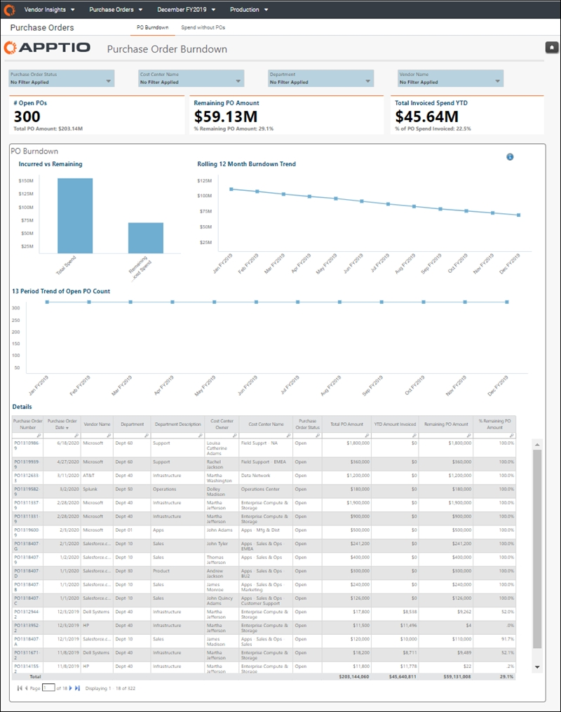

# Purchase Order Burndown

◆ Applies to: Vendor Insights on TBM Studio 12.8 and later (v107)

Use the  **Purchase Order Burndown**  report to analyze purchase order (PO) burndowns.

This report is designed for:

- CIO and Senior IT leadership
- Application Owners
- Services Owners
- IT Finance Managers
- Vendor Managers

**Display the Purchase Order Burndown report**

In the  Application  menu, select  Vendor Insights  .

1. Navigate to  Report Collections > Purchase Orders  .
2. From the bar at the top of the page, select  PO Burndown  .
3. Optionally, filter the report using the options at the top of the report.
4. To export or email your data, select  Export  (  ) at the top right of
   the page and select an export format.
5. Select any item in the  Purchase Order Number  column of the table in the  Details
    report component to open the detail report for that purchase order.

Questions answered

Use the information presented in this report to answer the
following questions:

- Which POs can be canceled or changed?
- Which POs are approaching their authorized amounts?
