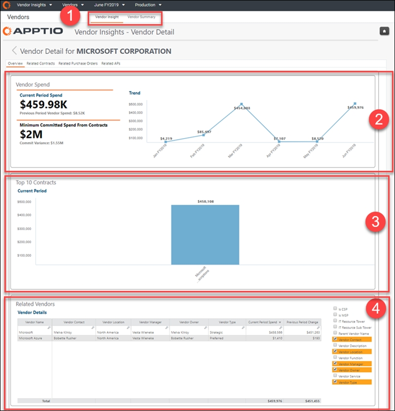
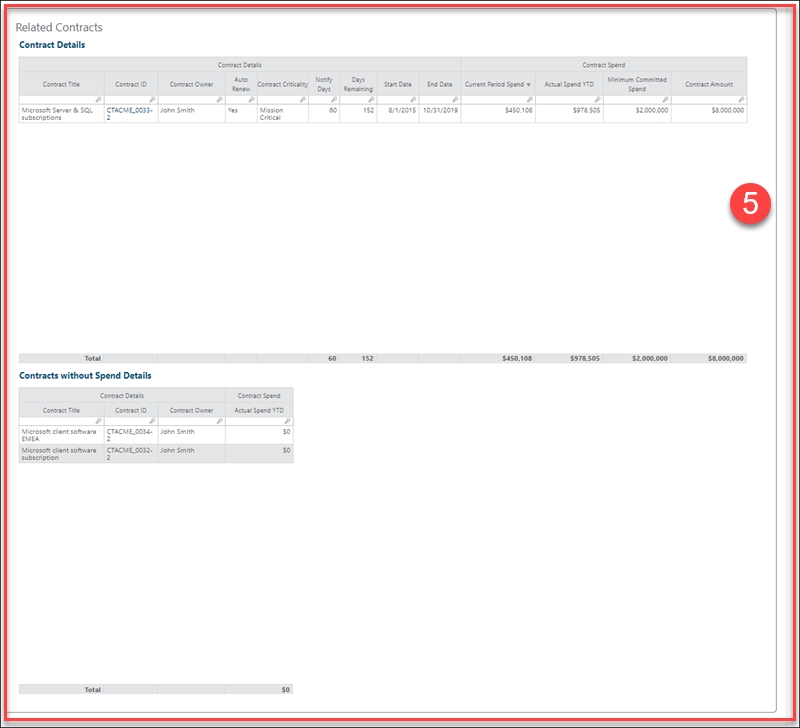
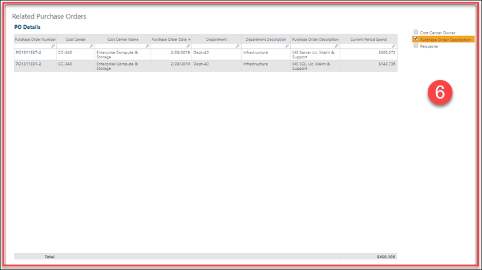
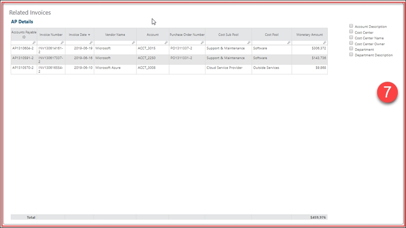
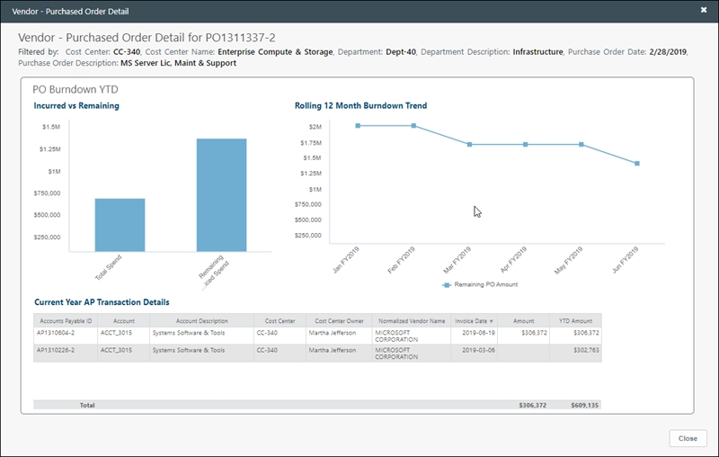

# Vendor Detail

◆ Applies to: Vendor Insights on TBM Studio 12.8 and later

The  **Vendor Detail**  report provides details about a specific vendor,
including current spend, top 10 contracts, related vendors, related contracts, related purchase
orders, and related APs (accounts payable).

**Display the Vendor Detail report**

In the  Application  menu, select  Vendor Insights  .

1. Navigate to  Report Collections > Vendors  .
2. From the bar at the top of the page, select  Vendor Insight  or  Vendor Summary
    .
3. Select any item in the  Vendor Name  column of a table to open the Vendor Detail
   report for that vendor.

The  **Vendor Detail**  report contains the following elements:

**(1) Access to this report**

To open this report, click either the  [Vendor Insights
(Dashboard) report](report-vendor-insights.html)  or  [Vendor Summary report](report-vendor-summary.html) 
, then click a link in the  **Vendor Name**  column of any table.

**(2) Vendor Spend**

KPIs provide a high-level view of your application spend compared to budget so you can know how
much is being spent with the vendor, how much is committed to be spent on contract, and the spend
trend over the last 12 months:

- **Current Period Spend**  - Shows the spend for the current and previous periods
  for the vendor.
- **Minimum Committed Spend from Contracts**  - Shows the minimum spend for
  committed contracts and the commit variance.

The trend chart shows the spend for the vendor month-over-month.

**(3) Top 10 Contracts**

Use the bar chart to analyze the spend of the top 10 contracts associated with the vendor for
the current period.

**(4) Related Vendors**

Use this table to see whether the vendor is part of a hierarchy and the other vendors that are
related. Use the options at the right of the table to add details about associated vendors,
including location, contact, type, IT resource tower, description, current period spend, and more.
You can see spend for the current period, the change since the previous period, and more.

**(5) Related Contracts**

Use this table to see what contracts are associated with the vendor, the committed spend, and
the amount already spent. See contract details such as contract owner, auto renew, and contract
criticality, among others. Also, you can see contract spend such current period spend, actual spend
YTD, and minimum committed spend, and more. Understanding these details can help you determine
whether a contract is valid and whether unusually large spend are properly managed with a PO.

**(6) Related Purchase Orders**

Use this table to see the value of the POs associated with the vendor, the amount spent, and the
amount left. Use the options to the right of the table to add details about the purchase orders
associated with the vendor. You can see the current period spend, department, cost center owner, and
more.

Click any item in the  **Purchase Order Number**  column to open the
 **Purchase Order Details**  dialog, which shows a PO burndown chart, a burndown
trend chart, and a table with current year AP transaction details.

**(7) Related APs**

In the AP Details table, you can view related invoices and details about them (accounts payable
ID, invoice number, invoice date, etc.). There are filter options to the right of the table that
include account description, cost center, department description, and more.
