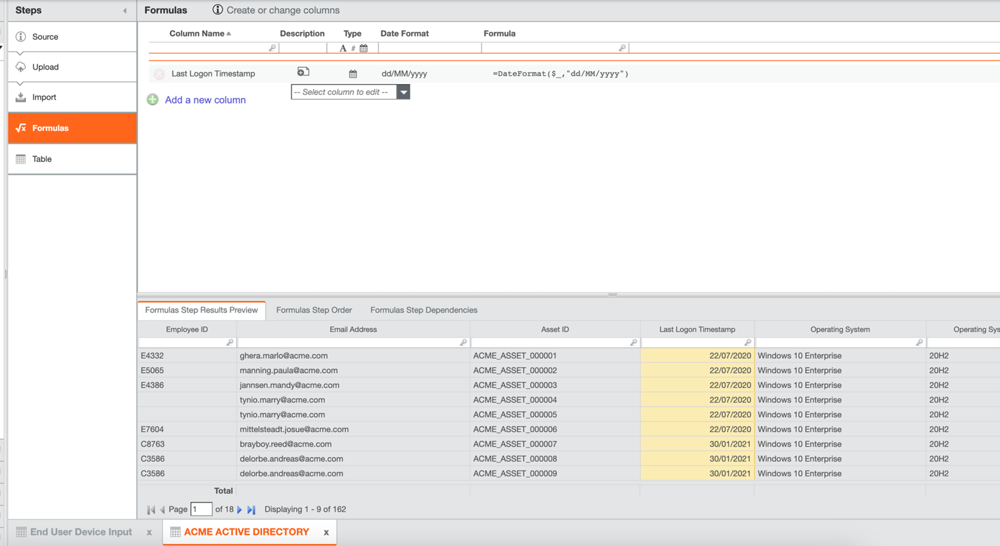

# Configure End User Devices

Complete these steps to start using End User Devices:

## Install the End User Devices component

1. Create a Project in TBM Studio.
2. Navigate to Project > Enable Features and verify that Templates and Modules (Beta) is enabled by
   the Apptio Support Admin or Apptio CSM.

   Note: For versions R12.10.0 to R12.10.7, the
   **Templates and Modules (Beta)** option should be enabled. Once this option is
   enabled, you should be able to install the component 'End User Devices'. From R12.10.8 version
   onwards, End User Devices is GA and this component is available without any feature
   enablement.
3. Navigate to Project > Components, scroll down to the list of Available features, and install End
   User Devices in the project.
   - For date format(dd/MM/yyyy) customers, go to edit Project settings and make sure “Locale” is set
     to “United Kingdom”.
   - For date format(MM/dd/yyyy) customers, go to edit Project settings and make sure “Locale” is set
     to “United States”.
4. There are primarily three data sets needed for configuring End User Devices. Prepare your data
   in tabular form for the following tables in your project:
   - Active Directory data
   - Labor Data
   - End User Devices Data
5. Map these tables to the following master tables. For more information, see [Upload data](../data%20studio/upload-data.html) and [Map Columns](../data%20studio/mapcolumns.html).

| Created table | Master table (present under Tables) |
| --- | --- |
| Active Directory data | EUI Active Directory Master Data |
| Labor data | EUI Labor Master Data |
| End User Devices data | End User Device Input |

The following tables are created automatically when the component is installed, and can be seen
under the **Tables** list:

- Device EOL and EOW Term Input
- Device Estimate Refresh Cost Input
- End User Device In Stock Status Definition Input
- End User Device OS Version Reference Input
- End User Exemption Input

You must upload data to these tables. For more information, see [Upload data](../data%20studio/upload-data.html).

Note: Upload data to the input master tables when there are changes or when there is a monthly
update. This ensures that reports are accurate.

## Component Details

| Table Name | Type |
| --- | --- |
| ACTIVE DIRECTORY | Input Table (Table to be created and data to be uploaded) |
| END USER DEVICES | Input Table (Table to be created and data to be uploaded) |
| LABOR DATA | Input Table (Table to be created and data to be uploaded) |
| Device EOL and EOW Term Input | Input Table |
| Device Estimate Refresh Cost Input | Input Table |
| End User Device In Stock Status Definition Input | Input Table |
| End User Device OS Version Reference Input | Input Table |
| End User Exemption Input | Input Table |
| Device EOL and EOW Term | Master Table |
| Device Estimate Refresh Cost | Master Table |
| End User Device In Stock Status Definition | Master Table |
| End User Device OS Version Reference | Master Table |
| End User Exemption | Master Table |
| End User Insights Master Data | Master Table |
| End User Device Input | Master Table |
| EUI Active Directory Master Data | Master Table |
| EUI Labor Master Data | Master Table |
| End User OS Version Reference | Master Table |
| EOL EOW Reporting Sort Sequence | Reference/Lookup Table |
| EOL And EOW Period Helper | Reference/Lookup Table |
| End User Age Range Tablematch | Reference/Lookup Table |
| Report Sequence | Reference/Lookup Table |
| End User Insights Pre Master Staging | Normal Table/Transition Table |
| End User Insights Pre Master Data | Normal Table/Transition Table |
| End User Insights Editable Reference | Transformed Table |

Tip: End User Devices supports multicurrency.

## Configure settings for End User Devices model

1. Create input tables and upload the data on a regular basis (preferably monthly) and map all the
   data as required to existing master tables. See [Install the End User Devices
   component](#ConfigureEndUserDevices__InstalltheEndUserDevicescomponent) for more information.
2. Map the labor and directory data in EUI Labor Master Data and EUI Active Directory Master Data
   respectively. See [Install the End User Devices component](#ConfigureEndUserDevices__InstalltheEndUserDevicescomponent) for more
   information.
3. Configure your input tables to master tables using the formulas listed below. If the Formulas
   step is not displayed, add it using the Add Step option.

   Tip: The formulas listed below
   are reference data only. You can update the formulas according to your specific data and industry
   standards.

   For customers with date format of dd/MM/yyyy
   :   - Update the following column for **Active Directory**:

         | Column Name | Type | Format | Formula |
         | --- | --- | --- | --- |
         | Last Logon Timestamp | Date | dd/MM/yyyy | =DateFormat($\_,"dd/MM/yyyy") |
       - Create and update the following columns for **End User Devices**:

         | Column Name | Type | Format | Formula |
         | --- | --- | --- | --- |
         | Business Unit | Label |  | =Lookup(Employee ID,EUI Labor Master Data,Employee ID,Business Unit) |
         | Business Unit Owner | Label |  | =Lookup(Employee ID,EUI Labor Master Data,Employee ID,Business Unit Owner) |
         | CC Check | Label |  | =Lookup(Employee ID,EUI Labor Master Data,Employee ID,Cost Center) |
         | Cost Center | Label |  | =IF({CC Check}!="",Lookup(Employee ID,EUI Labor Master Data,Employee ID,Cost Center Description)&" ("&Lookup(Employee ID,ACME LAB,Employee ID,Cost Center)&")","") |
         | Cost Center Owner | Label |  | =Lookup(Employee ID,EUI Labor Master Data,Employee ID,Cost Center Owner) |
         | Department | Label |  | =Lookup(Employee ID,EUI Labor Master Data,Employee ID,Cost Center Description) |
         | Device Count | Numeric |  | =1 |
         | In Stock Inventory | Label |  | =Lookup(Inventory Status,End User Device In Stock Status Definition,In Stock Status List,In Stock Status List) |
         | OS | Label |  | =Lookup(Asset ID,EUI Active Directory Master Data,Asset ID,OS) |
         | OS Version | Label |  | =Lookup(Asset ID,EUI Active Directory Master Data,Asset ID,OS Version) |
         | Source Table | Label |  | ="End User Devices Raw" |
         | User Name HR | Label |  | =Lookup(Employee ID,EUI Labor Master Data,Employee ID,Employee Name) |
         | Acquired Date | Date | dd/MM/yyyy | =DateFormat($\_,"dd/MM/yyyy") |
         | End of Life Date | Date | dd/MM/yyyy | =DateFormat($\_,"dd/MM/yyyy") |
         | Refresh Date | Date | dd/MM/yyyy | =DateFormat($\_,"dd/MM/yyyy") |
         | User Name | Label |  | =if($\_!="",$\_,If({User Name HR}="" AND {In Stock Inventory}="", "Employee ID not found",{User Name HR})) |
         | Warranty End Date | Date | dd/MM/yyyy | =DateFormat($\_,"dd/MM/yyyy") |
         | Warranty Start Date | Date | dd/MM/yyyy | =DateFormat($\_,"dd/MM/yyyy") |

         

         
       - Update the following columns for **Labor Data**:

         | Column Name | Type | Format | Formula |
         | --- | --- | --- | --- |
         | Cost Center and ID | Label |  | =Cost Center Description&&Cost Center |
         | End Date | Date | dd/MM/yyyy | =DateFormat($\_,"dd/MM/yyyy") |
         | Start Date | Date | dd/MM/yyyy | =DateFormat($\_,"dd/MM/yyyy") |

         

   For customers with date format MM/dd/yyyy
   :   - Update the following column for **Active Directory**:

         | Column Name | Type | Format | Formula |
         | --- | --- | --- | --- |
         | Last Logon Timestamp | Date | MM/dd/yyyy | =DateFormat($\_,"MM/dd/yyyy") |
       - Create and update the following columns for **End User Devices**:

         | Column Name | Type | Format | Formula |
         | --- | --- | --- | --- |
         | Business Unit | Label |  | =Lookup(Employee ID,EUI Labor Master Data,Employee ID,Business Unit) |
         | Business Unit Owner | Label |  | =Lookup(Employee ID,EUI Labor Master Data,Employee ID,Business Unit Owner) |
         | CC Check | Label |  | =Lookup(Employee ID,EUI Labor Master Data,Employee ID,Cost Center) |
         | Cost Center | Label |  | =IF({CC Check}!="",Lookup(Employee ID,EUI Labor Master Data,Employee ID,Cost Center Description)&" ("&Lookup(Employee ID,ACME LAB,Employee ID,Cost Center)&")","") |
         | Cost Center Owner | Label |  | =Lookup(Employee ID,EUI Labor Master Data,Employee ID,Cost Center Owner) |
         | Department | Label |  | =Lookup(Employee ID,EUI Labor Master Data,Employee ID,Cost Center Description) |
         | Device Count | Numeric |  | =1 |
         | In Stock Inventory | Label |  | =Lookup(Inventory Status,End User Device In Stock Status Definition,In Stock Status List,In Stock Status List) |
         | OS | Label |  | =Lookup(Asset ID,EUI Active Directory Master Data,Asset ID,OS) |
         | OS Version | Label |  | =Lookup(Asset ID,EUI Active Directory Master Data,Asset ID,OS Version) |
         | Source Table | Label |  | ="End User Devices Raw" |
         | User Name HR | Label |  | =Lookup(Employee ID,EUI Labor Master Data,Employee ID,Employee Name) |
         | Acquired Date | Date | MM/dd/yyyy | =DateFormat($\_,"MM/dd/yyyy") |
         | End of Life Date | Date | MM/dd/yyyy | =DateFormat($\_,"MM/dd/yyyy") |
         | Refresh Date | Date | MM/dd/yyyy | =DateFormat($\_,"MM/dd/yyyy") |
         | User Name | Label |  | =if($\_!="",$\_,If({User Name HR}="" AND {In Stock Inventory}="", "Employee ID not found",{User Name HR})) |
         | Warranty End Date | Date | MM/dd/yyyy | =DateFormat($\_,"MM/dd/yyyy") |
         | Warranty Start Date | Date | MM/dd/yyyy | =DateFormat($\_,"MM/dd/yyyy") |

         
       - Update the following columns for **Labor Data**:

         | Column Name | Type | Format | Formula |
         | --- | --- | --- | --- |
         | Cost Center and ID | Label |  | =Cost Center Description&&Cost Center |
         | End Date | Date | MM/dd/yyyy | =DateFormat($\_,"MM/dd/yyyy") |
         | Start Date | Date | MM/dd/yyyy | =DateFormat($\_,"MM/dd/yyyy") |

         
4. Map **End User Devices data** to **End User Device Input** by appending it. For more
   information, see [Append
   data](../data%20studio/append-data.html).

   
5. If the columns have date column, check the format and set the date format for all the master
   data tables or when uploading data make sure to set override datatype of those columns to your
   required format.
6. If some hard coded dates are there in master table set, kindly change the format as per your
   requirements.
7. Check End User Insights Pre Master data to confirm if all the data is coming from **End User
   Device Input**.
8. Check **End User Insights Pre Master Staging** to confirm if all the data and
   formulas are coming from **End User Insights Pre Master data**.
9. Check **End User Insights Master Data** to confirm the data flow from **End User Insights
   Pre Master Staging**.

   
10. Check **End User Insights model** to see if most of the costs are getting allocated
    correctly.

    

    Note: The cost in the screenshot is for reference
    purpose only.

    

    Note: The cost in the screenshot is for reference
    purpose only.
11. Check if **End user devices OOTB Reports** is showing the desired
    numbers.

## End user devices configuration flow

## Reports Studio

After you install End User Devices, **Report Studio** displays an End User
Devices tile on the home page. You can use this to navigate to the **End User Devices
reports**.

The following is a quick snapshot of the End User Devices reports:

[Learn more about End User
Devices reports](end_user_dev_dashboard.html)
