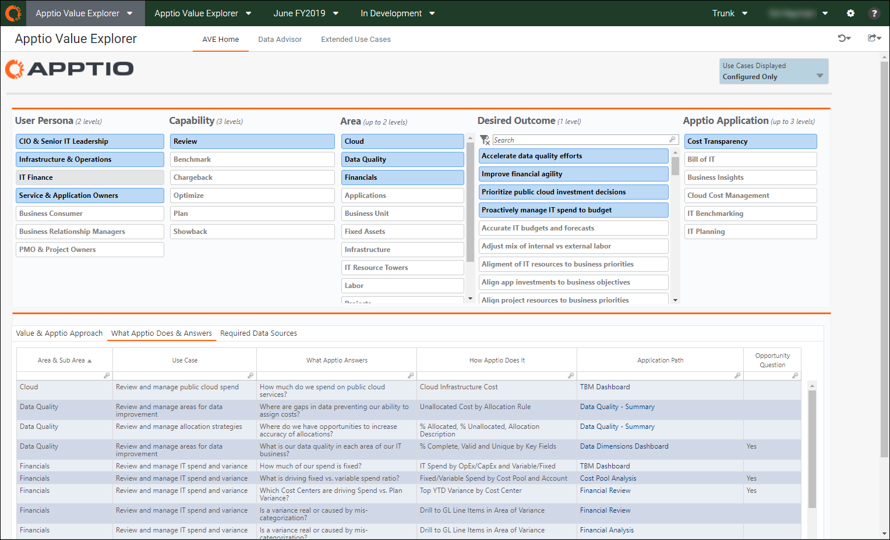
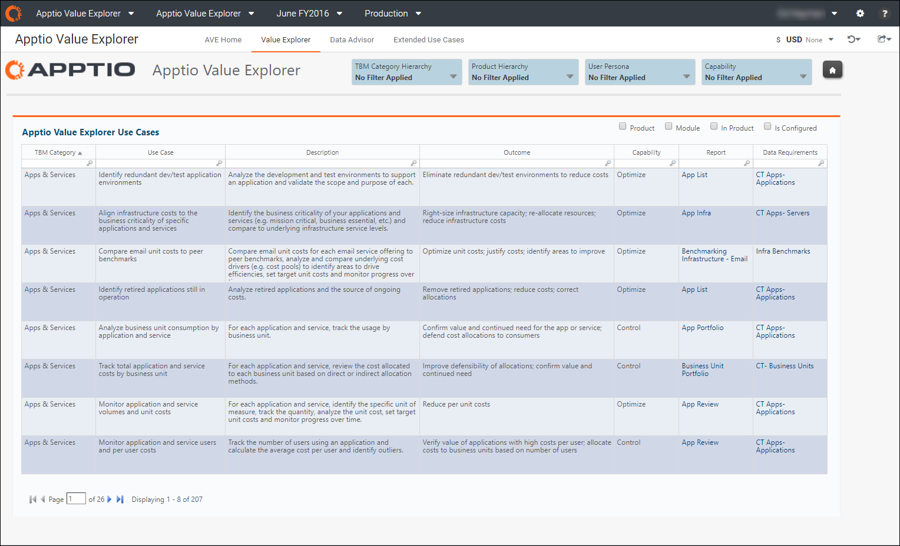

# Actualización a Apptio Value Explorer 12.7 ( v107 )

Se aplica a: Apptio Value Explorer (AVE) en TBM Studio 12.7 y posteriores, con Plantilla v107 y posteriores

El proceso general de configuración para actualizar todas las aplicaciones a TBM Studio 12.7 se describe en [Actualización de Costing Standard a la última versión de la plantilla](../user-guide/upgradecttolatest-9740.html). Este artículo contiene un paso de configuración específico para actualizar el Apptio Value Explorer (AVE) desde cualquier versión de plantilla anterior a la plantilla v107.

## Instrucciones de actualización

1. Siga las instrucciones de actualización de plantillas en [Actualizar Costing Standard a la última versión de plantilla](../user-guide/upgradecttolatest-9740.html)

   Cuando llegues al paso 5, cambia a este artículo, asegurándote de que estás en la rama correcta antes de continuar.
2. Actualice el componente Apptio Value Explorer.
3. Compruebe en la actualización del componente AVE.
4. Vaya a Apptio Value Explorer Master Dataset en el Explorador de Proyectos.
5. Consulta el documento.
6. Haga clic en **Añadir**.
7. Borre la tabla Apptio Value Explorer Raw.
8. Vuelva a añadir la tabla Apptio Value Explorer Raw.

   Todas las columnas se asignarán automáticamente.
9. Guarde y compruebe los cambios.
10. Vuelva a las instrucciones de actualización de plantillas en [Actualizar Costing Standard a la última versión de plantilla](../user-guide/upgradecttolatest-9740.html) para completar las actualizaciones de componentes restantes.

## En segundo plano

El AVE está construido sobre la plataforma TBM Studio y se entrega en el marco de un proyecto Costing Standard . AVE incluye una lista exhaustiva de casos de uso del producto. La actualización del AVE 12.7 aporta las siguientes mejoras:

1. Actualizar el contenido del AVE para incluir casos de uso de nuevos productos y funciones.
2. Simplificar la cantidad de documentación en favor de descripciones y resultados más sólidos que se centren en el "por qué".
3. Elimine la complejidad de las rebanadoras, la mensajería de ventas y las filas duplicadas.

## Persona

El AVE está diseñado para ser utilizado por las siguientes funciones:

- Oficina TBM
  - Revisar y priorizar características
  - Determinar qué componentes del producto configurar
  - Comunicar el valor que los productos de Apptio aportan a la organización
- Gestores de éxito de clientes, asesores de éxito de clientes, gestores de compromiso
  - Comunicar el valor que aportan los productos de Apptio

## Comparar versiones

AVE antes v107

AVE actualizado a la plantilla v107

## Resumen de los cambios

Contenido
:   - - Se han añadido casos de uso en todos los productos de Apptio.
      - Creación de casos de uso más detallados con una descripción exhaustiva y resultados para identificar la razón que subyace al caso de uso
      - Se han incluido casos de uso no incluidos en los informes preconfigurados de Apptio, pero disponibles gracias a la extensibilidad de TBM Studio.

        Estos casos de uso enlazan con el [Insights Toolkit](https://community.apptio.com/community/apptio/tbm-cookbook "(se abre en una pestaña o una ventana nueva)") en TBM Connect.

Cortadoras
:   - - Cambiado para compactar las rebanadas en la Plantilla de Informe Maestro AVE.
      - La jerarquía de corte **TBM Categoría > Subcategoría** sustituye a **Área**.
      - Eliminado el cortador de **Outcomes**.

Mesa AVE
:   - Simplificación de la tabla de tres pestañas en una tabla sin pestañas. Se ha eliminado la pestaña **Valor y Apptio Approach** y se ha consolidado la pestaña **Fuentes de datos requeridas** en una única tabla.
    - Columnas de la nueva tabla AVE:
      - **Categoría TBM** - Categoría de alto nivel para organizar los casos de uso. Sustituye a **Área** (por ejemplo, Finanzas, Aplicaciones y Servicios).
      - **Caso de uso** - El "qué" Expresión breve que define la capacidad del producto, expresada en una frase verbo-sustantivo coherente.
      - **Descripción** - Una descripción más larga del caso de uso que puede incluir los distintos atributos y el alcance del caso de uso.
      - **Resultado** - El "por qué" El valor esperado del caso de uso.
      - **Capacidad** - La capacidad o acción de alto nivel del caso de uso (por ejemplo, Planificar, Optimizar, Influir)
      - **Informe** - Si el componente asociado está instalado, esta columna contiene enlaces al informe específico de Apptio que puede utilizarse para analizar las métricas del caso de uso. Si el componente no está configurado, esta columna enlazará con el proyecto de referencia. Si el informe es personalizado en lugar de listo para usar, esta columna enlazará con el [Insights Toolkit](https://community.apptio.com/community/apptio/tbm-cookbook "(se abre en una pestaña o una ventana nueva)") en TBM Connect.
      - **Requisitos de datos** - Esta columna enlaza con el Asesor de datos para que pueda ver los conjuntos de datos y columnas necesarios (y opcionales) para configurar el componente y los casos de uso asociados.
    - Recolectores adicionales:
      - **Producto** - El producto Apptio que permite el caso de uso (por ejemplo, Apptio para Cloud).
      - **Módulo** - El módulo subyacente de Apptio que permite el caso de uso (por ejemplo, HBM).
      - **En el producto** - El indicador de que el caso de uso es compatible fuera de la caja frente a ser una configuración personalizada con TBM Studio.
      - **Está configurado** - Ordena en función de si el componente relacionado está instalado.
