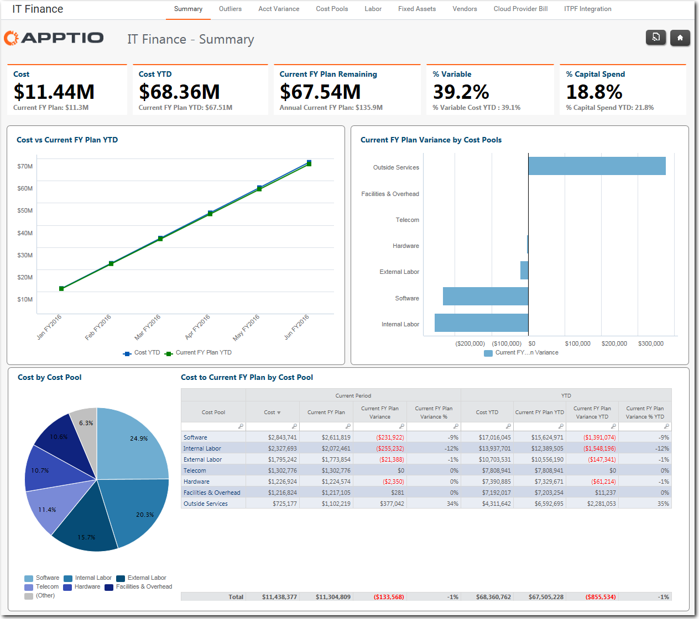

# Acerca de la aplicación Costing Standard

Utilice la aplicación Costing Standard para recopilar los datos que necesita para tomar decisiones empresariales más rápidas, mejorar la eficiencia y comunicar valor.

## Introducción

Se aplica a: Costing Standard 11.8.x que se ejecuta en [TBM Studio v12](https://community.apptio.com/community/apptio/product-central/tbm-studio/studio-v12 "(se abre en una pestaña o una ventana nueva)") o [TBM Studio v11](https://community.apptio.com/community/apptio/product-central/tbm-studio/studio-v11 "(se abre en una pestaña o una ventana nueva)").

La aplicación Costing Standard transforma los asientos del libro mayor en informes que pueden utilizarse para tomar mejores decisiones con mayor rapidez y confianza. Los informes presentan información sobre torres, servicios y proyectos de TI que pueden utilizar los responsables financieros, de gestión, de calidad de datos, de operaciones y de aplicaciones y servicios de TI. En la siguiente figura se muestra un informe típico.

La aplicación calcula los costes de los servicios que su organización de TI presta a su empresa. La información obtenida de Costing Standard le permite impulsar las acciones adecuadas a sus objetivos empresariales.

La aplicación Costing Standard proporciona:

- Un enfoque prescriptivo bien definido que incorpora las mejores prácticas de gestión empresarial de la tecnología (TBM).
- Contenido de alta calidad listo para usar, como informes, métricas e indicadores clave de rendimiento.
- Un modelo fácil de entender del flujo de dinero a través de su empresa.
- Tiempo eficiente para obtener información sobre su negocio.
- Una base sólida para futuras expansiones en la evolución de su viaje con la tuneladora.

## Costing Standard Módulos

La aplicación Costing Standard incluye tres módulos:

Costing Standard Fundación
:   Automatice las vistas mensuales del rendimiento financiero de TI frente al plan (presupuesto) y lo que impulsa los costes de sus torres, proyectos, mano de obra, centros de costes, etc.

Aplicaciones y servicios
:   Automatice el análisis y la elaboración de informes mensuales de los costes completos y los factores de coste de sus aplicaciones y servicios, y gestione su rendimiento con respecto a un plan (presupuesto).

Unidades de negocio
:   Automatice el análisis y los informes mensuales del gasto por unidad de negocio para comprender sus costes en el contexto de los planes de valor y de negocio (asignaciones presupuestarias de TI).

## Qué puede hacer con la aplicación Costing Standard

La aplicación Costing Standard proporciona información que puede utilizarse para tomar las decisiones adecuadas para una empresa.

Ejecutivos de TI
:   Determinar cómo demostrar a la organización el valor empresarial que aportan las TI, y dónde pueden pasar de estrategias Run The Business a estrategias Transform the Business.

Propietarios de dominios de servicios de TI
:   Determine cómo aumentar el rendimiento de los activos, cómo hacer un seguimiento del crecimiento de la empresa y en qué aspectos debe redimensionarse la empresa o la infraestructura para satisfacer la demanda de servicios.

Finanzas
:   Dedique más tiempo al análisis de datos que a su recopilación.

## Si está actualizando desde R11.8.x

Hay varios cambios significativos en la aplicación Costing Standard que se ejecuta en la plataforma v12.

- Los informes maestros ya no muestran la barra de navegación de la colección.
- Ya no se incluye el informe IT Finance-Waterfall. Por el momento, la plataforma v12 no admite informes en cascada.
- Ya no es posible cargar un archivo en el informe Calidad de datos. Por el momento, la plataforma v12 tampoco lo admite.
- Al crear un nuevo proyecto, ya no habrá una página de Próximos pasos.
- Ya no es necesaria una Biblioteca de Servicios.

## Información relacionada

- [Enviar comentarios sobre el Centro de ayuda](productfeedback@apptio.com "(se abre en una pestaña o una ventana nueva)")
