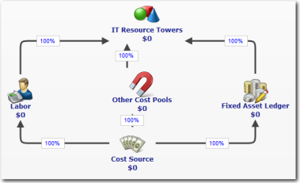

# Acerca de la configuración del módulo básico de la Norma de cálculo de costes

Al crear un proyecto Costing Standard , se instala el módulo Costing Standard Foundation.

## Introducción

El módulo se basa en el modelo de costes de la figura A. En general, el valor se introduce en el modelo en el nivel de objeto Fuente de Coste. Para facilitar la elaboración de informes sobre mano de obra y activos fijos, el valor se asigna a los objetos Mano de obra, Libro de activos fijos y Otros pools de costes. Para facilitar la elaboración de informes basados en torres de recursos TI, el valor se agrega en el objeto Torres de recursos TI. Este modelo sirve de base para los otros dos módulos de la aplicación Costing Standard : Aplicaciones y Servicios, y Unidades de Negocio.

## Pasos de configuración

Para proporcionar las métricas básicas, los modelos de cálculo y los informes para Costing Standard, deberá realizar los siguientes pasos:

- Cree el proyecto Costing Standard
- Configurar el tiempo para el proyecto
- Cargar tablas de datos en la aplicación
- Añadir columnas a las tablas para prepararlas para la asignación a las tablas de datos maestros
- Adjuntar y asignar las tablas a las tablas de datos maestros

## Funciones

Los usuarios que accedan a la página de inicio de Costing Standard para ver los informes deben tener asignada la función Sólo ver. No pueden asignarse a las funciones de Director de proyecto o Propietario de unidad de negocio.

Los usuarios que vayan a configurar la aplicación deberán tener asignada la función Admin.

## Información relacionada

- [Enviar comentarios sobre el Centro de ayuda](productfeedback@apptio.com "(se abre en una pestaña o una ventana nueva)")
