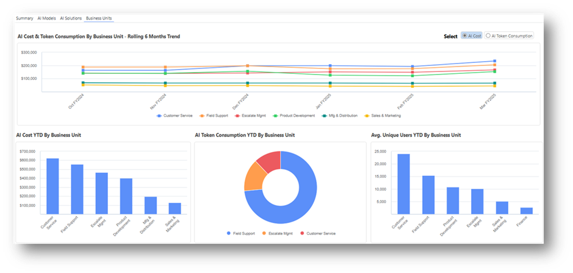
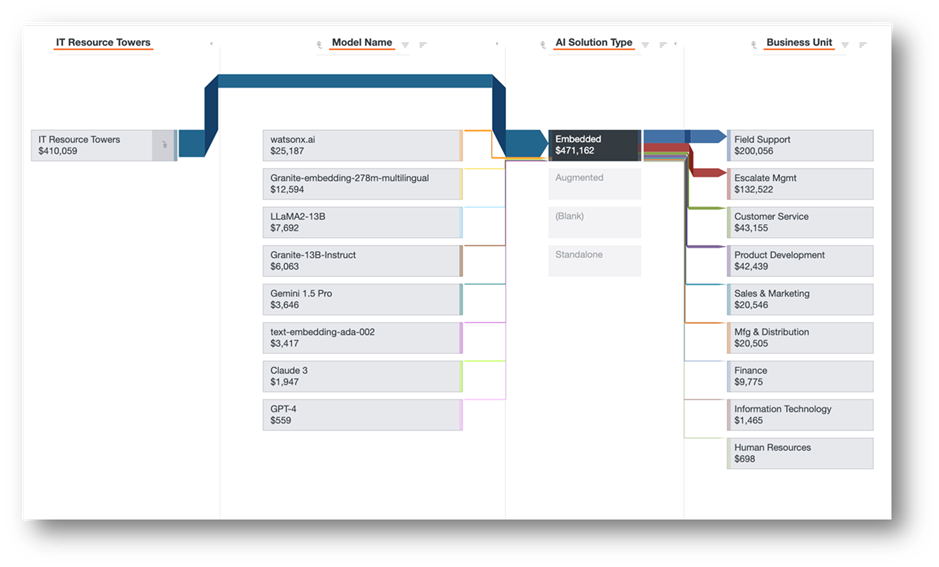

# IBM Apptio Solución AI TCO

La Inteligencia Artificial (IA) es una prioridad clave para muchas organizaciones, y cada vez se encarga más a los CIOs que lideren las estrategias de IA en toda la organización. A medida que se acelera el gasto en IA, también lo hace la complejidad. Los CIO admiten que la gestión de los costes limita su capacidad para liberar el verdadero valor de la IA. Para que las organizaciones adopten, amplíen y gestionen las iniciativas de IA de forma sostenible y aprovechen todo su valor, necesitan una visibilidad clara de los costes, el uso y la adopción de la IA.

## Visión general

IBM Apptio 's AI TCO & Usage solution es una solución diseñada específicamente para realizar un seguimiento del ciclo de vida completo de sus inversiones en IA, proporcionando una transparencia defendible de los costes, el uso y la adopción continuos de la IA en todos los modelos de IA y las funciones de AI solutions.Key incluyen:

- Supervisión continua de las tendencias y anomalías del coste total de propiedad de la IA
- Indicadores de costes detallados y visibilidad del uso de la IA
- Evaluación económica de la unidad para tomar decisiones informadas sobre la ampliación
- Consumo responsable de IA y retroalimentación a toda la organización

## Transparencia y asignación de costes de IA

Ingesta de todas las fuentes de datos de IA en nuestro modelo de IA ATUM, que tiene en cuenta varias métricas esenciales de coste y uso, lo que permite obtener una visión única de todos los costes de IA.

Obtenga visibilidad integral de sus inversiones en IA a lo largo de todo su ciclo de vida; realice un seguimiento de los impulsores de costes en la nube, la mano de obra y los proveedores para sacar a la luz los crecientes problemas de costes con antelación.

Responde a preguntas críticas como

- ¿Cuál es el coste total de propiedad de todas mis inversiones en IA? ¿Cuánto representa esto en % de los costes totales de TI?
- ¿Cuánto gastamos en inversiones en IA piloto, de prueba de concepto o de producción?
- ¿Cuáles son los principales consumidores de costes en los modelos de IA, las soluciones de IA y las unidades de negocio?
- ¿Cuáles son los principales impulsores de los costes de nube, proveedores, mano de obra y otros?
- ¿Cuáles son los costes unitarios de nuestras soluciones de IA?

## Seguimiento y evaluación del uso de la IA

Adelántate a la expansión de la IA. Identifique oportunidades para consolidar o retirar modelos de IA o soluciones de IA basadas en el uso -como consumo de tokens, usuarios y números de licencia- y patrones de costes que expongan ineficiencias. Analice las tendencias de uso de la IA a lo largo del tiempo para comprender el consumo de IA en toda su organización, hasta el nivel de unidad de negocio.

Responde a preguntas como:

- ¿Cómo se consume la IA en los modelos de IA, las soluciones de IA y las unidades de negocio?
- ¿Cuál es el reparto de fichas de entrada y salida de IA entre nuestros modelos de IA?
- ¿Existen tendencias de adopción y uso que puedan indicar ineficiencias tempranas?

## Permitir una adopción responsable de la IA

Aumentar la concienciación de las unidades de negocio mediante la presentación de los costes, el uso y el consumo de la IA para fomentar decisiones sostenibles de inversión y adopción de la IA.

Responde a preguntas como:

- ¿Qué unidades de negocio consumen más recursos de IA?
- ¿Tenemos modelos de IA redundantes o soluciones de IA que podríamos retirar?
- ¿Qué soluciones de IA podemos ampliar a otras partes de la organización?

Para saber más sobre la configuración, consulte [la Guía de configuración de AI TCO](ai-tco-configguide.html)
