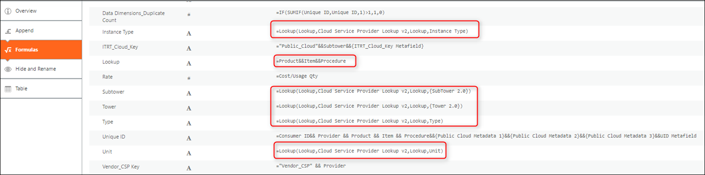
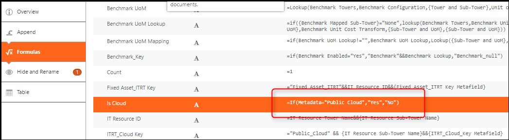
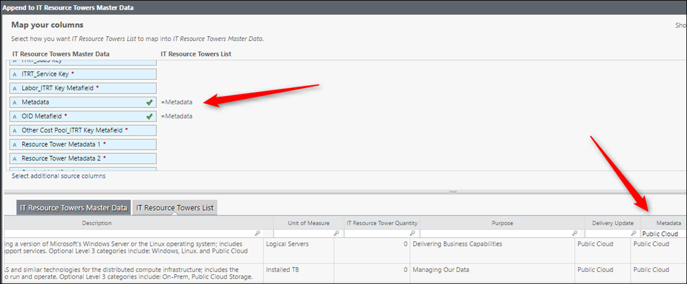
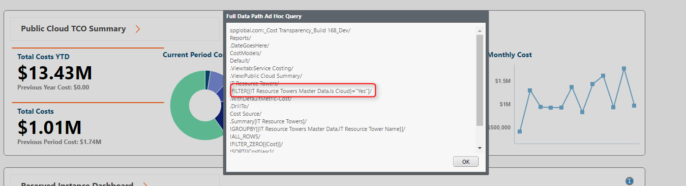
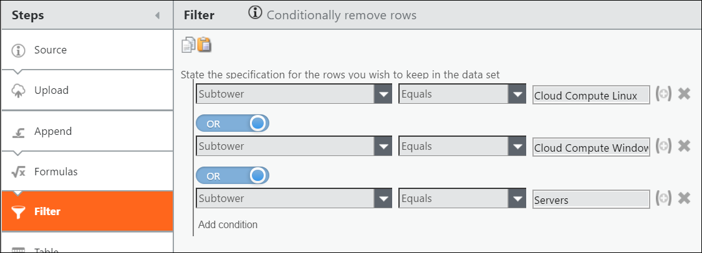

# Configuración de la nube y ATUM 2.0

Este artículo explica algunas actualizaciones de configuración relacionadas con ATUM 2.0 y Public Cloud si se necesitan modificaciones en los Conjuntos de Datos Maestros (Cloud \ ITRT) para soportar la taxonomía ATUM 2.0. Los siguientes cambios configuran ATUM 2.0, con una sección adicional que muestra una transformación de servidores que anexa los Datos Maestros del Servidor para Public Cloud con un filtro que necesita ser removido para permitir que los datos se muestren.

**AVISO**

En la lista de torres de recursos de TI que viene de fábrica,las torres y subtorres no se identifican como Public Cloud, por lo que tendrá que actualizar esa lista para incluir subtorres con Public Cloud.

Se aplica a: Cloud para Costing Standard en TBM Studio 12.4.1 y posteriores.

## Cambios en la configuración

Proveedor de servicios en la nube
:   1. Añada el maestro de facturas de imputación de costes AWS y, a continuación, cambie la columna Producto a ProductCode.
    2. En la sección Fórmulas, actualice Tipo de instancia, Subtorre, Torre, Tipo, Unidad como sigue:
       1. Para el tipo de instancia, asignar a =Lookup(Lookup,Cloud Service Provider Lookup v2,Lookup,Instance Type).
       2. Para Subtower, map to=Lookup(Lookup,Cloud Service Provider Lookup v2,Lookup, {SubTower 2.0} ).
       3. Para Tower, map to=Lookup(Lookup,Cloud Service Provider Lookup v2,Lookup, {Tower 2.0} ).
       4. Para Type,map to=Lookup(Lookup,Cloud Service Provider Lookup v2,Lookup,Type ).
       5. Para la unidad, map to=Lookup(Lookup,Cloud Service Provider Lookup v2,Lookup,Unit ).
       6. Cambiar Búsqueda a =Producto&&Artículo&&Procedimiento.
    3. Nuevo neto es Producto.
    4. Sólo para ATUM 1.0, aproveche el artículo&&Procedimiento.
:   

Datos maestros de recursos informáticos
:   1. En la sección Fórmulas, cambie Es nube a Public Cloud=Sí, ya que el informe de nube pública que aparece a continuación tiene un filtro para Es nube.

       Por defecto, Is Cloud consulta la subpotencia de recursos de TI y, a continuación, vuelve al archivo Lookup para determinar el valor, pero si se cambia para consultar el archivo v2, los costes se inflarían en exceso en los informes de la nube pública, ya que se marcarían las subpotencias no relacionadas con la nube.

       
    2. Añada el indicador Public Cloud al campo de metadatos de los datos maestros de la torre de recursos informáticos. Esto separa los costes no relacionados con la nube de los costes relacionados con la nube.

    Los informes de Nube están configurados para filtrar por el valor Es Nube, establecido anteriormente.

    

## Los servidores en nube se transforman para Public Cloud

Para ATUM 2.0 y la transformación de servidores en nube, cambie el filtro para Cloud Compute Linux y Windows para incluir Compute - Servidores - Public Cloud, como se muestra.

Para obtener información sobre la asignación de servicios de AWS, consulte [Asignación de servicios de AWS](awsservices.html "Apptio los conectores CBM y AWS de DataLink le permiten asignar partidas de facturación desde las partidas de facturación de su proveedor de nube a los atributos de ATUM, incluidas las torres y subtorres de TI, la jerarquía de servicios TBM, así como una unidad de medida normalizada.").

Para obtener información sobre la asignación de servicios de Azure, consulte [Asignación de servicios de Azure.](azuremap.html "Apptio los conectores CBM y AWS de DataLink le permiten asignar partidas de facturación desde las partidas de facturación de su proveedor de nube a los atributos de ATUM, incluidas las torres y subtorres de TI, la jerarquía de servicios TBM, así como una unidad de medida normalizada.")

## Información relacionada

- [Enviar comentarios sobre el Centro de ayuda](productfeedback@apptio.com "(se abre en una pestaña o una ventana nueva)")
