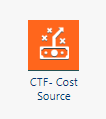

# Crear el proyecto Costing Standard

El primer paso en el proceso de configuración de Costing Standard es crear el proyecto Costing Standard . Al crear el proyecto Costing Standard , la aplicación Costing Standard crea las métricas estándar, los modelos de cálculo y los informes.

## Procedimiento

1. Inicie sesión en la instancia Apptio.
2. Abra el menú Configuración y haga clic en **Nuevo proyecto**.
3. En el cuadro de diálogo Nuevo proyecto, introduzca el nombre del proyecto.
4. Seleccione **Costing Standard** para el tipo de proyecto.
5. Haga clic en **Aceptar**.

## Componentes instalados

Al crear un proyecto Costing Standard , la aplicación instala el componente de origen de costes que se muestra a continuación.

