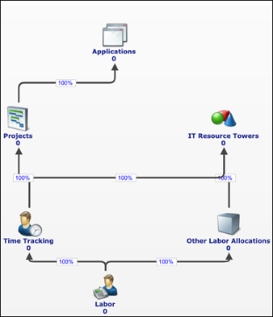
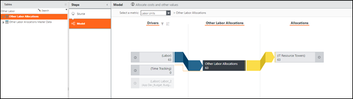
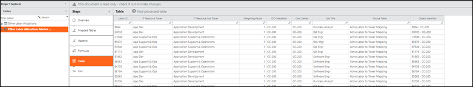
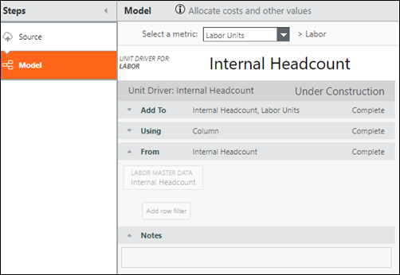
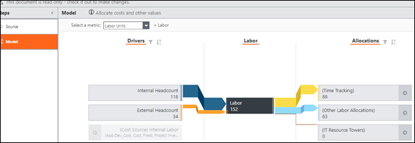
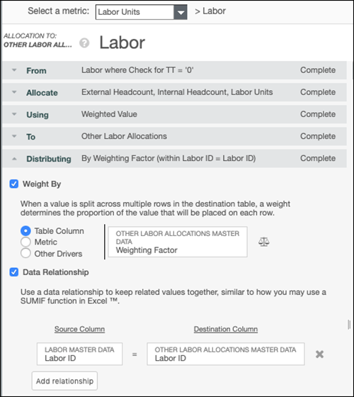
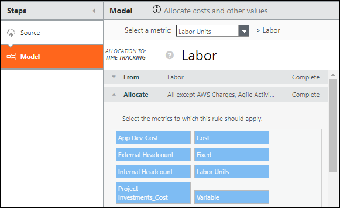

# CTF - Componente Unidades de Trabajo: instalar y configurar

Utilice el componente CTF - Unidades Laborales para integrar el modelo Agile Insight Headcount en Costing Standard.

Se aplica a: TBM Studio 12.8 y posteriores, con Plantilla v107 y posteriores

## Introducción

El modelo Unidades de mano de obra se instala con el componente CTF - Unidades de mano de obra, y se integra con el modelo Agile Insights Headcount para asignar mano de obra en un modelo operativo de proyecto, ágil o híbrido de TI. La dimensión de recuento de mano de obra existente utiliza el modelo de unidades de mano de obra, si está instalado. Si el modelo de Unidades de Mano de Obra no está instalado, se utiliza el Recuento de Mano de Obra de los Datos Maestros de Mano de Obra.

Para las organizaciones totalmente ágiles, el modelo de Unidades de Trabajo hace lo siguiente:

- Asigna correctamente el gasto en mano de obra del TCO de aplicaciones y productos del modelo Costing Standard
- Sustituye al objeto Agile Labor
- Requiere la alteración de ciertas asignaciones (como Trabajo a Aplicaciones)
- Permite modelar el Trabajo hasta Aplicaciones y Productos tanto en entornos de desarrollo en cascada como ágiles

El componente Unidades de mano de obra le permite asignar los recuentos de mano de obra entre mano de obra interna y externa, y hasta proyectos y aplicaciones para proporcionar una mejor experiencia de elaboración de informes al visualizar los recuentos de mano de obra. Como resultado, el número total de empleados se comunica correctamente por proyecto y aplicación. Además, este nuevo nivel de asignación crea un informe más preciso de los empleados que realizan trabajos en varias subtorres de recursos de TI.

AVISO

Sin la instalación de este componente, los informes de mano de obra personalizados podrían no actualizar las dimensiones de recuento de mano de obra, lo que provocaría un comportamiento inesperado.

## Acerca del componente

La base del modelo es el objeto Labor. Los drivers de este objeto son Recuento interno y Recuento externo, que obtienen los datos de los Datos maestros de personal. El objeto Mano de obra controla los objetos Seguimiento del tiempo y Otras asignaciones de mano de obra. La asignación entre estos objetos se pondera mediante los datos maestros Otras asignaciones de mano de obra.

## Métricas

Se instalan las siguientes métricas:

- Impulsores de los efectivos internos y externos
- Unidades de trabajo

## Conjunto de datos maestros

Se instala el conjunto de datos maestros Otras asignaciones de mano de obra.

## Columnas

Las siguientes columnas se incluyen en el conjunto de datos maestros:

- Identificación laboral
- Metadatos OID
- Torre de recursos informáticos
- Subtorre de recursos informáticos
- Factor de ponderación

## Muestra de datos de respaldo

Mapeo de torres de recursos laborales a informáticos:

## Campo nuevo

Se ha añadido un nuevo campo a los datos maestros de mano de obra para desglosar la mano de obra interna de la externa: La mano de obra interna

## Configuración

Las siguientes instrucciones presuponen que Costing Standard ya está instalado.

1. En TBM Studio, vaya a Proyectos > Componentes, luego haga clic en **CTF - Unidades de trabajo** para instalar el componente Unidades de trabajo. Están instalados los siguientes controladores:
   - Plantilla interna
   - Personal externo

   Estos controladores extraen automáticamente los valores de recuento de los datos maestros de mano de obra para rellenar los modelos de recuento interno y unidades de mano de obra

   .

   Una vez rellenados los controladores de unidades, el modelo de Unidades de mano de obra tiene el siguiente aspecto:

   
2. Ir a **Pasos** **Modelo** **Unidades de Trabajo**.
3. Para aprovechar el ID de Mano de Obra y asignar Otras Asignaciones de Mano de Obra a Mano de Obra, establezca el De a Mano de Obra donde Comprobar para TT = '0'.

   

   Nota: La instalación del componente Unidades de mano de obra en un proyecto existente puede dar lugar a una asignación entre Torres de mano de obra y Torres de recursos informáticos. Si esto ocurre, elimine la asignación en el modelo Unidades de mano de obra y, en su lugar, cree una asignación de Mano de obra a Otras asignaciones de mano de obra y, a continuación, de Otras asignaciones de mano de obra a Torres de recursos de TI.
4. Seleccione **Ponderar por**, luego **Columna de tabla**, luego **Factor de ponderación**.
5. Para Relación de datos, introduzca **ID de mano de obra** tanto para la **columna de origen** como para **la columna de destino**.
6. Para el modelo restante, aproveche las asignaciones existentes del modelo de costes. Si existen asignaciones personalizadas, seleccione las siguientes métricas que se aplicarán a esa asignación para realizar un seguimiento de los efectivos:
   - Plantilla interna
   - Personal externo
   - Unidades de trabajop

     

## Información relacionada

- [Enviar comentarios sobre el Centro de ayuda](productfeedback@apptio.com "(se abre en una pestaña o una ventana nueva)")
