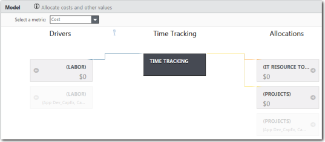
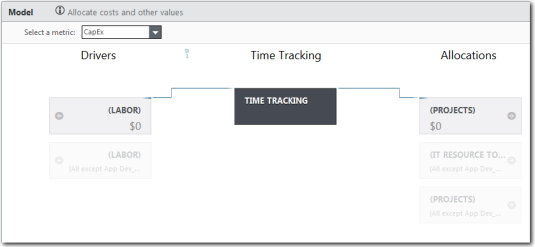

# CTF - Componente de control del tiempo: instalación y configuración

El componente de seguimiento del tiempo utiliza la información sobre proyectos y otros informes de tiempo para asignar costes y proporcionar un análisis más detallado del coste y el esfuerzo de la mano de obra del proyecto. El componente CTF - Seguimiento del tiempo no se instala con el proyecto estándar Costing Standard .

## Antes de empezar

Debe instalar los siguientes componentes antes de instalar el componente Control de Horarios:

- Fuente de costes
- Trabajo

## Acerca de esta tarea

Se aplica a: Costing Standard en TBM Studio 12.0 y posteriores

El componente CTF - Seguimiento del tiempo proporciona información a la dirección y las finanzas de TI en apoyo de las revisiones operativas y estratégicas mensuales, trimestrales y anuales, centrándose en las asignaciones de mano de obra a proyectos y en la asignación más amplia de mano de obra a proyectos y otras actividades operativas.

El componente CTF - Seguimiento del tiempo no se instala con el proyecto estándar Costing Standard .

## Procedimiento

1. Abra el proyecto Costing Standard .
2. Haga clic en la pestaña **Proyecto**.
3. Haga clic en **Componentes** en la cinta de opciones.
4. Haga clic en el componente **CTF - Seguimiento del tiempo**.
5. Haga clic en **Instalar**.

## Seguimiento del tiempo en el modelo

Cuando se instala el componente de Control de Tiempos, éste afecta tanto a la métrica de Costes como a la de CapEx en el modelo. Los modelos se muestran a continuación.

