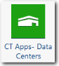
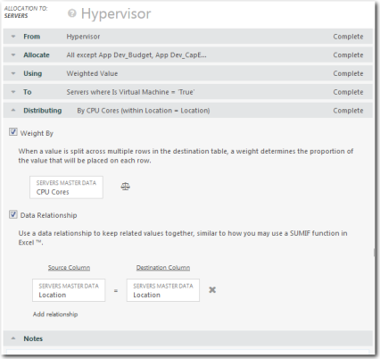

# CT Apps - Componente de centros de datos

El componente de Centros de Datos es un prerrequisito fundamental que es utilizado por el componente de Optimización de Centros de Datos. El componente Centros de Datos no proporciona informes. Proporciona métricas que se exponen en los informes del componente Optimización del centro de datos.

Se aplica a: Costing Standard en TBM Studio 12.0 y posteriores

Icono de componente:

## Cuadros de apoyo

Al instalar el componente CT Apps - Centros de Datos, se crea un nuevo grupo de Centros de Datos con dos tablas: Centros de Datos (tabla modelo), Datos Maestros de Centros de Datos.

## Datos maestros

Para obtener una descripción de los campos de la tabla de datos maestros, consulte la información de la página del componente CT Data Centers del producto. Para visualizar la página:

1. Haga clic en la pestaña **Proyecto** de la cinta de opciones.
2. Haga clic en **Componentes**.
3. Haga clic en el componente **CT Apps - Centros de datos**.

## Cargar los datos

Cargue los datos de su centro de datos. A continuación se enumeran los campos obligatorios y recomendados. Todos los campos pueden asignarse a la tabla Datos maestros de los centros de datos.

- Nivel de certificación (obligatorio)
- ID del centro de datos (obligatorio)
- Capacidad eléctrica del centro de datos (obligatorio)
- Consumo de energía del centro de datos (obligatorio)
- Capacidad RU del centro de datos (necesaria)
- Uso de RU del centro de datos (obligatorio)
- Metros cuadrados del centro de datos (obligatorio)
- Lugar (obligatorio)
- Gestor (recomendado)
- Nombre (obligatorio)
- Objetivo (obligatorio)
- Región (recomendada)
- Proveedor de servicios (recomendado)
- Nivel (obligatorio)

## Mapear los datos

1. Tras cargar los datos de almacenamiento, asigne la tabla a la tabla Datos maestros de dispositivos de almacenamiento y a la tabla Datos maestros de almacenamiento.
2. En el diagrama del modelo, si sigue la asignación de Servidores Físicos haciendo clic en la flecha derecha del objeto Servidor Físico, será redirigido a la vista Modelo Único de Servidores Físicos.
3. Actualice el documento haciendo clic en Actualizar documento en la cinta de opciones. Dado que ahora hay costes asociados a todos los servidores basados en la ubicación desde los centros de datos, se puede ver cómo el valor fluye hacia los hipervisores.
4. Para asignar los nuevos costes del Hipervisor a los Servidores, configure la asignación del Hipervisor al Servidor utilizando la configuración que se muestra en el siguiente ejemplo.

   

## Información relacionada

- [Enviar comentarios sobre el Centro de ayuda](productfeedback@apptio.com "(se abre en una pestaña o una ventana nueva)")
