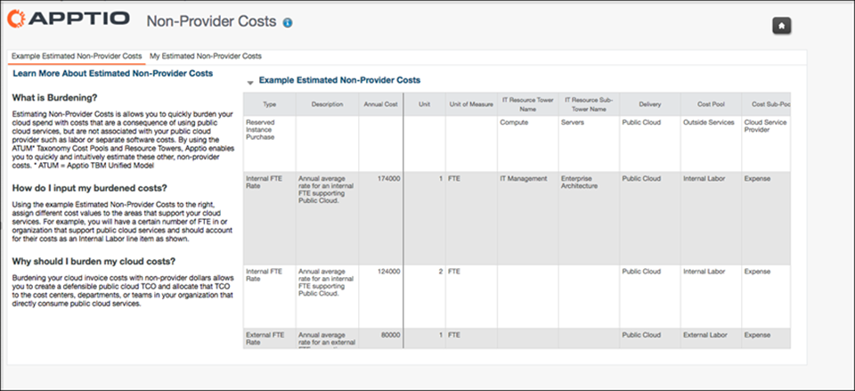

# Introduzca los costes estimados no relacionados con el proveedor

Los costes estimados de no proveedores introducidos manualmente corresponden principalmente a los nuevos clientes de Cloud Cost Management que no han actualizado los datos reales con su libro mayor en Costing Standard. Para cualquiera que tenga Costing Standard, la mejor opción es sacar los costes de los no proveedores de los reales en el modelo de costes Costing Standard . Existe un enlace entre los dos modelos (modelo CT Cost y modelo CCM Cloud Invoice) que permite hacerlo a través del objeto IT Resource Towers.

Se aplica a: Apptio Costing Standard o Apptio Cloud Cost Management ejecutándose en TBM Studio v12.3.3 o posterior.

Cualquier coste en el modelo de Costes que tenga "Is Cloud" configurado en "Yes" en el objeto ITRT y que no esté controlado desde el objeto Cloud Service Provider fluirá hacia el modelo Cloud Invoice y será la fuente de los costes de no-proveedor.

Para introducir los costes estimados de los no proveedores:

1. Conéctese a Apptio y, en la página de inicio, haga clic en **Public Cloud**.
2. En el panel Public Cloud , haga clic en el icono **Costes estimados de no proveedores**.
3. Lea "Más información sobre la estimación de los costes no imputables a los proveedores" para comprender mejor la finalidad y el razonamiento de los costes no imputables a los proveedores. El formato de los datos:

   
4. Para cargar los datos del usuario, en Studio, expanda **Tablas** y, a continuación, haga clic en **Datos maestros de costes públicos**.
5. En la cinta Proyecto, haga clic en **Salida**.
6. En la sección Paso, haga clic en **Añadir**.
7. Añada manualmente el coste cargado, el conjunto de datos que ha creado. Los campos obligatorios:
   - Coste anual o mensual
   - Pool de costes
   - Subcobertura de costes
   - Entrega
   - Descripción
   - Torre de recursos informáticos Nombre
   - Tipo
   - Unidad
   - Unidad de medida
8. Comprueba tus cambios.
9. Para asegurarse de que los datos del usuario se han adjuntado y cargado correctamente, en el informe Costes de no proveedores (Public Cloud > Costes estimados de no proveedores), haga clic en la pestaña **Mis costes estimados de no proveedores** y asegúrese de que los datos cargados aparecen correctamente.

## Información relacionada

- [Enviar comentarios sobre el Centro de ayuda](productfeedback@apptio.com "(se abre en una pestaña o una ventana nueva)")
