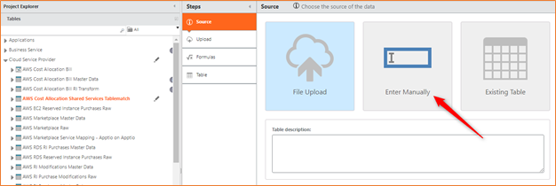

# Identificar los servicios compartidos

Una parte de sus costes de nube podría atribuirse a los servicios de infraestructura de nube pública compartidos entre los departamentos que crean aplicaciones en la nube pública. Un buen ejemplo es el Soporte Empresarial, cuyos costes podrían ser una gran cantidad global que debe asignarse a los servicios en la nube que consumen directamente los equipos y departamentos de su organización. Los costes de estos servicios de infraestructura compartidos pueden asignarse a aquellos servicios que se consumen directamente, garantizando que los costes para los departamentos de aplicaciones tengan en cuenta todos los costes derivados del uso de proveedores de nube pública.

Se aplica a: Apptio Costing Standard o Apptio Cloud Cost Management ejecutándose en TBM Studio v12.3.3 o posterior.

Nota:

Los costes de los servicios compartidos se repartirán entre todos los servicios en nube consumidos directamente y se ponderarán en función del coste de dichos servicios consumidos directamente.

## Visión general

Para imputar esos costes de infraestructura compartidos, debe identificar en su factura de proveedor los costes que son compartidos. Apptio es flexible en cuanto a las columnas de facturación que utiliza para identificar los conjuntos de partidas individuales de facturación que representan servicios compartidos. Por ejemplo, para Enterprise Support, podría identificar servicios compartidos a través de valores en la columna de producto o alguna otra cuenta que cree herramientas de despliegue y entrega que compartan los grupos que crean aplicaciones en la nube pública. En este último caso, identificaría los servicios compartidos a través de los valores de la columna de cuentas.

## Identificación de servicios compartidos

La identificación de servicios compartidos se basa en gran medida en la función Tablematch, que permite buscar valores en una tabla de búsqueda creada por separado utilizando valores de la factura del proveedor de la nube. CBM incluye archivos Tablematch preexistentes para AWS y Azure. CBM utiliza Tablematch para determinar si una partida de facturación se considera un servicio compartido basándose en las columnas y valores que usted proporciona en los archivos Tablematch. Para obtener más información, consulte la definición de la función en [Función TableMatch](../../studio/formulas-and-functions/functions/tablematch.htm "(se abre en una pestaña o una ventana nueva)").

## Asigne los costes de AWS en la Tabla de Servicios Compartidos (Shared Services Tablematch)

Determinar y asignar los costes de los servicios compartidos para AWS :

1. En el explorador de proyectos TBM Studio , expanda la sección **Tablas**.
2. Haga clic en **AWS Coste AllocationShared Servicios Tablamatch**.
3. Pulse **Check Out**.
4. En el área Fuente, haga clic en **Introducir manualmente**.

   
5. Haga clic en **Tabla en blanco**.
6. En el paso Tabla editable, identifique el servicio compartido y, a continuación, establezca IsSelfService en Sí. Puede utilizar las columnas existentes o añadir y eliminar columnas según sea necesario. Por ejemplo, para identificar el Soporte Empresarial como un servicio compartido y asignar los costes a todos los servicios consumidos directamente, realice uno de los siguientes métodos:
   - En **Código de producto**, introduzca " AWS Support Business" (o el término que aparezca para soporte en su factura de asignación de costes de AWS ) y, a continuación, configure **IsSharedService** en Sí.
   - Si una cuenta vinculada específica es responsable de la creación de herramientas de infraestructura compartida, haga clic con el botón derecho del ratón en esa cuenta y añada una nueva columna llamada "LinkedAccountId" a la tabla; a continuación, añada una nueva fila e introduzca el ID de esa cuenta vinculada en la nueva fila en la que el valor de la columna esté establecido en Sí **IsSelfService** valor de la columna sea Sí.
7. Guarde sus cambios.
8. Comprueba tus cambios.

## Asigne los costes de Azure en la Tabla de Servicios Compartidos (Shared Services Tablematch)

Determinar y asignar los costes de los servicios compartidos para Azure :

1. En el explorador de proyectos TBM Studio , expanda la sección **Tablas**.
2. Haga clic en **AzureShared Services Tablematch**.
3. Pulse **Check Out**.
4. En el área Fuente, haga clic en **Introducir manualmente**.
5. Haga clic en **Tabla en blanco**.
6. En el paso Tabla editable, identifique el servicio compartido y, a continuación, establezca **IsSelfService** en Sí. Puede utilizar las columnas existentes o añadir y eliminar columnas según sea necesario. Por ejemplo, para identificar una partida específica de un propietario de cuenta concreto como servicio compartido y asignar esos costes directamente a los servicios consumidos, introduzca el ID de ese propietario de cuenta en el campo **AccountOwnerId** y establezca **IsSharedService** en Sí.
7. Guarde sus cambios.
8. Comprueba tus cambios.

## Información relacionada

- [Enviar comentarios sobre el Centro de ayuda](productfeedback@apptio.com "(se abre en una pestaña o una ventana nueva)")
