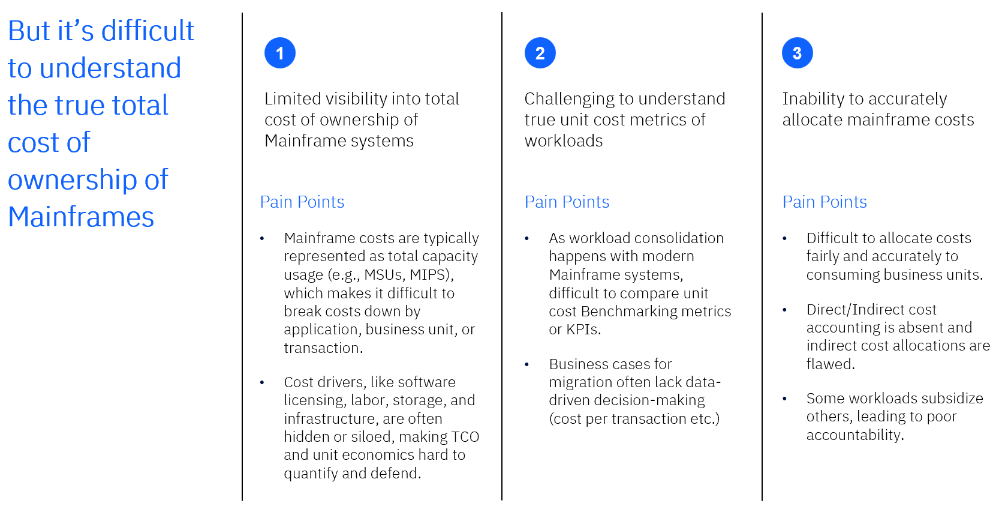
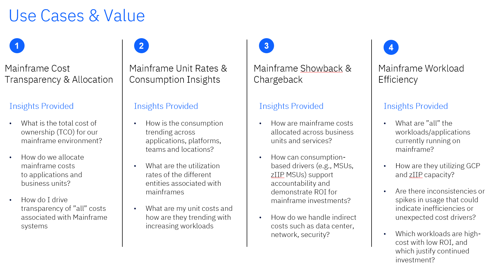

# Guía de configuración del TCO de Mainframe

## Visión general

La solución Mainframe TCO está diseñada para resolver

- Visibilidad limitada del coste total de propiedad.
- Comprender las métricas del coste unitario real de las cargas de trabajo.
- Incapacidad para imputar con precisión los costes del mainframe.

  

Admite los siguientes casos de uso

## Requisitos previos

Los requisitos previos para la solución Mainframe TCO & Usage son:

- IBM Apptio Cálculo de costes Licencia estándar
- IBM Apptio Versión del servidor: R12.11.17 (o superior), Versión Beta - R12.11.16 (o superior)
- Versión de los componentes v120 en Configuración del proyecto.
  - Consulte [esta guía](install-apptio-ibm-costing-old-template.html) para instalar componentes de v120 en proyectos con versiones de componentes anteriores.

## Instalación de componentes

El núcleo de la solución Mainframe TCO & Usage se introduce a través del componente BI- Mainframe Insights. Para los nuevos clientes, también será necesario instalar los componentes típicos, como la fuente de costes, la mano de obra, el proveedor, los activos fijos, las aplicaciones, etc., de acuerdo con la arquitectura general prevista. Los clientes existentes pueden reutilizar los componentes previamente instalados sin necesidad de changes.Before. Para instalar los componentes, consulte la siguiente sección sobre arquitectura para asegurarse de que se tiene debidamente en cuenta si se deben instalar en un proyecto existente o crear un nuevo proyecto para la solución Mainframe TCO & Usage. Lo que sigue es una descripción general de los 4 componentes, en el orden prioritario para considerarlos e instalarlos.

**Configure el objeto Mainframe en el proyecto existente de Transparencia de Costes**. Estos cambios deben realizarse en TBM Studio

1. Vaya al icono Componentes en la pestaña Proyecto e instale el componente BI-Mainframe Insights.

   
2. Instale el componente CT Apps- Aplicaciones.

   

   Nota: Para el componente BI-Mainframe Insights, deben preinstalarse y configurarse dos componentes.
   - CTF-Fuente de coste
   - CTF- Torre IT

   
3. Comprueba los cambios.

## Arquitectura

La línea de asignación del Modelo de Costes describe el coste de las soluciones Mainframe que fluye de Fuente de Costes a Mano de Obra/Proveedor/Activos Fijos/otros grupos de costes a Torres de Recursos TI a Mainframes a Aplicaciones a Servicios de Negocio a Unidad de Negocio. Todas las líneas en gris y punteadas muestran que estos objetos no forman parte de la solución Mainframe TCO.

Flujo de linaje

## Configuraciones

Estos cambios deben realizarse en TBM Studio

**Conjuntos de datos**

1. Cargue los datos recibidos de la herramienta Intellimagic como archivo de entrada en la categoría " **Mainframes** ". Cree una columna " **Ponderación**" utilizando una fórmula personalizada.

   Nota:
   - En Apptio, la ponderación distribuye los costes entre dimensiones como aplicaciones, mano de obra y proveedor. Se basa en: MSU + ( zIIP \* 0.3 ), lo que garantiza un reparto equitativo de los costes en función del uso.
   - Usted tiene la flexibilidad para alterar la fórmula basada en su preferencia de ponderación MSU. En este caso, la ponderación se basa en la suma del 100% del consumo de MSU de GCP y el 30% del consumo de MSU de zIIP.

   
2. Seleccione **Guardar** y Compruebe los cambios.
3. Asigne el conjunto de datos Intellimagic a Mainframe Intellimagic Feed.

   
4. Asigne los campos relevantes del archivo de entrada a la tabla Mainframe Intellimagic Feed como se muestra a continuación.

   
5. Seleccione **Guardar** y Compruebe los cambios.

   Nota: La tabla de alimentación de Mainframe Intellimagic debe revisarse para asegurarse de que está correctamente asignada a la tabla maestra de Mainframe, con todas las transformaciones necesarias creadas a través de formulas.Additionally personalizado. Si se añaden nuevos campos personalizados, también deben incluirse en la asignación en consecuencia.

   

     

   
6. Imputación de costes de la torre de recursos informáticos al mainframe.
   - Seleccione Coste métrico en el menú desplegable Seleccionar una métrica.
   - En el modelo, seleccione **Distribuir** > **Por ponderación** y elija la columna **Ponderación** de los Datos maestros de Mainframe.

     
   - Finalizada la asignación de costes de las torres de recursos informáticos a los mainframes.

     
7. Seleccione Guardar y Compruebe los cambios.
8. Asignación de GCP MSU a Mainframe.
   - En Modelo, seleccione la métrica como GCP MSU y, a continuación, haga clic en el **controlador Añadir unidad**

     
   - Utilice la columna **GCP CPU (Consumo MSU)** para rellenar el controlador y denomine al controlador como **GCP MSU Unit Driver**.

     
   - Seleccione **Guardar** y Compruebe los cambios para rellenar los datos MSU de GCP en el objeto Mainframes.

     

   Nota: Los MSU de GCP son controladores de unidad específicos del objeto Mainframes y sólo deben asignarse desde Mainframe. Esta asignación debe eliminarse manualmente si existe asignación de cualquier otro objeto.

   
9. zIIP Asignación de MSU a Mainframe
   - En el modelo, seleccione la métrica como zIIP MSU y, a continuación, haga clic en el **controlador Add Unit**

     
   - Utilice la columna **zIIP CPU (Consumo MSU)** para rellenar el controlador y nombre el controlador como zIIP MSU Unit Driver.

     
   - Seleccione **Guardar** y Compruebe los cambios para rellenar los datos de zIIP MSU en el objeto Mainframes.

     

     Nota: zIIP MSUs son controladores de unidad que son específicos para Mainframes objeto y deben ser asignados sólo de Mainframe. Esta asignación debe eliminarse manualmente si existe asignación de cualquier otro objeto.

     
10. Imputación de costes de Mainframe a Aplicación.
    - Seleccione Metric Cost y, a continuación, seleccione las métricas GCP MSU y zIIP MSU.
    - Haga clic en la opción **Añadir asignación** y elija el objeto **Aplicaciones** como destino.

      
    - En la sección Distribución, seleccione la casilla de verificación Relación de datos y, a continuación, asigne el origen y el destino por ID de aplicación.

      
    - Seleccione **Guardar** y Compruebe los cambios.

## Informes

El componente Mainframe tiene cuatro informes listos para usar.

- **TCO de mainframe**
  - Visión completa del coste total y el consumo combinando los costes y GCP/zIIP MSUs en una sola pantalla.
  - Comprenda las tendencias de costes y uso a lo largo del tiempo y compárelas con los volúmenes de negocio y los costes unitarios transaccionales para identificar ineficiencias y anomalías.
  - Desglose los principales factores de coste en mano de obra, proveedores y aplicaciones, incluido el gasto por función, tipo de proveedor y objetivo de inversión en aplicaciones.
  - Para obtener más detalles sobre la aplicación seleccionada, en la pestaña "Aplicación" hay disponible un informe de perforación.
  - El informe de perforación tiene dos pestañas
    - **Coste** : Comparación entre Coste y Consumo en función de la categoría seleccionada, mensualmente se muestran en detalle para la aplicación seleccionada.
    - **Unit Metric:** Muestra los antecedentes detallados de la aplicación seleccionada como "Familia de aplicaciones", "Objetivo de inversión", etc. junto con la comparación de dos métricas de negocio a lo largo de meses.

    
- **Análisis de Mainframe**
  - Visualice los costes y el consumo del mainframe en un formato de tabla flexible utilizando filtros y dimensiones opcionales, métricas y tiempo.
  - Vea el consumo tanto de GCP como de zIIP MSU y compare los distintos tipos de procesamiento de cargas de trabajo.
  - Analizar las tendencias en varios periodos de tiempo: mensual, trimestral o según sea necesario para la elaboración de informes.

  
- **Uso del Mainframe**
  - Vea las tendencias de consumo de MSU por categoría de carga de trabajo, lo que ayuda a los usuarios a realizar un seguimiento del uso en diferentes tipos de procesamiento.
  - Realice un seguimiento del uso por tipo de carga de trabajo, nombre de la línea de productos, nombre del producto y nombre de la aplicación.
  - Supervise el consumo mensual de MSU con resúmenes condicionales que identifican los cambios significativos de un mes a otro.
  - Las perspectivas intertrimestral e interanual ayudan a comprender las tendencias del consumo a largo plazo.

  
- **Modelo Mainframe**
  - Visualice el flujo de costes de principio a fin en el modelo de costes.
  - Rastree los generadores de costes subyacentes que alimentan el procesador del ordenador central, incluidos los costes directos del libro mayor (por ejemplo, la depreciación), así como los costes de mano de obra y de proveedores.
  - Visualice cómo los datos de uso impulsan la asignación del TCO del mainframe a las aplicaciones empresariales.

  
