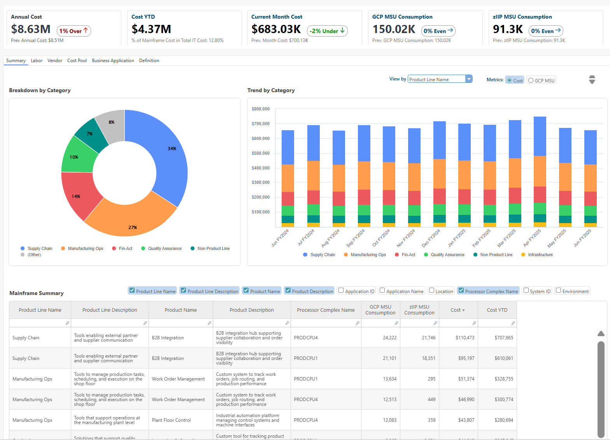
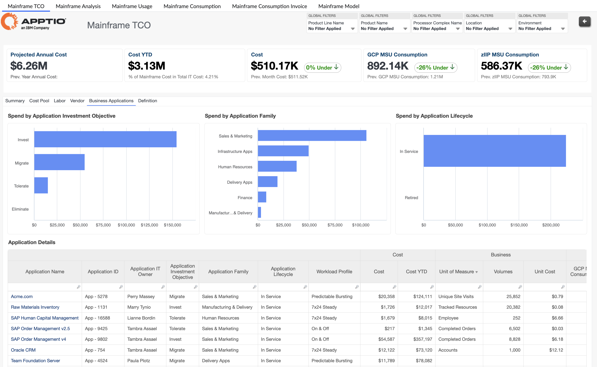
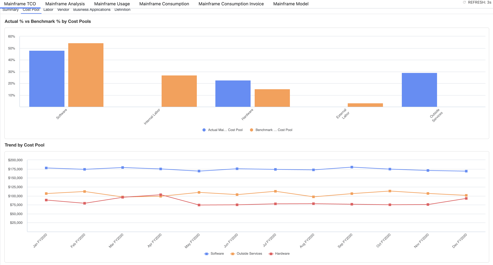
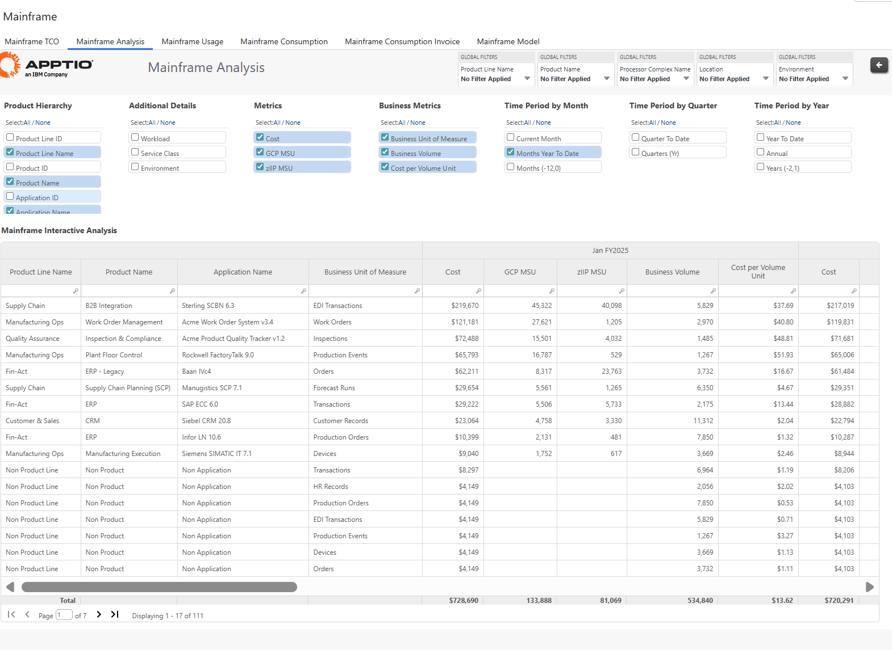
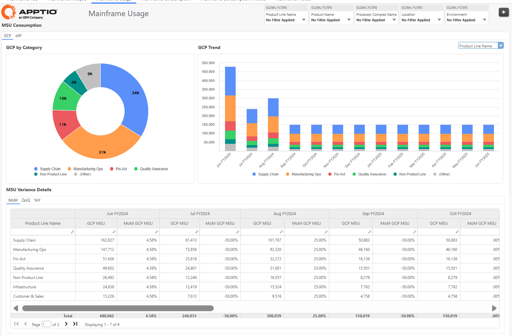
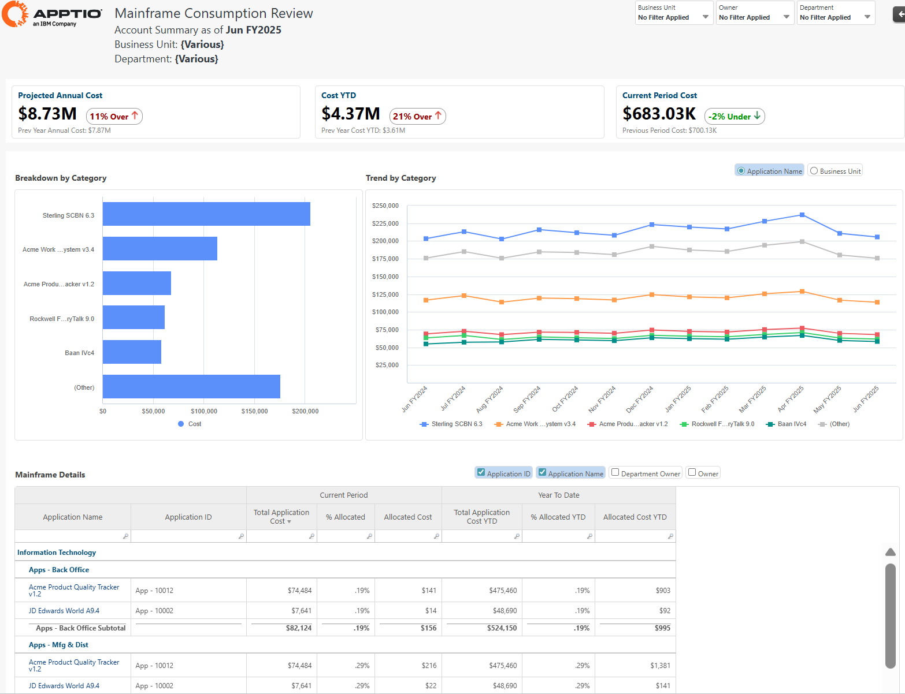
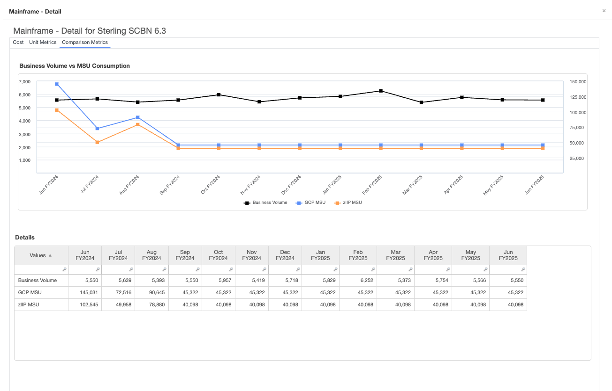
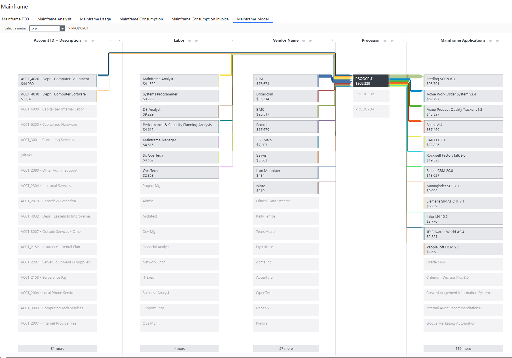

# IBM Apptio Solución Mainframe TCO

## Visión general

Los mainframes siguen desempeñando un papel vital en las operaciones empresariales y se adaptan bien a las cargas de trabajo modernas. Cuando se trata de cargas de trabajo con muchas transacciones, los mainframes siguen siendo la opción preferida por su fiabilidad, eficacia y seguridad.

## Solución

**IBM Apptio TCO de mainframe**

Para maximizar el valor empresarial de sus entornos mainframe, es crucial comprender el coste total de propiedad y la utilización precisa. Esta solución proporciona una visión clara y defendible de los costes del mainframe, lo que permite una asignación precisa de los costes, un seguimiento exhaustivo de la utilización y una toma de decisiones basada en datos.

- **Transparencia de costes y asignación**Obtenga una visión completa del coste total de propiedad del mainframe con el coste por MSU, el uso de GCP/zIIP y el gasto por aplicación o carga de trabajo para respaldar una asignación e informes precisos.
- ****Cost Pool Composition & Peer Comparison****Este informe proporciona un desglose detallado del coste total de propiedad de su mainframe en los principales grupos de costes, que incluyen hardware, software, mano de obra, instalaciones y servicios externos.
- **Unit Rates & Consumption Insights**Realice un seguimiento de las tendencias de GCP y zIIP MSU para detectar la infrautilización, detectar anomalías e identificar patrones para optimizar la utilización de los recursos del mainframe.
- **Showback & Chargeback**Asigne los costes según el uso real y proporcione vistas claras y defendibles a las unidades de negocio.
- **Eficiencia de la carga de trabajo**Vea lo que se está ejecutando en su mainframe, identifique las cargas de trabajo redundantes y reasígnelas o retírelas para optimizar los recursos y mejorar la eficiencia.

## Transparencia y asignación de costes - TCO

**Principales ventajas**  

- Vista completa del coste total y el consumo combinando costes, GCP/zIIP MSU y costes unitarios calculados en una sola pantalla.
- Comprenda las tendencias de costes y uso a lo largo del tiempo y compárelas con los volúmenes de negocio y los costes unitarios transaccionales para identificar ineficiencias y anomalías.
- Desglose los principales generadores de costes por mano de obra, proveedores y aplicaciones, incluido el gasto por mano de obra, proveedor y aplicación.

## Composición del grupo de costes y comparación

**Principales ventajas**  

- Proporciona un desglose detallado del coste total de propiedad del mainframe en los principales grupos de costes, que incluyen hardware, software, mano de obra, instalaciones y servicios externos.
- Los porcentajes de referencia se superponen para resaltar cómo se compara su estructura de costes con las normas del sector.
- Esta información le ayudará a identificar posibles áreas de optimización de costes, validar hipótesis presupuestarias y respaldar iniciativas estratégicas de mejora.

## Transparencia e imputación de costes - Costes unitarios y consumo

**Principales ventajas**  

- Visualice los costes y el consumo del mainframe en un formato de tabla flexible utilizando filtros y dimensiones opcionales, métricas y tiempo.
- Vea el consumo tanto de GCP como de zIIP MSU y compare los distintos tipos de procesamiento de cargas de trabajo.
- Analizar las tendencias en varios periodos de tiempo: mensual, trimestral o según sea necesario para la elaboración de informes.
- Exporte datos para su posterior análisis en otras herramientas o cuadros de mando.

## Utilización del Mainframe

**Principales ventajas**  

- Vea las tendencias de consumo de MSU por categoría de carga de trabajo, lo que ayuda a los usuarios a realizar un seguimiento del uso en diferentes tipos de procesamiento.
- Realice un seguimiento del uso por tipo de carga de trabajo, nombre de la línea de productos, nombre del producto y nombre de la aplicación.
- Supervise el consumo mensual de MSU con resúmenes condicionales que identifican los cambios significativos de un mes a otro.
- Las perspectivas intertrimestral e interanual ayudan a comprender las tendencias del consumo a largo plazo.

## Showback y chargeback de mainframe

**Principales ventajas**  

- Conecte el uso del mainframe con los costes por aplicación, carga de trabajo o unidad de negocio.
- Asegúrese de que la asignación de costes refleja el consumo real con los datos de IBM IntelliMagic Vision.
- Ofrezca a las unidades de negocio vistas claras y defendibles de las devoluciones y los cargos.
- Haga que los debates sobre costes sean productivos basándolos en datos

## Perspectivas de utilización y eficiencia del mainframe

**Principales ventajas**  

- Identifique las eficiencias del mainframe mediante perspectivas de utilización a nivel de carga de trabajo que revelan patrones, picos y capacidad infrautilizada para tomar decisiones de planificación y uso más inteligentes.
- Realice un seguimiento de todas las cargas de trabajo y aplicaciones actualmente activas en el mainframe, junto con su consumo de MSU.
- Realice un seguimiento de las tendencias de consumo por tipo de carga de trabajo, línea de productos y aplicación para identificar ineficiencias.
- Seguimiento de los picos de carga de trabajo e identificación de oportunidades para mejorar la eficiencia operativa.

## Mainframe TCO - Vista Modelo

**Principales ventajas**  

- Visualice el flujo de costes de principio a fin en el modelo de costes.
- Rastree los generadores de costes subyacentes que alimentan el procesador del mainframe, incluidos los costes directos del libro mayor (por ejemplo, la depreciación), así como los costes de mano de obra y de proveedores.
- Visualice cómo los datos de uso impulsan la asignación del TCO del mainframe a las aplicaciones empresariales.

