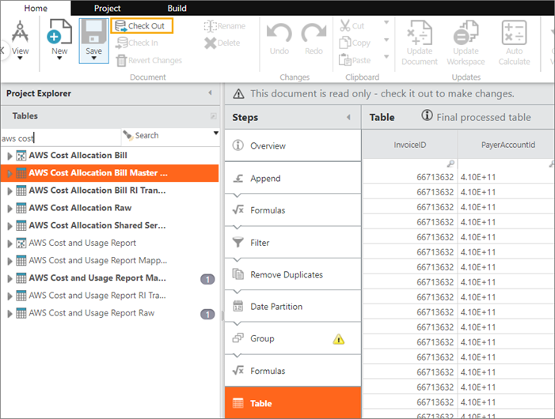

# Asigne las etiquetas AWS al esquema Apptio

Este artículo le ayudará a asignar las etiquetas de asignación de costes de AWS a su esquema Apptio. Las etiquetas de asignación de costes le ayudan a clasificar y seguir sus costes en AWS.

Cuando aplica etiquetas a sus recursos de AWS (como las instancias de Amazon EC2 o los buckets de Amazon S3 ) y activa las etiquetas, AWS genera un informe de asignación de costes como valor separado por comas (archivo CSV) con su uso y costes agregados por sus etiquetas activas. Puede aplicar etiquetas que representen categorías empresariales (como centros de costes, nombres de aplicaciones o propietarios) para organizar sus costes en varios servicios.

Se aplica a: Apptio Costing Standard en TBM Studio 12.3.3 y posteriores

## Acerca de esta tarea

Los siguientes recursos de AWS proporcionan información general sobre las etiquetas:

- [¿Qué es una etiqueta?](https://docs.aws.amazon.com/awsaccountbilling/latest/aboutv2/billing-what-is.html "(se abre en una pestaña o una ventana nueva)")
- [Etiqueta Restricciones](https://docs.aws.amazon.com/awsaccountbilling/latest/aboutv2/allocation-tag-restrictions.html "(se abre en una pestaña o una ventana nueva)")
- [Configuración del informe mensual de imputación de costes](https://docs.aws.amazon.com/awsaccountbilling/latest/aboutv2/configurecostallocreport.html "(se abre en una pestaña o una ventana nueva)")
- [AWS Facturación](https://docs.aws.amazon.com/awsaccountbilling/latest/aboutv2/cost-alloc-tags.html "(se abre en una pestaña o una ventana nueva)") y gestión de costes (Este sitio también proporciona un archivo.pdf con información sobre la facturación y la gestión de costes de Amazon)

Etiquetas recomendadas

No todas las etiquetas AWS son necesarias para Apptio. Se recomienda la siguiente lista como guía para los datos que serán importantes en su aplicación de Costing Standard .

| **Etiqueta** | **Descripción** | **Valor en Apptio** |
| --- | --- | --- |
| Nombre de aplicación | Nombre de la aplicación soportada por el recurso etiquetado | - Proporcionar análisis que ayuden a comprender el gasto en nube de las aplicaciones que consumen servicios en nube - Asignar gastos a aplicaciones para calcular el coste total de propiedad |
| Entorno de aplicación (producción, desarrollo, pruebas, RD) | Entorno soportado por el recurso etiquetado | Proporcionar análisis que ayuden a comprender el gasto en nube por entorno de aplicación creado en servicios en nube |
| Nivel de aplicación (servidor web, lógica empresarial, base de datos) | Nivel de aplicación del recurso etiquetado | Proporcionar análisis que ayuden a comprender el gasto en la nube por niveles de aplicaciones creadas en servicios en la nube |
| Centro de costes | Centro de costes responsable del funcionamiento del recurso etiquetado | - Proporcionar análisis para ayudar a comprender el gasto en nube por centro de coste que consume servicios en nube - Asignar y mostrar los gastos a los clientes de TI |
| Propietario del sistema | Persona responsable del funcionamiento del recurso etiquetado | - Proporcionar análisis para ayudar a comprender el gasto en nube por centro de coste que consume servicios en nube - Asignar y mostrar los gastos a los clientes de TI |
| Proyecto | Proyecto asociado al recurso etiquetado | - Proporcionar análisis para ayudar a comprender el gasto en nube por proyecto de coste que impulsa los servicios en nube - Asignar gastos a proyectos informáticos |

## Para el informe mensual de asignación de costes

### Procedimiento

1. Navegue hasta TBM Studio.
2. Seleccione **AWS Cost Allocation Bill Master Data** y compruébelo.

   
3. En la cadena de transformación, haga clic en el paso **Append** y, a continuación, en **Edit** en AWS Cost Allocation Raw.

   Se abrirá un cuadro de diálogo que le permitirá asignar columnas de la tabla AWS Cost Allocation Raw a la tabla Apptio AWS Cost Allocation Bill Master Data.
4. Complete las asignaciones para las siguientes columnas que sean relevantes para las etiquetas AWS de su organización y la estructura de pagador/cuenta vinculada:

   **IMPORTANTE Asegúrese de hacer clic en **Guardar después de** completar las asignaciones.**
   - Unidad de negocio (por defecto es Cuenta de pagador)
   - Departamento (por defecto, cuenta vinculada)
   - Equipo
   - Propietario del sistema
   - Centro de costes
   - Aplicación
   - Entorno
   - Proyecto
   - Finalidad
5. Haz clic en **Guardar** y, a continuación, comprueba tu trabajo.
