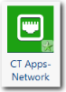

# CT Apps - Componente Dispositivos de red

El componente Dispositivos de red forma parte del módulo Aplicaciones y servicios de Costing Standard . Se utiliza para asignar los costes de infraestructura de los dispositivos de red, incluyendo LAN, WAN, voz y otros equipos de red utilizados en el centro de datos y en las oficinas a los consumidores de los dispositivos de red.

Se aplica a: Costing Standard en TBM Studio 12.0 y posteriores

Icono de componente:

## Introducción

El componente Dispositivos de red instala un nuevo objeto, conjuntos de datos y estrategias de asignación recomendadas para repartir los costes de los Dispositivos de red entre los siguientes servicios típicos:

- Mainframe: para equipos de red que soportan los mainframes en los centros de datos de las empresas
- Servidores físicos: para los equipos de red que dan soporte a los servidores en los centros de datos de las empresas
- Dispositivos de almacenamiento: para equipos de red que soportan el almacenamiento en los centros de datos de las empresas
- Dispositivos de usuario final: para equipos de red que admiten conexiones físicas e inalámbricas a ordenadores personales, portátiles y dispositivos móviles en las oficinas

## Cuadros de apoyo

Al instalar el componente CT Apps - Dispositivos de red, se crea un nuevo grupo Dispositivos de red con dos tablas: Dispositivos de red (tabla modelo), Datos maestros de dispositivos de red.

## Datos maestros

Para obtener una descripción de los campos de la tabla de datos maestros, consulte la información de la página del componente CT Apps - Dispositivos de red del producto. Para visualizar la página:

1. Haga clic en la pestaña **Proyecto** de la cinta de opciones.
2. Haga clic en **Componentes**.
3. Haga clic en el componente **CT Apps - Dispositivos de red**.

## Cargar los datos

Carga los datos de tus dispositivos de red. A continuación se enumeran los campos obligatorios y recomendados. Todos los campos pueden asignarse a la tabla Datos maestros de dispositivos de red.

- Recuento de dispositivos (obligatorio)
- Tipo de dispositivo (obligatorio)
- Ubicación (recomendada)
- Tipo de ubicación (obligatorio)
- Dispositivos de red\_Dispositivos de almacenamiento (obligatorio)
- Identificador de objeto (obligatorio)
- ID de servicio (recomendado)
- Nombre del servicio (recomendado)

## Mapear los datos

Después de cargar los datos de los dispositivos de red, asigne la tabla a la tabla Datos maestros de dispositivos de red.

Después de mapear los datos, debería haber valor asignado de Torres de Recursos IT y Centros de Datos a Dispositivos de Red, y de Dispositivos de Red a Servidor Físico, Dispositivos de Almacenamiento, Dispositivos de Usuario Final y Mainframes en el modelo de Costes.

## Información relacionada

- [Enviar comentarios sobre el Centro de ayuda](productfeedback@apptio.com "(se abre en una pestaña o una ventana nueva)")
