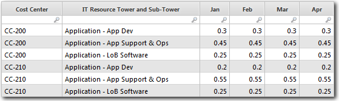

# Rellenar la tabla Fuente de costes en datos maestros de recursos de TI

Para rellenar la tabla Fuente de costes a datos maestros de recursos de TI, cargue una tabla de datos que defina el porcentaje de los otros costes a asignar a cada centro de coste. Después de crear la tabla, asígnela a la tabla Fuente de costes a datos maestros de recursos de TI.

Se aplica a: Costing Standard en TBM Studio 12.0 y posteriores

## Introducción

Utilice la tabla Otros Pools de Costes para asignar cualquier valor no asignado a Mano de Obra o Activos Fijos a las Torres y Sub-Torres de Recursos IT. Para ello, tendrá que:

- Asigne sus centros de coste a las torres y subtorres de TI.
- Defina una asignación porcentual real si un centro de costes se asigna a varias torres y subtorres de TI.
- Defina una asignación porcentual presupuestada si un centro de costes se asigna a varias torres y subtorres de TI.

La tabla Fuente de costes a datos maestros de recursos de TI define los datos necesarios para "iluminar" los informes relacionados con costes y presupuestos. Para rellenar la tabla, debe cargar un conjunto de datos que defina el porcentaje de los otros costes a asignar a cada centro de coste. Después de crear la tabla, asígnela a la tabla Fuente de costes a datos maestros de recursos de TI. A continuación se muestra una tabla de ejemplo.

## Fuentes de datos habituales

Las cifras de los centros de coste suelen extraerse de aplicaciones como Oracle, SAP, Lawson y Cognos Financial Statement Reporting. Los datos que utilice determinarán el nivel de detalle disponible y las columnas que asignará a la tabla Fuente de costes a datos maestros de recursos de TI.

## Una carga

Normalmente, se carga una única tabla de datos que se anexa a la tabla Fuente de costes a datos maestros de recursos TI y a la tabla Datos maestros de torres de recursos TI. La tabla de datos debe contener campos que puedan asignarse a los campos correspondientes de las tablas de datos maestros.

## Campos obligatorios y recomendados

A continuación se enumeran los campos obligatorios y recomendados necesarios para iluminar las tablas de datos maestros.

Fuente de costes a datos maestros de recursos de TI

- % Asignado (obligatorio)
- Centro de costes (obligatorio)
- Torre y subtorre de recursos informáticos (obligatorio)
- Previsto % Asignado (recomendado)

Datos maestros de las torres de recursos informáticos

- Nombre de la subpotencia de recursos informáticos (obligatorio)
- Nombre de la torre de recursos informáticos (obligatorio)
- Propietario de la torre de recursos de TI (obligatorio)
- Cantidad de torres de recursos informáticos (obligatorio)
- Unidad de medida (obligatorio)

## Información relacionada

- [Enviar comentarios sobre el Centro de ayuda](productfeedback@apptio.com "(se abre en una pestaña o una ventana nueva)")
