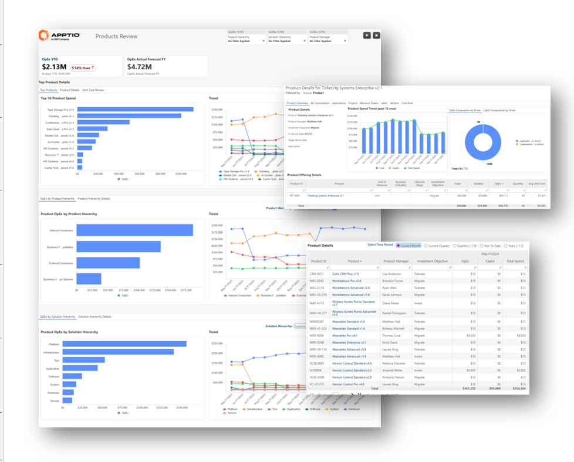
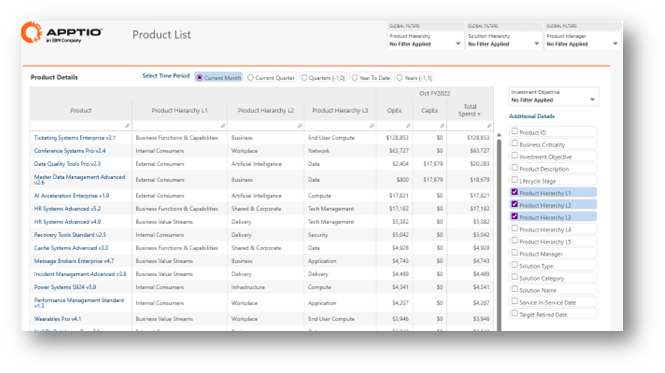
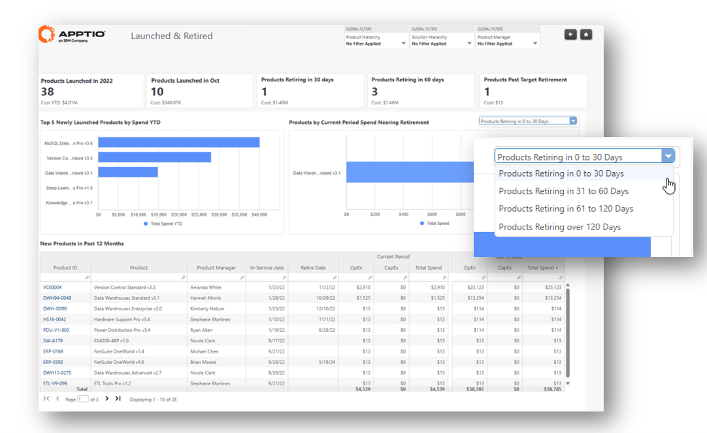
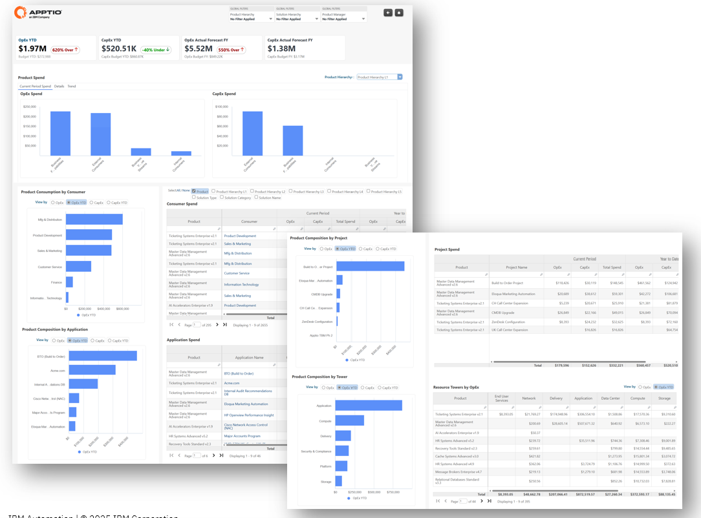
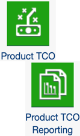
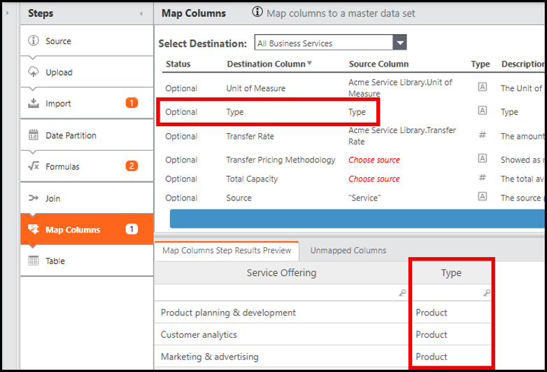
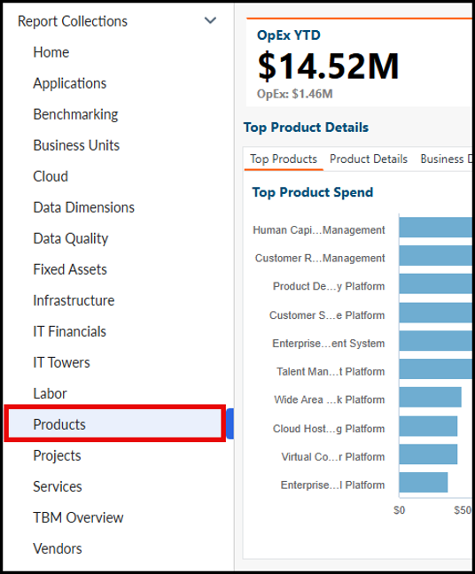

# IBM Apptio Solución TCO de producto

Las organizaciones han empezado a utilizar el enfoque basado en el producto y están pensando cómo planificar, financiar y medir el valor de las inversiones en tecnología. Este cambio representa un nuevo modelo de prestación que requiere

- Clara visibilidad del resultado del producto.
- Nuevas prácticas de gobernanza financiera.
- Comprensión compartida de cómo los productos crecen y mejoran con el tiempo.

## Visión general

IBM Apptio El TCO de producto es una solución específica diseñada para ofrecer una visión clara y defendible de los costes y la composición de los productos. Esta solución ofrece visibilidad de principio a fin a lo largo de todo el ciclo de vida del producto. Al integrar datos financieros y operativos, proporciona una visión única centrada en el producto, conectando OpEx, CapEx, y los impulsores de costes entre consumidores, aplicaciones y proyectos.

Con esta solución puedes:

- Realice un seguimiento continuo de los costes de los productos para eliminar el despilfarro y mejorar la presupuestación.
- Gestione los recursos en cada fase del ciclo de vida para pasar del mantenimiento al crecimiento.
- Cree vistas de cartera para que cada parte interesada obtenga información que le permita tomar decisiones más rápidamente.

## Solución

Product TCO admite tanto los modelos de entrega basados en productos como los híbridos, proporcionando la transparencia y el control de productos necesarios para gestionar eficazmente las transiciones organizativas. Al vincular directamente las finanzas con los productos finales, los directivos pueden optimizar las inversiones en productos, gestionar los ciclos de vida de los productos con información basada en datos y tomar decisiones informadas sobre la hoja de ruta. Como resultado, las organizaciones obtienen mejoras cuantificables en la rentabilidad de los productos, lo que refuerza la alineación entre las inversiones en productos y los resultados estratégicos.

- **Product Cost & Driver Visibility**  
  Al automatizar la asignación de OpEx y CapEx a los productos, las organizaciones pueden comprender claramente cómo los costes de las distintas dimensiones, incluidos los consumidores, las aplicaciones, los proyectos y otras áreas, repercuten directamente en el nivel de producto. Esto permite un seguimiento continuo de los costes de los productos, lo que permite a las organizaciones eliminar el despilfarro y mejorar la elaboración de presupuestos.  
  El informe responde a preguntas críticas como:
  - ¿Cuál es el coste total del producto X en este periodo?
  - ¿Dónde tenemos desviaciones presupuestarias?
  - ¿Qué proyectos apoyan directamente qué productos?
  - ¿Cuál es la composición de mis recursos laborales?
  - ¿Qué proveedores repercuten en mi producto con los costes más elevados?

- **Ciclo de vida de los productos y gestión de inversiones**

  Para optimizar el rendimiento y la inversión en productos, es esencial gestionar los recursos y las inversiones en cada fase del ciclo de vida del producto, desde su lanzamiento hasta su retirada. Obtenga una instantánea completa de su cartera de productos para identificar los productos nuevos, los que están envejeciendo o los que están a punto de retirarse. Alinee OpEx y CapEx con cada fase del ciclo de vida para evitar invertir demasiado en productos obsoletos e invertir poco en productos que impulsen el crecimiento del negocio.

  Con esta información, las organizaciones pueden tomar decisiones informadas para optimizar sus carteras de productos, asegurándose de que siguen siendo relevantes y estratégicamente alineados con sus prioridades de negocio.

    
  El informe responde a preguntas críticas como:
  - ¿Qué productos se acercan a la fecha prevista de jubilación?
  - ¿Se ajustan los costes del producto OpEx / CapEx a la fase del ciclo de vida?
  - ¿Cómo podemos reorientar nuestro gasto para minimizar los costes de mantenimiento de los productos?
  - ¿Me queda algún coste o componente asociado al producto que voy a retirar?
  - ¿Se han asignado costes a los productos retirados y cuáles son sus fuentes?

- **Jerarquías de cartera personalizables**

  Las organizaciones crean vistas de cartera para cada parte interesada con el fin de proporcionar información que permita tomar decisiones más rápidamente. Agrupan los productos en una jerarquía personalizable de cuatro niveles y en la taxonomía estandarizada de soluciones de TBM, lo que facilita la comparación y el análisis entre diferentes vistas de cartera y modelos de entrega. Con estos conocimientos,
  - Los líderes pueden determinar qué familias de productos dominan el gasto
  - Pueden decidir dónde asignar los fondos.
  - Pueden analizar cómo se alinean las carteras con la estrategia de la organización.

    
  El informe responde a preguntas críticas como:
  - ¿Cómo se integra el producto X en la jerarquía de nuestra organización frente a la taxonomía TBM?
  - ¿Dónde tenemos productos duplicados?
  - ¿Qué productos de la cartera merecen más financiación?

## Cómo empezar

1. Vaya al icono Componentes en la pestaña **Proyecto** e instale **el TCO del producto** y **los informes de TCO del producto**.

   
2. Para clasificar los registros de ofertas como productos, elija la opción **Todos los servicios empresariales** de la lista **Seleccionar destino** y seleccione **Tipo** como **producto** en la columna **Oferta de servicios**.

   
3. Para revisar los informes, despliegue el menú **Colecciones de informes** y seleccione **Producto**.

   
