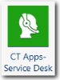

# CT Apps - Componente Service Desk

El componente Service Desk es un requisito previo que utiliza el componente Service Desk Insights. El componente Service Desk no proporciona nuevos informes, sino que se utiliza para crear métricas que se exponen en el componente Service Desk Insights.

Se aplica a: Costing Standard en TBM Studio 12.0 y posteriores

Icono de componente

## Mesas de apoyo

Al instalar el componente CT Apps - Service Desk, se crea un nuevo grupo Service Desk con dos tablas: Tickets (tabla modelo), Datos maestros de Tickets.

## Datos maestros

Para obtener una descripción de los campos de la tabla de datos maestros, consulte la información de la página del componente CT Apps - Service Desk del producto. Para visualizar la página:

1. Haga clic en la pestaña **Proyecto** de la cinta de opciones.
2. Haga clic en **Componentes**.
3. Haga clic en el componente **CT Apps - Service Desk**.

## Cargar los datos

Cargue los datos de su servicio de asistencia. A continuación se enumeran los campos obligatorios y recomendados. Todos los campos pueden asignarse a la tabla de datos maestros de entradas.

- ID de la aplicación (recomendado)
- Asignado a (recomendado)
- Categoría (obligatorio)
- Hora de cierre (obligatorio)
- Cerrado (recomendado)
- Descripción (recomendada)
- Duración (recomendada)
- Impacto (recomendado)
- Ubicación (recomendada)
- Hora de apertura (obligatoria)
- Prioridad (obligatorio)
- Peso prioritario (obligatorio)
- Reportado por (recomendado)
- Servicio (recomendado)
- Gravedad (recomendada)
- Estado (obligatorio)
- Ticket ID (obligatorio)
- Tipo (obligatorio)
- Ponderación (obligatoria)

## Mapear los datos

Tras cargar los datos de la mesa de servicio, asigne la tabla a la tabla de datos maestros de la mesa de servicio.

Después de asignar los datos, debería haber un valor asignado de las Torres de Recursos de TI a los Tickets en el modelo de Costes.

## Información relacionada

- [Enviar comentarios sobre el Centro de ayuda](productfeedback@apptio.com "(se abre en una pestaña o una ventana nueva)")
