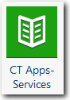

# CT Apps - Componente de servicios

El componente CT Apps - Servicios proporciona información sobre el gasto de TI en servicios empresariales, incluidos los cambios mensuales en el gasto y el rendimiento con respecto al plan.

Se aplica a: Costing Standard en TBM Studio 12.0 y posteriores

Icono de componente

## Mesas de apoyo

Al instalar el componente CT Apps - Servicios, se crea un nuevo grupo de Servicios Empresariales con tres tablas: Servicios empresariales (tabla modelo), Todos los servicios empresariales, Lista de referencia de todos los servicios empresariales.

La tabla All Business Services Reference List incluye una lista de tipos de servicios (e. g.: Business Application Services, End User Services, etc.) y las distintas categorías de servicios asociadas a cada tipo de servicio. No debe modificar esta tabla.

## Datos obligatorios y recomendados

No existe una tabla maestra para el componente CT Apps - Servicios. Sin embargo, la tabla Todos los servicios empresariales cumple una función similar.

A continuación se enumeran los campos obligatorios y recomendados. Todos los campos pueden asignarse a la tabla Todos los servicios empresariales.

- Descripción (recomendada)
- Etapa del ciclo de vida (recomendada)
- Objetivo (recomendado)
- Cantidad (recomendada)
- .PK (obligatorio)
- Tipo de asignación (recomendado)
- Comprobar SAD (obligatorio)
- Categoría de servicio (recomendada)
- Recuento de servicios (obligatorio)
- ID de servicio (obligatorio)
- Nombre del servicio (obligatorio)
- Oferta de servicios (recomendada)
- Propietario del servicio (recomendado)
- Tipo de servicio (recomendado)
- Tipo (obligatorio)
- Unidad de medida (recomendada)

## Información relacionada

- [Enviar comentarios sobre el Centro de ayuda](productfeedback@apptio.com "(se abre en una pestaña o una ventana nueva)")
