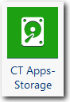

# CT Apps - Componente de almacenamiento

El componente Almacenamiento es un componente básico que utiliza el componente Storage Insights. El componente Almacenamiento no proporciona nuevos informes, sino que se utiliza para crear métricas que se exponen en el componente Storage Insights.

Icono de componente:

## Cuadros de apoyo

Al instalar el componente CT Apps - Almacenamiento, se crean dos nuevos grupos con dos tablas cada uno:

- Almacenamiento
- Almacenamiento (tabla de modelos)
- Datos maestros de almacenamiento
- Dispositivos de almacenamiento
- Dispositivos de almacenamiento (tabla de modelos)
- Dispositivos de almacenamiento Datos maestros

La tabla Datos maestros de dispositivos de almacenamiento incluye información sobre los dispositivos físicos de almacenamiento.

La tabla Datos maestros de almacenamiento incluye los LUN (números de unidad lógica) asociados a los dispositivos físicos de almacenamiento.

## Datos maestros

Para obtener una descripción de los campos de la tabla de datos maestros, consulte la información de la página del componente Almacenamiento CT del producto. Para visualizar la página:

1. Haga clic en la pestaña **Proyecto** de la cinta de opciones.
2. Haga clic en **Componentes**.
3. Haga clic en el componente **CT Apps - Almacenamiento**.

## Cargar los datos

Cargue los datos de su centro de datos. A continuación se enumeran los campos obligatorios y recomendados. Todos los campos pueden asignarse a la tabla Datos maestros de almacenamiento o a la tabla Datos maestros de dispositivos de almacenamiento.

- Unidades reales (obligatorias)
- Unidades presupuestadas (recomendadas)
- Fecha de compra (recomendada)
- Medio ambiente (obligatorio)
- Lugar (obligatorio)
- Plataforma (obligatorio)
- Objetivo (obligatorio)
- ID de servidor (obligatorio)
- Abastecimiento (obligatorio)
- ID del dispositivo de almacenamiento (obligatorio)
- Nivel (obligatorio)
- Espacio total (obligatorio)
- Tipo (obligatorio)

## Mapear los datos

Tras cargar los datos de almacenamiento, asigne la tabla a la tabla Datos maestros de dispositivos de almacenamiento.

## Información relacionada

- [Enviar comentarios sobre el Centro de ayuda](productfeedback@apptio.com "(se abre en una pestaña o una ventana nueva)")
