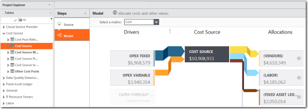

# Validar las asignaciones del modelo

Utilice la vista de tabla del modelo para validar el flujo de valor en un modelo. Una vez cargados y asignados los datos de origen a la tabla de datos maestros correspondiente, sus tablas modeladas asociadas deberían empezar a mostrar tanto los controladores de unidades como las asignaciones.

Se aplica a: Costing Standard en TBM Studio 12.0 y posteriores

## Demostraciones

Vea estos vídeos de demostración:

- [TBM Studio Configuración de la asignación](https://community.apptio.com/videos/2038 "(se abre en una pestaña o una ventana nueva)")
- [Vídeo: Mejoras de usabilidad del modelador en la versión 12.4.1](https://community.apptio.com/videos/1953 "(se abre en una pestaña o una ventana nueva)")

Consulta el [catálogo completo de vídeos de productos Apptio](https://community.apptio.com/docs/DOC-7714 "(se abre en una pestaña o una ventana nueva)")

## Mesas modeladas

Una tabla modelada Costing Standard es una tabla a la que se ha añadido un paso Modelo. La tabla modelada es una transformación de una tabla de datos maestros. Por ejemplo, la tabla Fuente de costes es una transformación de la tabla Datos maestros de la fuente de costes. No se pueden añadir pasos adicionales del proceso de transformación a las tablas modeladas en Costing Standard . Los únicos pasos de transformación que se muestran para las tablas modeladas son **Origen** y **Modelo**.

## Diagrama de asignación de controladores

Si hace clic en una tabla modelo en **el Explorador de proyectos** y, a continuación, en el paso Modelo del canal de transformación, aparecerá un diagrama de asignación de controladores como el que se muestra a continuación. Utiliza el diagrama para comprobar el flujo de valores hacia y desde la tabla.

El diagrama muestra el flujo de valor de la métrica del modelo seleccionada en el campo **Seleccionar una métrica** situado encima del diagrama. En la figura A, la métrica es el coste. Puede seleccionar cualquiera de las métricas del modelo definidas para el proyecto.

## Realizar cambios

Puede modificar las asignaciones en el modelo Costing Standard . Puede modificar las asignaciones existentes y añadir otras nuevas. Antes de realizar cambios en un modelo, debe comprender a fondo cómo crear y modificar modelos. Para obtener información sobre cómo trabajar con modelos, consulte [Acerca de Model Studio](https://community.apptio.com/docs/DOC-4891.html "(se abre en una pestaña o una ventana nueva)").

## Información relacionada

- [Enviar comentarios sobre el Centro de ayuda](productfeedback@apptio.com "(se abre en una pestaña o una ventana nueva)")
