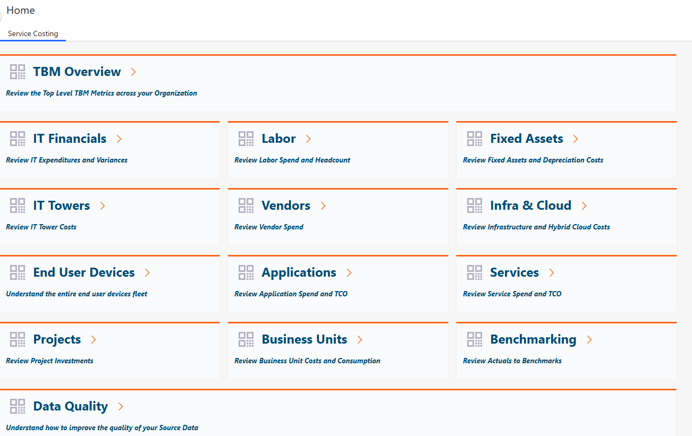
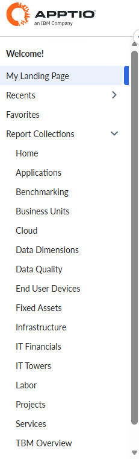
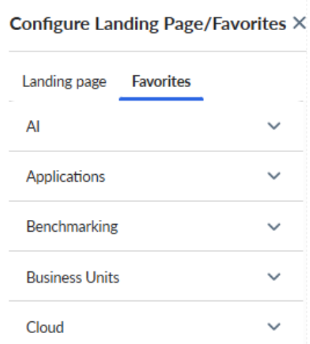
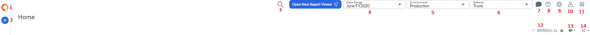
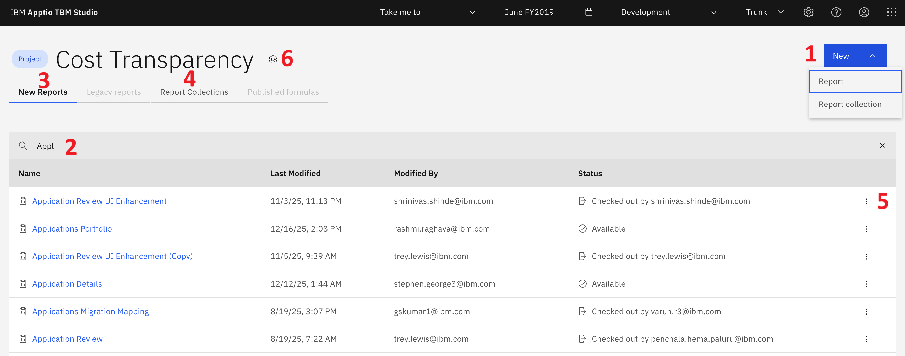

# Guía de IBM Apptio : Navegación por los costes

Este tema ofrece una descripción general de cómo está organizada la navegación IBMApptio de costes, basada en el TBM Report Studio actual. Esta navegación será diferente si utiliza el Nuevo Estudio de Informes.

## Informes clásicos

Nota: Los elementos del menú que se muestran dependen de sus permisos de usuario y de la configuración.

1. **Página de inicio** : al acceder IBMApptio a Costing, la página de inicio permite acceder a las distintas colecciones de informes disponibles dentro de la IBMApptio aplicación Costing. Los informes están organizados por áreas de interés y revelan información financiera relevante para los perfiles clave.

   

   Haga clic en un encabezado para abrir el informe resumido de alto nivel de una colección de informes.
2. **Botones de navegación por los informes** : estos botones de navegación le permiten desplazarse rápidamente por los informes. El icono Atrás te lleva a la página anterior, mientras que el icono Inicio te lleva directamente a tu página de inicio principal.

   

**Menú lateral de navegación**

El menú lateral izquierdo sirve como centro de navegación principal. Agrupa sus colecciones de informes y proporciona acceso a Mi página de inicio, Recientes y Favoritos, lo que le permite localizar y volver de forma eficaz a la información más importante.

**Mi página de inicio** : mi página de inicio le proporciona un punto de partida personalizado en la aplicación. Seleccione el informe que prefiera y desígnalo como su página de destino preferida, lo que le permitirá reanudar rápidamente su trabajo sin tener que navegar por múltiples menús.

**Recientes** : muestra una lista de los elementos que ha abierto más recientemente. Esta vista le permite volver fácilmente a los informes más recientes y más consultados sin necesidad de buscarlos de nuevo.

**Favoritos** : Favoritos proporciona una ubicación centralizada para los elementos que ha marcado como importantes. Al añadir informes a tus favoritos, podrás acceder a ellos de forma rápida y sistemática desde una única ubicación.

**Menú de navegación superior**

La barra de navegación superior proporciona un acceso rápido a los ajustes clave, las herramientas de navegación, el centro de ayuda y la conectividad con otras IBMApptio soluciones.

1. **ApptioIBM Logotipo** : cuando la barra lateral de navegación está contraída, se muestra el IBMApptio logotipo. El IBMApptio logotipo le permite cambiar entre IBMApptio las aplicaciones disponibles en su organización. ApptioIBM Costing admite el inicio de sesión común y la administración de usuarios a través de Frontdoor.
2. **Icono de Chevron** : expande o contrae el panel de navegación izquierdo.
3. **Búsqueda de informes** : utilice el icono de la lupa para buscar rápidamente el informe que necesita.
4. **Intervalo de fechas** : IBMApptio el cálculo de costes tiene plenamente en cuenta el tiempo. Seleccione y establezca el intervalo de fechas al navegar por sus informes.
5. **Entorno** : IBMApptio Costing le ofrece tres entornos: producción, ensayo y desarrollo. Dentro de Desarrollo, cada persona tendrá su propio espacio de trabajo. Al navegar, asegúrese de haber seleccionado el entorno correcto. Nota: Se pueden establecer permisos para denegar el acceso a determinados entornos, como el de desarrollo.
6. **Liberación** : IBMApptio el cálculo de costes le ofrece opciones para la gestión de liberaciones. Aunque la mayor parte del trabajo y las publicaciones se realizan en el tronco, también se puede trabajar en una rama, que luego se puede fusionar de nuevo con el tronco. Hotfix es una tercera opción dentro de la gestión de lanzamientos.
7. **Comentarios y colaboración** : el panel Comentarios le permite colaborar directamente en un informe añadiendo contexto, haciendo preguntas o compartiendo comentarios con otros usuarios. Puedes dejar comentarios públicos visibles para todos los espectadores o comentarios privados para personas o equipos específicos. También puedes responder a comentarios existentes y utilizar menciones para notificar a los usuarios e incluirlos en la conversación. Esto ayuda a mantener el debate centrado en los datos, lo que mejora la claridad, la trazabilidad y la toma de decisiones.
8. **Ayuda** : abre el Centro de ayuda, envía comentarios sobre el producto, consulta las notas de la versión o accede a la IBM Comunidad.
9. **Configuración** : la sección Configuración proporciona a los administradores acceso a opciones de configuración clave que controlan el comportamiento de la aplicación en su organización. Desde este menú, puede gestionar las preferencias del sistema, ajustar la configuración del proyecto, configurar la multidivisa y acceder a herramientas como Data Advisor, aplicaciones de referencia y seguridad a nivel de fila. Estas opciones le permiten adaptar el entorno a sus requisitos operativos, de seguridad y de generación de informes, lo que garantiza una experiencia de usuario coherente y controlada. La página «Acerca de» proporciona información detallada sobre las versiones actuales de su cliente y servidor, lo que le ayuda a verificar la configuración de su entorno y garantizar la compatibilidad con las actualizaciones y funciones del producto.
10. **Configuración del perfil** : gestiona tu perfil de usuario; los administradores pueden suplantar a los usuarios.
11. **Menú de aplicaciones** : cambie entre IBMApptio las aplicaciones disponibles en su organización. ApptioIBM Costing admite el inicio de sesión común y la administración de usuarios a través de Frontdoor.
12. **Actualizar** - Seleccione la frecuencia de actualización. Por defecto, está configurado en 3 segundos, pero se puede cambiar a manual según sea necesario.
13. **Vistas guardadas y restablecer** : este menú le permite gestionar cómo se muestra un informe y volver rápidamente a la configuración preferida. Puede guardar su configuración actual utilizando Guardar vista o Guardar como, conservando los filtros, segmentadores y opciones de diseño para su uso futuro. Si necesita empezar de cero, puede restablecer todos los segmentadores, restablecer los filtros globales o restaurar el informe a su estado predeterminado original. Estas opciones le ayudan a personalizar su análisis, al tiempo que le permiten volver fácilmente al informe de referencia.
14. **Exportación y uso compartido de informes** : estas opciones le permiten exportar y distribuir la información de los informes en el formato que mejor se adapte a sus necesidades. Puede descargar el informe como archivo Excel o PDF para analizarlo sin conexión o para mantener registros. La opción Enviar correo electrónico le permite compartir el informe actual directamente con otros usuarios, mientras que Suscripciones por correo electrónico le permite programar envíos automáticos de informes a intervalos regulares. En conjunto, estas funciones facilitan una colaboración fluida y una comunicación oportuna en toda su organización.

**Multidivisa** - Si la función multidivisa está habilitada, utilice el menú de divisas para cambiar la vista a una divisa diferente.

## Nuevo Studio de informes

**Busca el botón azul «Abrir IBM Apptio Report Studio»:** una vez que tu instancia se haya actualizado a 12.11.21 o una versión superior, verás un botón azul en la parte superior de tu Report Studio actual. Al hacer clic aquí, se abrirá una lista de los proyectos disponibles.

Nota: Los clientes que utilicen las versiones 12.11.19 deben estar inscritos en la versión preliminar pública para que les aparezca el botón azul.

**Selecciona un proyecto para abrirlo en el nuevo Report Studio** : elige un proyecto del menú desplegable para iniciarlo automáticamente en la nueva interfaz.

El nuevo Report Studio se abre en la página de inicio, tal y como se muestra a continuación.

**Inicio de informes**

1. Nuevo botón: haz clic aquí para crear un nuevo informe o una nueva colección de informes
2. Buscar – Buscar un informe ya existente
3. Nuevos informes: muestra todos los informes creados con el nuevo Report Studio.
4. Colecciones de informes: muestra grupos de informes relacionados organizados en colecciones.
5. Menú de opciones adicionales del informe (menú de los tres puntos): haz clic aquí para acceder a una serie de operaciones que se pueden realizar en un informe, como eliminarlo o exportar su definición y configuración.
6. Configuración del proyecto: haz clic aquí para registrar uno o varios informes, revertir los cambios realizados en ellos o importar una configuración de informe al proyecto en cuestión.

**Panel de navegación**

1. Selector de aplicaciones: utilízalo para cambiar a otro producto de IBM Apptio
2. Configuración del perfil: utiliza esta opción para gestionar tu perfil, suplantar a otro usuario (Nota: los administradores pueden hacerlo para comprobar los permisos de un usuario o para solucionar problemas) y cerrar sesión
3. Ayuda: utilice esta opción para acceder a la nueva documentación de ayuda de Report Studio
4. Configuración: utilice esta opción para modificar el acceso de los clientes, actualizar los permisos y acceder a la configuración de múltiples divisas
5. Menú desplegable de entornos: utilícelo para cambiar entre los entornos y los espacios de trabajo de los usuarios.
6. Selector de fechas: utilízalo para cambiar entre distintos periodos
7. Llévame a: utiliza este menú de navegación rápida para cambiar al TBM Studio clásico y/o al nuevo visor de informes.

Para obtener más información, visita [IBMApptio](https://www.ibm.com/docs/en/apptio-commercial/tbm-studio/saas?topic=rn-recent-releases "(se abre en una pestaña o una ventana nueva)") : Nuevo Report Studio.
