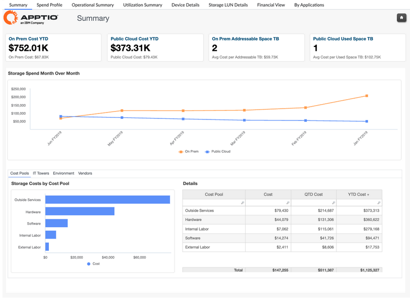
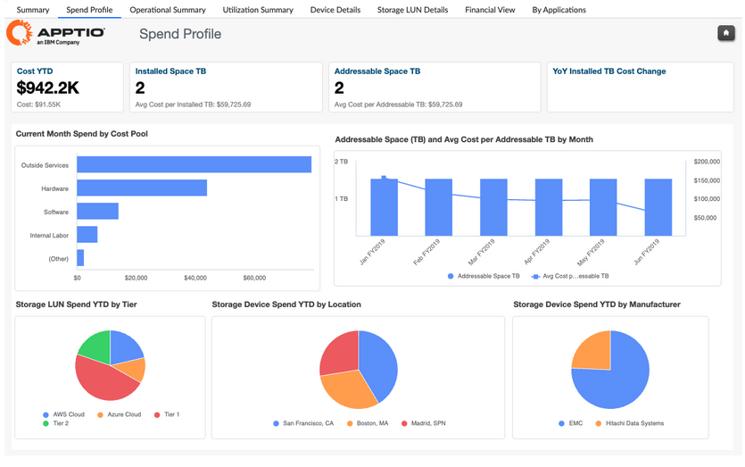
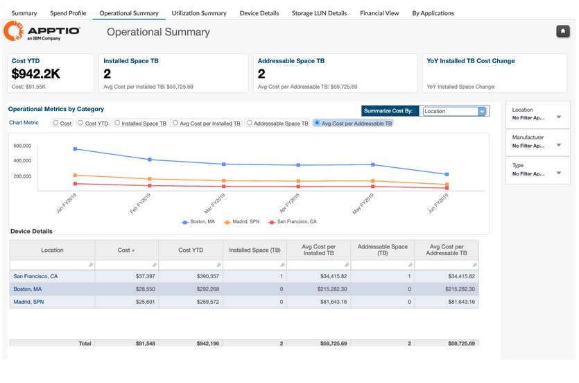
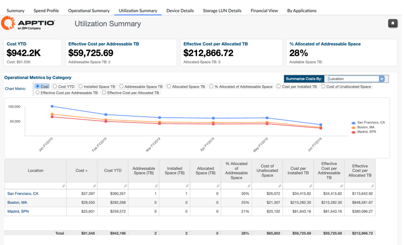
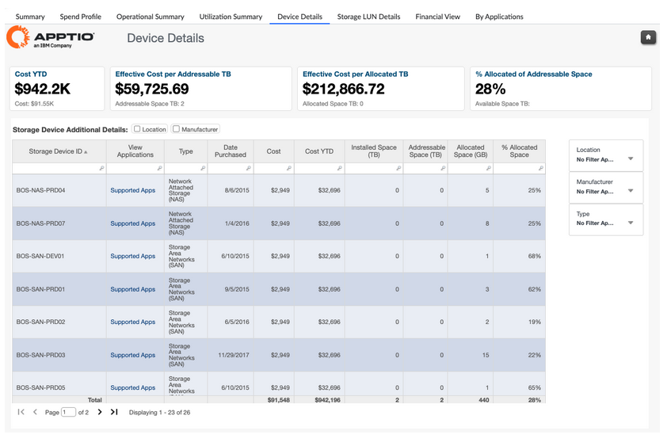
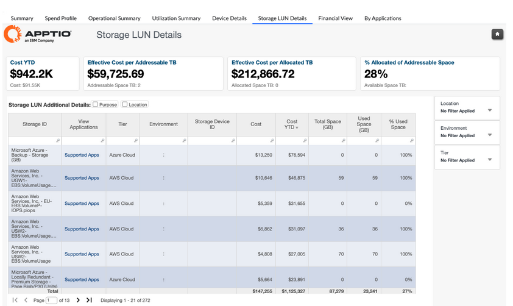
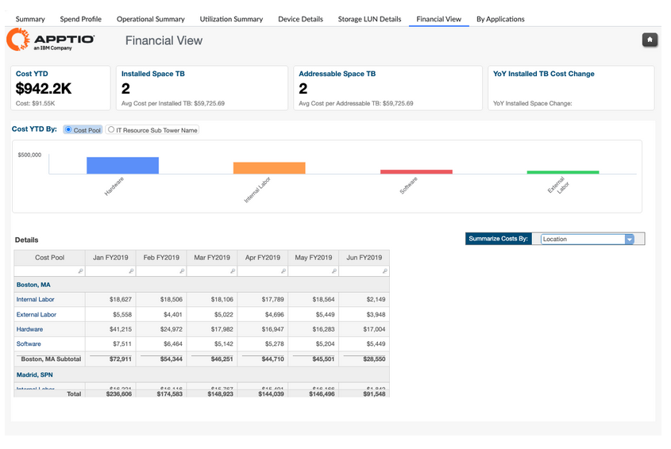
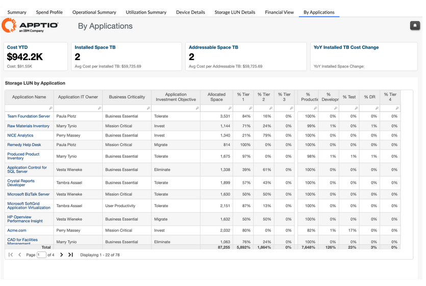

# Informes de almacenamiento

## Informes: resumen de los costes de almacenamiento

**Coste total de propiedad del almacenamiento**

El informe sobre el coste total de propiedad del almacenamiento ofrece una visión completa de los costes totales de almacenamiento y la capacidad en entornos locales y de nube pública. Analiza el gasto en almacenamiento por tipo de abastecimiento, entorno, grupo de costes, torre de TI y proveedor, al tiempo que realiza un seguimiento de métricas clave como el espacio direccionable, el espacio utilizado y los costes unitarios. Este informe ayuda a las organizaciones a comprender cómo se distribuyen los costes de almacenamiento, cómo se utiliza la capacidad de almacenamiento de manera eficiente y dónde existen oportunidades para optimizar los costes.

Este informe está diseñado para ser utilizado por los siguientes perfiles:

- Finanzas de TI
- Gestores de infraestructura y almacenamiento
- Propietarios de plataformas y servicios en la nube
- Propietarios de servicios y soluciones

Información proporcionada:

- Comprenda los costes totales de almacenamiento acumulados en lo que va de año en entornos locales y de nube pública con visibilidad de las tendencias de abastecimiento.
- Analizar el gasto en almacenamiento por entorno (producción, desarrollo, pruebas) para respaldar la priorización de las cargas de trabajo críticas y las decisiones de inversión.
- Realice un seguimiento de la capacidad de almacenamiento direccionable frente a la utilizada para identificar oportunidades de sobreaprovisionamiento, infrautilización y recuperación.
- Compare los costes unitarios, como el coste por GB y el coste por TB direccionable, para evaluar la eficiencia entre las distintas plataformas y niveles de almacenamiento.
- Identifique los cambios en el abastecimiento de almacenamiento entre las instalaciones locales y la nube pública para respaldar la planificación de la infraestructura híbrida y las estrategias de migración a la nube.
- Apoye la planificación presupuestaria, la gestión del ciclo de vida y las iniciativas de optimización destacando los factores que influyen en los costes de almacenamiento, los patrones de utilización y las tendencias de costes a lo largo del tiempo.

## Informes - Storage Insights y optimización

La recopilación de datos de almacenamiento (informe de información y optimización) proporciona una visibilidad completa de los costes, la capacidad, la utilización y el consumo de aplicaciones de almacenamiento en entornos locales, de nube pública e híbridos. Reúne perspectivas financieras y operativas del almacenamiento para ayudar a las organizaciones a comprender cómo se consumen los recursos de almacenamiento, cómo se distribuyen los costes y dónde existen oportunidades de optimización en dispositivos, unidades lógicas, niveles y aplicaciones.

Esta colección permite a los equipos supervisar el gasto en almacenamiento en comparación con el plan, evaluar la eficiencia del almacenamiento y las tendencias de utilización, identificar los activos de almacenamiento infrautilizados o de alto coste, y respaldar decisiones informadas sobre la optimización del almacenamiento, la gestión del ciclo de vida y la estrategia de infraestructura.

La colección « Storage Insights » (Optimización de la experiencia de usuario) incluye los siguientes informes:

- Resumen de almacenamiento
- Perfil de gasto en almacenamiento
- Resumen operativo del almacenamiento
- Resumen de utilización del almacenamiento
- Detalles del dispositivo de almacenamiento
- Detalles del LUN de almacenamiento
- Vista financiera del almacenamiento
- Almacenamiento por aplicación

Nota: Esta colección está disponible en un punto final independiente: **Infrastructure Insights**.

**Informe resumido de almacenamiento**

El informe Resumen de almacenamiento ofrece una visión a nivel empresarial del gasto total en almacenamiento en entornos locales y de nube pública. Destaca los costes de almacenamiento por torre de TI, entorno, proveedor y modelo de abastecimiento para ayudar a las organizaciones a comprender dónde se concentra el gasto en almacenamiento y cómo evoluciona con el tiempo.

Este informe está diseñado para ser utilizado por los siguientes perfiles:

- Finanzas de TI
- Gestores de infraestructura y almacenamiento
- Jefe de Operaciones
- Propietarios del servicio

Información proporcionada:

- Comprenda el gasto total en almacenamiento en entornos locales y de nube pública con tendencias mensuales y acumuladas en lo que va de año.
- Analizar los costes de almacenamiento por torre de TI, grupo de costes, entorno y proveedor para identificar los principales factores que influyen en los costes.
- Realice un seguimiento de los cambios en la capacidad de almacenamiento disponible y utilizada junto con las métricas de coste unitario.
- Identificar anomalías en el gasto en almacenamiento y evaluar la alineación con la estrategia de almacenamiento a lo largo del tiempo.

Para obtener más información sobre cómo utilizar el informe Resumen de almacenamiento, vaya [aquí.](https://www.ibm.com/docs/en/apptio-commercial/costing-standard/saas?topic=reports-storage-summary "(se abre en una pestaña o una ventana nueva)")

**Informe sobre el perfil de gasto en almacenamiento**

El informe Perfil de gasto en almacenamiento proporciona información sobre el gasto y la capacidad de almacenamiento previstos frente a los reales. Se centra en la estructura de costes, la capacidad instalada y disponible, y las tendencias de los costes unitarios para respaldar la planificación financiera y la optimización del almacenamiento.

Este informe está diseñado para ser utilizado por los siguientes perfiles:

- Finanzas de TI
- Gestores de infraestructura y almacenamiento
- Propietarios del servicio

Información proporcionada:

- Revise el gasto en almacenamiento acumulado en lo que va de año junto con las métricas de capacidad instalada y disponible.
- Comprender la distribución de los costes de almacenamiento por grupo de costes e identificar los factores clave que contribuyen al gasto mensual.
- Siga los cambios en la capacidad instalada y el coste medio por terabyte a lo largo del tiempo.
- Analice el gasto en almacenamiento por nivel, ubicación y fabricante para comprender el perfil general de los costes de almacenamiento.

Para obtener más información sobre cómo utilizar el informe Perfil de gasto en almacenamiento, haga clic [aquí.](https://www.ibm.com/docs/en/apptio-commercial/costing-standard/saas?topic=reports-spend-profile "(se abre en una pestaña o una ventana nueva)")

**Informe resumido operativo de almacenamiento**

El informe «Resumen operativo del almacenamiento» proporciona visibilidad operativa sobre los costes y la capacidad de almacenamiento en diferentes ubicaciones, fabricantes y tipos de almacenamiento. Conecta métricas financieras y operativas para respaldar las decisiones diarias de gestión del almacenamiento.

Este informe está diseñado para ser utilizado por los siguientes perfiles:

- Gestores de infraestructura y almacenamiento
- Operaciones de TI
- Propietarios del servicio

Información proporcionada:

- Analizar métricas operativas de almacenamiento, como el coste, la capacidad direccionable y el coste unitario medio por categoría.
- Compare los costes de almacenamiento entre ubicaciones, fabricantes y tipos de almacenamiento.
- Identificar anomalías en los costes operativos y áreas en las que se puede mejorar la eficiencia del almacenamiento.
- Apoyar el seguimiento continuo de las operaciones de almacenamiento en relación con la estrategia y los objetivos definidos.

Para obtener más información sobre cómo utilizar el informe Resumen operativo del almacenamiento, haga clic [aquí.](https://www.ibm.com/docs/en/apptio-commercial/costing-standard/saas?topic=reports-operational-summary "(se abre en una pestaña o una ventana nueva)")

**Informe resumido sobre la utilización del almacenamiento**

El informe «Resumen de utilización del almacenamiento» se centra en la eficacia con la que se utiliza la capacidad de almacenamiento local y en cómo la utilización repercute en los costes. Destaca la capacidad asignada frente a la disponible y los costes unitarios asociados.

Este informe está diseñado para ser utilizado por los siguientes perfiles:

- Gestores de infraestructura y almacenamiento
- Operaciones de TI
- Propietarios del servicio

**Información proporcionada:**

- Comprender el coste efectivo por terabyte de almacenamiento direccionable y asignado.
- Realice un seguimiento de los niveles de utilización, incluida la capacidad de almacenamiento asignada frente a la disponible.
- Identifique los niveles de almacenamiento infrautilizados y las oportunidades para recuperar la capacidad no utilizada.
- Evalúa si la utilización del almacenamiento se ajusta a las expectativas operativas y de costes.

Para obtener más información sobre cómo utilizar el informe Resumen de utilización del almacenamiento, haga clic [aquí.](https://www.ibm.com/docs/en/apptio-commercial/costing-standard/saas?topic=reports-utilization-summary "(se abre en una pestaña o una ventana nueva)")

**Informe detallado del dispositivo de almacenamiento**

El informe Detalles del dispositivo de almacenamiento proporciona una visibilidad detallada de los dispositivos de almacenamiento físico, incluyendo el coste, la capacidad, la asignación y el uso de las aplicaciones. Permite realizar análisis detallados a nivel de dispositivo.

Este informe está diseñado para ser utilizado por los siguientes perfiles:

- Gestores de infraestructura y almacenamiento
- Operaciones de TI

**Información proporcionada:**

- Revisar el gasto en almacenamiento y las métricas de capacidad de los dispositivos de almacenamiento individuales.
- Compare el espacio instalado, direccionable y asignado a nivel de dispositivo.
- Identificar dispositivos de almacenamiento de alto coste o infrautilizados.
- Comprenda qué aplicaciones son compatibles con dispositivos de almacenamiento específicos.

Para obtener más información sobre cómo utilizar el informe Detalles del dispositivo de almacenamiento, vaya [aquí.](https://www.ibm.com/docs/en/apptio-commercial/costing-standard/saas?topic=reports-device-details "(se abre en una pestaña o una ventana nueva)")

**Informe detallado de LUN de almacenamiento**

El informe Detalles de LUN de almacenamiento proporciona información sobre los costes y la utilización del almacenamiento a nivel de unidad lógica (LUN). Permite realizar análisis detallados de la asignación lógica del almacenamiento y la dependencia de las aplicaciones.

Este informe está diseñado para ser utilizado por los siguientes perfiles:

- Gestores de infraestructura y almacenamiento
- Operaciones de TI
- Propietarios del servicio

Información proporcionada:

- Analizar el gasto y la capacidad de almacenamiento a nivel de unidad lógica.
- Compare el espacio total con el espacio utilizado para cada LUN individual.
- Comprender qué aplicaciones consumen unidades de almacenamiento lógico específicas.
- Identificar oportunidades para optimizar o consolidar las asignaciones lógicas de almacenamiento.

Para obtener más información sobre cómo utilizar el informe Detalles del LUN de almacenamiento, vaya [aquí.](https://www.ibm.com/docs/en/apptio-commercial/costing-standard/saas?topic=reports-storage-lun-details "(se abre en una pestaña o una ventana nueva)")

**Informe financiero de almacenamiento**

El informe Storage Financial View ofrece una perspectiva financiera sobre el gasto en almacenamiento en múltiples dimensiones, como la ubicación, el fabricante, el producto y el conjunto de costes. Apoya la gobernanza financiera y la transparencia de los costes.

Este informe está diseñado para ser utilizado por los siguientes perfiles:

- Finanzas de TI
- Gestores de infraestructuras

Información proporcionada:

- Ver el gasto en almacenamiento por grupo de costes y subtorre de TI para comprender la distribución financiera.
- Analizar los costes de almacenamiento acumulados en lo que va de año por ubicaciones, proveedores y tipos de almacenamiento.
- Identificar anomalías en los costes y cambios en los patrones de gasto en almacenamiento.
- Apoyar la elaboración de presupuestos y la planificación financiera para las inversiones en almacenamiento.

Para obtener más información sobre cómo utilizar el informe «Storage Financial View», haga clic [aquí.](https://www.ibm.com/docs/en/apptio-commercial/costing-standard/saas?topic=reports-financial-view "(se abre en una pestaña o una ventana nueva)")

**Informe de almacenamiento por aplicación**

El informe «Almacenamiento por aplicación» ofrece una visión centrada en las aplicaciones del consumo y el coste del almacenamiento. Conecta el gasto en almacenamiento directamente con las aplicaciones para facilitar la rendición de cuentas y la optimización.

Este informe está diseñado para ser utilizado por los siguientes perfiles:

- Propietarios de aplicaciones
- Finanzas de TI
- Propietarios del servicio

Información proporcionada:

- Comprenda el gasto en almacenamiento y la capacidad asignada por aplicación.
- Analice cómo varía el uso del almacenamiento según el nivel, el entorno y la importancia de la aplicación.
- Identifique las aplicaciones que generan costes de almacenamiento desproporcionados.
- Apoyar iniciativas de optimización, reembolso y racionalización a nivel de aplicaciones.

Para obtener más información sobre cómo utilizar el informe Almacenamiento por aplicación, haga clic [aquí.](https://www.ibm.com/docs/en/apptio-commercial/costing-standard/saas?topic=reports-by-applications "(se abre en una pestaña o una ventana nueva)")

