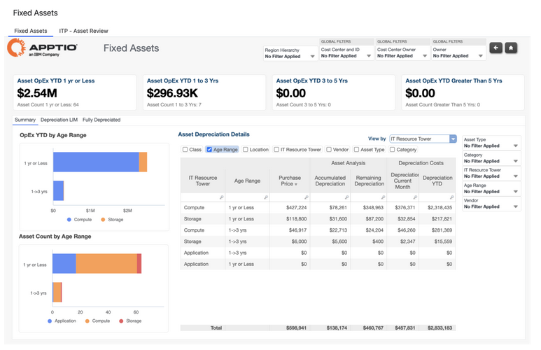

# Informes de activos fijos

**La recopilación de informes** de activos fijos proporciona visibilidad sobre la depreciación, el envejecimiento y el estado del ciclo de vida de los activos de TI en toda la organización. Esta colección incluye:

**Activos fijos**

El informe de activos fijos proporciona una visibilidad detallada de los activos de TI amortizados y en proceso de amortización a lo largo del tiempo. Muestra información sobre los activos, como la clase, la antigüedad, la ubicación, la torre de recursos informáticos, el proveedor, el tipo de activo y la categoría, junto con métricas de depreciación.

Utilice este informe para revisar el envejecimiento de los activos, realizar un seguimiento del estado de la depreciación y comprender cómo evolucionan los costes de los activos a lo largo de su ciclo de vida.

Este informe está diseñado para los siguientes roles:

- Finanzas de TI
- Propietarios del servicio

## Información proporcionada

- Identificar los activos que están totalmente amortizados y se acercan al final de su vida útil.
- Comprender la depreciación restante de los activos activos en diferentes rangos de antigüedad.
- Revise la distribución de activos por antigüedad, proveedor, ubicación, torre de TI, tipo de activo y categoría.
- Supervisar las tendencias de depreciación de los activos e OpEx es en lo que va de año.
- Analizar los costes de amortización y el valor residual de los activos a un nivel detallado.

Para obtener más información sobre cómo utilizar el informe de activos fijos[, haga](https://www.ibm.com/docs/en/apptio-commercial/costing-standard/saas?topic=reports-fixed-assets "(se abre en una pestaña o una ventana nueva)") clic aquí.

