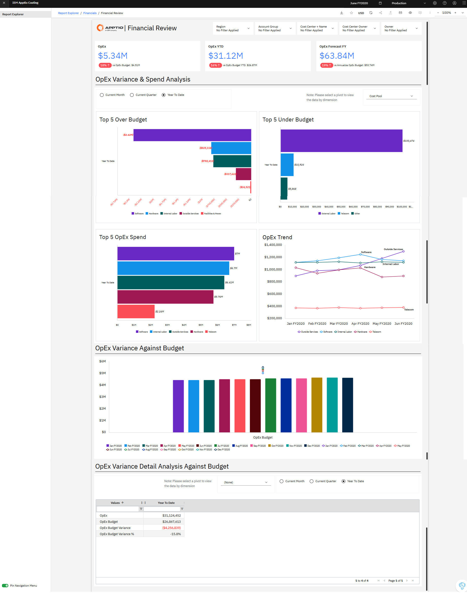
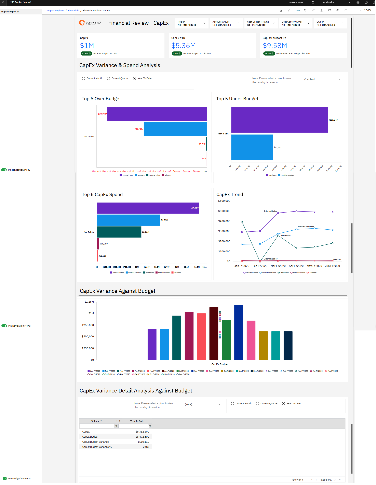
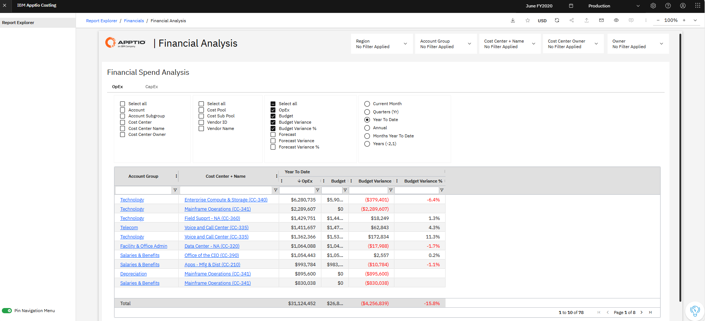

# Informes financieros de IT NX

La colección **de informes financieros de** TI ofrece información sobre el gasto en TI, el presupuesto y las previsiones de rendimiento, así como sobre los factores que influyen en los costes en toda la organización. Facilitan las revisiones ejecutivas, los análisis financieros periódicos y la investigación de desviaciones al combinar resúmenes generales con información detallada a nivel de transacción.

La colección de informes financieros de TI incluye:

- Análisis financiero
- Financial Review - CapEx
- Análisis financiero

## Análisis financiero

Este informe ofrece una visión general de las variaciones presupuestarias globales OpEx y del gasto OpEx de su organización. El informe desglosa los costes de TI por grupo de costes y responsable, lo que le permite determinar qué responsables de TI son los que generan el mayor gasto en TI.

Los distintos gráficos del informe también te ayudan a determinar si las variaciones son reales o se deben a una clasificación errónea.

Utilice este informe para elaborar un resumen ejecutivo que explique el gasto en TI y para llevar a cabo las revisiones financieras periódicas que son esenciales para gestionar eficazmente dicho gasto. Los datos de este informe incluyen partidas del libro mayor, lo que le permite ajustar los planes para tener en cuenta las desviaciones.

Este informe está pensado para los siguientes perfiles:

- -1, director de sistemas de información (Oficina de TBM)
- Responsables de centros de coste
- Analistas financieros del sector de las tecnologías de la información

**Información proporcionada** :

- Identifique en qué aspectos el gasto real difiere más del presupuesto o de las previsiones y determine qué grupos de costes, grupos de cuentas o centros de coste están provocando esas desviaciones.
- Averigüe qué responsables de TI o de centros de coste son los encargados de los gastos y las desviaciones más elevados.
- Determina si las desviaciones son válidas o si se deben a una clasificación errónea o a una categorización incorrecta de las transacciones.
- Revisar las tendencias de gasto interanuales y analizar los detalles a nivel de transacción que influyen en las variaciones de costes.
- Evaluar los resultados acumulados del año e identificar en qué aspectos podría ser necesario ajustar las previsiones para alcanzar los objetivos financieros.

Para obtener más información sobre cómo utilizar el informe de revisión financiera, vaya a [«Revisión financiera»](https://www.ibm.com/docs/en/apptio-commercial/costing-standard/saas?topic=reports-financial-review "(se abre en una pestaña o una ventana nueva)")

## Financial Review – CapEx

Este informe ofrece una visión general de las variaciones presupuestarias globales CapEx y del gasto CapEx de su organización. El informe desglosa los costes de TI por grupo de costes y responsable, lo que le permite determinar qué responsables de TI son los que generan el mayor gasto en TI.

Los distintos gráficos del informe también te ayudan a determinar si las variaciones son reales o se deben a una clasificación incorrecta.

Utilice este informe para elaborar un resumen ejecutivo que explique el gasto global en TI CapEx y para llevar a cabo las revisiones financieras periódicas que son esenciales para gestionar eficazmente el gasto en TI. Este informe también permite consultar las partidas del libro mayor relacionadas con las desviaciones, de modo que pueda ajustar los planes para tener en cuenta dichas desviaciones.

Este informe está pensado para los siguientes perfiles:

- -1, director de sistemas de información (Oficina de TBM)
- Responsables de centros de coste
- Analistas financieros del sector de las tecnologías de la información

**Información proporcionada**

- Identifique dónde se produce el mayor gasto en « CapEx » por grupos de costes, responsables de TI y centros de coste, y averigüe quién es el responsable de dicho gasto.
- Detectar desviaciones significativas entre los resultados reales CapEx y los previstos (presupuesto o previsión) y determinar qué categorías o centros de coste están provocando esas desviaciones.
- Comprueba si las desviaciones son válidas o si se deben a una clasificación incorrecta o incoherente de las transacciones, analizando los detalles a nivel del libro mayor.
- Analizar las tendencias de gasto en « CapEx » (cambios interanuales) y examinar las partidas de gastos que contribuyen a las variaciones en los costes.
- Evaluar el rendimiento de CapEx en lo que va de año e identificar en qué aspectos podría ser necesario ajustar las previsiones para cumplir los objetivos financieros.

Para obtener más información sobre cómo utilizar el informe «Financial Review - CapEx [», visite «Financial Review - CapEx »](https://www.ibm.com/docs/en/apptio-commercial/costing-standard/saas?topic=reports-financial-review-capex "(se abre en una pestaña o una ventana nueva)")

## Análisis financiero

Este informe ofrece una visión detallada de las variaciones mes a mes de « OpEx » y « CapEx », así como de las variaciones presupuestarias y de las previsiones acumuladas en lo que va de año. Puede utilizar este informe para revisar y gestionar el gasto en TI y las desviaciones correspondientes a grupos de cuentas, subgrupos de cuentas, cuentas y centros de coste.

Este informe está pensado para los siguientes perfiles:

- Responsables de centros de coste
- Analistas financieros del sector de las tecnologías de la información

**Información proporcionada:**

- Identifique en qué grupos de costes, cuentas y centros de coste se concentra el mayor gasto en TI.
- Detecta las áreas con los cambios más significativos de un periodo a otro en OpEx o CapEx.
- Determina si los costes reales están superando el presupuesto aprobado o las previsiones.
- Identificar qué partidas de gasto concretas están provocando las desviaciones entre la última previsión y el presupuesto.
- Comprueba si las desviaciones son legítimas o si se deben a una clasificación incorrecta o incoherente de las transacciones, e identifica cómo los centros de coste podrían tener que ajustar sus previsiones para cumplir los objetivos financieros.

Para obtener más información sobre cómo utilizar el informe de análisis financiero[, vaya a «Análisis financiero».](https://www.ibm.com/docs/en/apptio-commercial/costing-standard/saas?topic=reports-financial-analysis "(se abre en una pestaña o una ventana nueva)")
