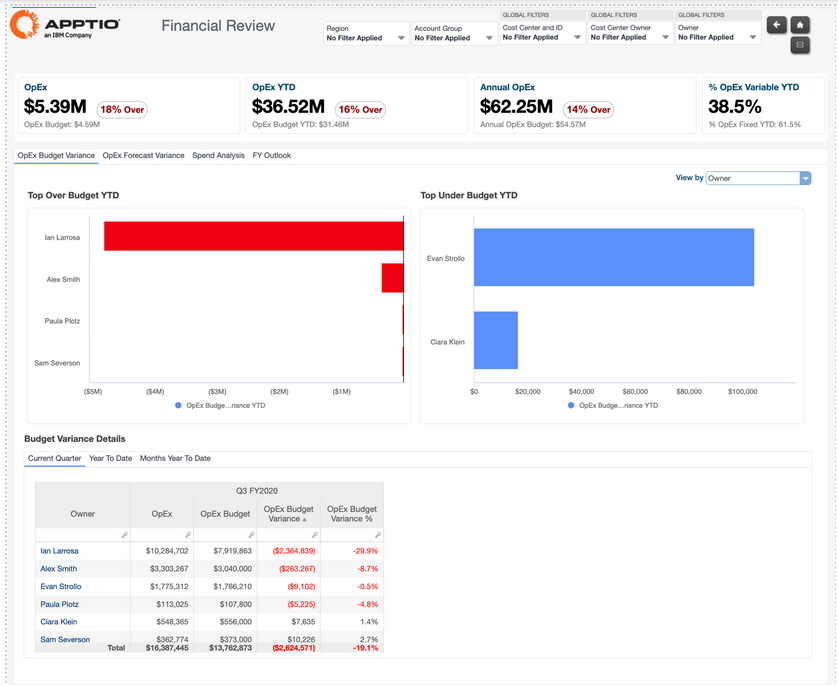
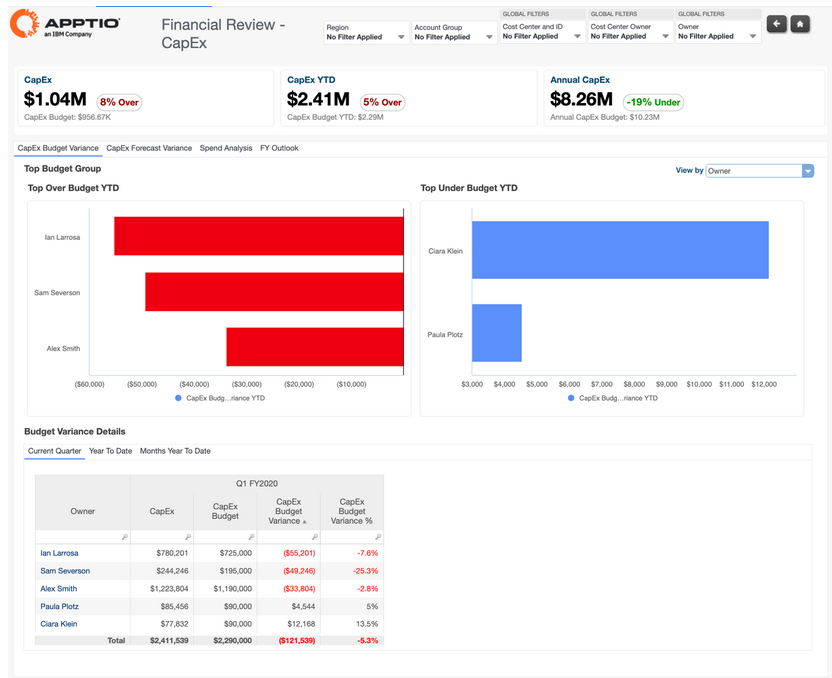
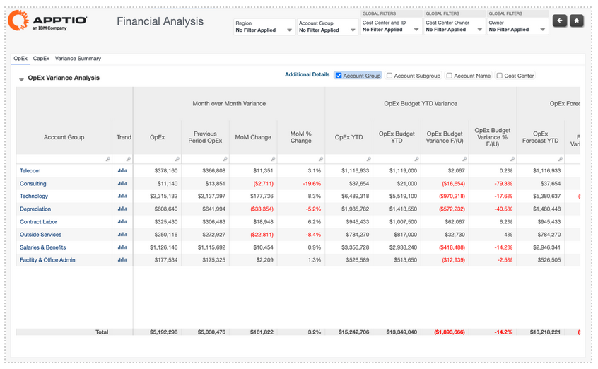

# Informes financieros de TI

La colección **de informes financieros de** TI proporciona visibilidad sobre el gasto en TI, el presupuesto y el rendimiento previsto, así como los factores que influyen en los costes en toda la organización. Apoyan las revisiones ejecutivas, los análisis financieros periódicos y la investigación de variaciones combinando resúmenes de alto nivel con información detallada a nivel de transacción.

La recopilación de informes financieros de TI incluye:

- Revisión financiera
- Revisión financiera - CapEx
- Análisis financiero
- Análisis de costes compartidos

## Revisión financiera

Este informe ofrece una visión ejecutiva de la variación presupuestaria y OpEx el OpEx gasto totales de su organización. El informe desglosa los costes de TI por grupo de costes y propietario, para que puedas determinar qué propietarios de TI son responsables del mayor gasto en TI.

Varios gráficos del informe también le ayudan a determinar si las variaciones son reales o se deben a una categorización errónea.

Utilice este informe para crear un resumen ejecutivo que explique el gasto en TI y para realizar las revisiones financieras periódicas que son esenciales para gestionar eficazmente el gasto en TI. Los datos de este informe incluyen partidas del libro mayor, por lo que puede ajustar los planes para adaptarse a las variaciones.

Este informe está diseñado para ser utilizado por los siguientes perfiles:

- Director de Sistemas de Información -1 (Oficina de TBM)
- Propietarios de centros de coste
- Analistas financieros de TI

**Información proporcionada** :

- Identifique dónde difiere más el gasto real del presupuesto o la previsión y determine qué grupos de costes, grupos de cuentas o centros de costes están provocando esas variaciones.
- Comprender qué propietarios de TI o propietarios de centros de costes son responsables del mayor gasto y variación.
- Determinar si las variaciones son válidas o si se deben a una categorización errónea o a una clasificación incorrecta de las transacciones.
- Revise las tendencias de gasto entre períodos y analice los detalles a nivel de transacción que contribuyen a los cambios en los costos.
- Evaluar el rendimiento acumulado del año e identificar dónde pueden ser necesarios ajustes en las previsiones para alcanzar los objetivos financieros.

Para obtener más información sobre cómo utilizar el informe de revisión financiera[, haga](https://www.ibm.com/docs/en/apptio-commercial/costing-standard/saas?topic=reports-financial-review "(se abre en una pestaña o una ventana nueva)") clic aquí

## Revisión financiera – CapEx

Este informe ofrece una visión ejecutiva de la variación presupuestaria y CapEx el CapEx gasto totales de su organización. El informe desglosa los costes de TI por grupo de costes y propietario, para que puedas determinar qué propietarios de TI son responsables del mayor gasto en TI.

Varios gráficos del informe también le ayudan a determinar si las variaciones son reales o se deben a una categorización incorrecta.

Utilice este informe para crear un resumen ejecutivo que explique el gasto total CapEx en TI y para realizar las revisiones financieras periódicas que son esenciales para gestionar eficazmente el gasto en TI. Este informe también permite ver las partidas del libro mayor asociadas a las variaciones, de modo que se puedan ajustar los planes para adaptarse a ellas.

Este informe está diseñado para ser utilizado por los siguientes perfiles:

- Director de Sistemas de Información -1 (Oficina de TBM)
- Responsables de centros de coste
- Analistas financieros de TI

**Información proporcionada**

- Identifique dónde se produce el mayor CapEx gasto entre los grupos de costes, los propietarios de TI y los centros de costes, y comprenda quién es responsable de ese gasto.
- Detecte variaciones significativas entre los datos reales CapEx y los previstos (presupuesto o previsión) y determine qué categorías o centros de coste están provocando esas excepciones.
- Verifique si las variaciones son válidas o si se deben a una categorización incorrecta o inconsistente de las transacciones, analizando en detalle los datos a nivel de contabilidad general.
- Analizar las tendencias de gasto de un CapEx período a otro y revisar las partidas de gastos que contribuyen a los cambios en los costes.
- Evaluar el CapEx rendimiento acumulado del año e identificar dónde pueden ser necesarios ajustes en las previsiones para alcanzar los objetivos financieros.

Para obtener más información sobre cómo utilizar el informe «Financial Review - CapEx [», haga](https://www.ibm.com/docs/en/apptio-commercial/costing-standard/saas?topic=reports-financial-review-capex "(se abre en una pestaña o una ventana nueva)") clic aquí.

## Análisis financiero

Este informe muestra una vista detallada de la variación mes a mes OpEx y CapEx la variación, la variación presupuestaria acumulada en el año y la variación de la previsión acumulada en el año. Puede utilizar este informe para revisar y gestionar el gasto y la variación de TI para grupos de cuentas, subgrupos de cuentas, cuentas y centros de coste.

Este informe está diseñado para ser utilizado por los siguientes roles:

- Propietarios de centros de coste
- Analistas financieros de TI

**Información proporcionada:**

- Identifique dónde se concentra el mayor gasto en TI entre los grupos de costes, cuentas y centros de costes.
- Detecte las áreas con los cambios más significativos de un período a otro en OpEx o CapEx.
- Determinar si los costes reales superan el presupuesto aprobado o las previsiones.
- Comprenda qué partidas de gasto específicas están provocando las variaciones entre la última previsión y el presupuesto.
- Validar si las variaciones son legítimas o el resultado de una categorización incorrecta o inconsistente de las transacciones, e identificar cómo los centros de costos pueden necesitar ajustar las previsiones para cumplir los objetivos financieros.

Para obtener más información sobre cómo utilizar el informe de análisis financiero[, haga](https://www.ibm.com/docs/en/apptio-commercial/costing-standard/saas?topic=reports-financial-analysis "(se abre en una pestaña o una ventana nueva)") clic aquí.

## Análisis de costes compartidos

Este informe agrega sus gastos financieros en categorías estándar (conocidas como grupos de costes), tal y como las define el TBM Council. El informe desglosa además el gasto total por gastos operativos ( OpEx ) y gastos de capital ( CapEx ), así como por costes fijos y variables.

Este informe está diseñado para ser utilizado por los siguientes roles:

- Propietarios de centros de coste
- Analistas financieros de TI

**Información proporcionada:**

- Comprenda cómo se distribuye el gasto en TI entre los grupos de costes y determine el equilibrio entre los costes OpEx,CapEx, fijos y variables.
- Evalúa la agilidad financiera de la organización analizando qué parte del gasto es fijo y qué parte es variable, y dónde hay flexibilidad para reducir o cambiar los costes.
- Identifique dónde se produce la mayor capitalización en los grupos de costes y cómo CapEx y OpEx las tendencias cambian a lo largo del ejercicio fiscal.
- Revise las cuentas, los subgrupos y las transacciones que contribuyen a cada grupo de costes para comprender qué factores influyen en el gasto total y la variación.
- Detecte las tendencias de los grupos de costes a lo largo del tiempo e identifique dónde los cambios en el abastecimiento, los cambios en el consumo o las variaciones presupuestarias pueden estar afectando al rendimiento financiero general.

Para obtener más información sobre cómo utilizar el informe de agrupación de costes[, haga](https://www.ibm.com/docs/en/apptio-commercial/costing-standard/saas?topic=reports-cost-pool-analysis "(se abre en una pestaña o una ventana nueva)") clic aquí.
