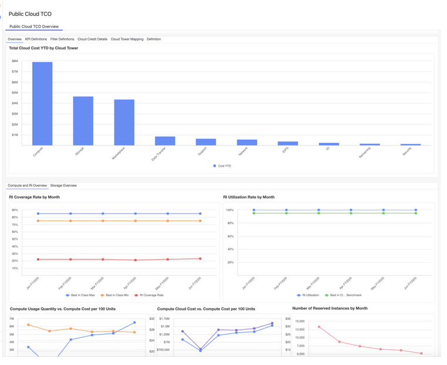

# Nube pública: Introducción

## Nube pública integrada: Introducción

Utilice el componente **Public Cloud Integrated (CTF-Cloud)** para cargar, asignar y analizar el gasto en la nube pública como parte del modelo Costing Standard. Este componente permite generar informes sobre los costes de la nube pública IaaS y PaaS, y admite el análisis del coste total de propiedad (TCO) de la nube combinando los datos de facturación del proveedor de la nube con los costes de TI basados en el libro mayor.

Instale y configure este componente antes de revisar los informes de la nube. Una vez instalado el componente, los datos de facturación en la nube se ingestan automáticamente y se asignan a las tablas de datos maestros necesarias para facilitar la asignación, la generación de informes y el análisis en todas las torres de recursos de TI, aplicaciones y servicios.

**Instalación de componentes**

El componente CTF-Cloud proporciona los datos y la lógica fundamentales necesarios para la generación de informes y el análisis de la nube pública. Admite las siguientes capacidades:

- Permite que los informes y los KPI realicen un seguimiento y gestionen el gasto en la nube pública entre proveedores, servicios y torres de recursos de TI.
- Utiliza datos detallados de facturación en la nube para asignar los servicios en la nube a las subtorres de recursos de TI y distribuir los costes del libro mayor a un nivel más granular.

Este componente se utiliza cuando las organizaciones desean tener visibilidad tanto de los costes del proveedor de servicios en la nube como de los costes asociados no relacionados con el proveedor**,** tales como mano de obra, software y servicios de TI compartidos, necesarios para operar entornos en la nube.

**Informes de TCO de la nube pública de NX (componente adicional)**

Este componente ofrece informes NX predefinidos basados en datos de costes de la nube pública para realizar análisis por servicios, cuentas y periodos de tiempo.

Utiliza este componente cuando:

- Necesitas informes estándar sobre los costes de la nube
- ¿Quieres comparar los datos reales con los presupuestos?
- Necesitas informes periódicos sobre los costes de la nube

**Requisitos previos**

Antes de utilizar el componente CTF-Cloud, asegúrese de que los siguientes componentes estén instalados y configurados:

- CTF: Fuente de costes
- CTF - Proveedor

Estos componentes proporcionan el contexto financiero y de proveedores necesario para asumir íntegramente los costes de la nube.

**Fuentes de datos en la nube**

Los datos sobre los costes de la nube pública proceden de Cloudability y se introducen en Apptio a través de Apptio Data Management (ADM)**.** Los datos se actualizan periódicamente y se cargan en tablas de facturación mensual específicas de la nube, que incluyen:

- AWS: `cldy_monthly_aws`
- Azure: `cldy_monthly_azure`
- GCP: `cldy_monthly_gcp`

Para obtener más información sobre cómo configurar Apptio Data Management (ADM), consulte la documentación disponible [aquí.](https://www.ibm.com/docs/en/apptio-platform/adm/saas?topic=creation-entity-cloudability "(se abre en una pestaña o una ventana nueva)")

**Conjuntos de datos**

**CLDY Transform Master Data** : los datos de facturación de las tablas mensuales de la nube se asignan a CLDY Transform Master Data, que normaliza los servicios específicos de cada proveedor.

**Datos maestros del proveedor de servicios en la nube** : los datos transformados se asignan posteriormente a los datos maestros del proveedor de servicios en la nube, lo que permite una clasificación coherente entre los distintos proveedores y la alineación con el modelo unificado TBM de Apptio ( ATUM ).

Para obtener instrucciones detalladas, consulte la documentación disponible aquí.

## Nube pública para informes financieros de TI

Los informes sobre la nube pública para finanzas de TI proporcionan a los equipos financieros de TI una visión consolidada y centrada en las finanzas del gasto en nube pública de los principales proveedores de nube, como AWS y Azure. Estos informes están diseñados para destacar los factores financieros que influyen en los costes de la nube, incluidos los servicios que contribuyen al aumento del gasto, la eficacia del modelo de compra, el comportamiento de las tarifas unitarias y las tendencias de consumo. Gracias a los desgloses integrados, los informes permiten un análisis más profundo de los movimientos de costes por proveedor, servicio, cuenta y factores comerciales o técnicos subyacentes, lo que favorece una gobernanza financiera más sólida y una toma de decisiones informada.

Este informe está diseñado para ser utilizado por los siguientes perfiles:

- Finanzas de TI
- Controladores financieros

**Información proporcionada:**

- Identifique los servicios y proveedores de nube que generan mayores costes para centrar los esfuerzos de control y optimización de costes.
- Evalúa la eficacia de los modelos de compra en la nube comparándolos con los mejores estándares de referencia para descubrir oportunidades de ahorro.
- Supervise las tendencias de las tarifas unitarias y el consumo para detectar anomalías en los precios, mejoras en la eficiencia o aumentos de los costes derivados del uso.
- Utilice el análisis detallado para vincular los costes a cuentas, servicios empresariales y aplicaciones específicos con fines de rendición de cuentas, análisis de las causas fundamentales y toma de decisiones presupuestarias informadas.

Para obtener más información sobre cómo utilizar la nube pública para los informes de finanzas de TI, haz clic [aquí.](https://www.ibm.com/docs/en/apptio-commercial/costing-standard/saas?topic=reports-public-cloud-tcooverview "(se abre en una pestaña o una ventana nueva)")

## Nube pública para finanzas de TI: introducción

La nube pública para finanzas de TI permite a las organizaciones analizar y controlar el gasto en la nube pública mediante un modelo centrado en las finanzas que se centra en los costes de los proveedores, el uso y la economía unitaria. La solución se integra directamente con los datos de Cloudability para ofrecer informes estandarizados y multiproveedor para AWS, Azure, GCP y OCI, sin necesidad de asignar los costes no relacionados con los proveedores. Está diseñado para una rápida implementación y es ideal para equipos financieros de TI que buscan una visibilidad rápida del gasto en la nube, las tendencias y las oportunidades de optimización.

**Instalación de componentes**

**Coste total de propiedad de la nube pública**

Este componente admite la integración con los siguientes proveedores de servicios en la nube:

- Amazon Web Services (AWS)
- Microsoft Azure
- Google Cloud Platform (GCP)
- Oracle Infraestructura en la nube (OCI)

Nota: Este componente está disponible en las plantillas **v120 y posteriores**.

Después de instalar el componente, proceda a cargar y asignar los conjuntos de datos necesarios en las tablas de datos maestros para habilitar la generación de informes.

**Fuentes comunes de datos**

Public Cloud for IT Finance se basa en Cloudability como fuente principal de datos sobre costes y uso de la nube:

- **Apptio Data Management (ADM)**

  Proporciona conjuntos de datos mensuales sobre el gasto y el uso de la nube, como `cldy_monthly_aws` y `cldy_monthly_azure`, que constituyen la base para la elaboración de informes sobre costes y consumo.

  Para obtener más información sobre cómo configurar Apptio Data Management (ADM), consulte la documentación disponible [aquí.](https://www.ibm.com/docs/en/apptio-platform/adm/saas?topic=creation-entity-cloudability "(se abre en una pestaña o una ventana nueva)")
- **Cloudability Informes de instancias reservadas (RI) a través de servicios REST**

  Datos sobre horas reservadas y utilización que se utilizan para calcular la eficacia de las instancias reservadas y los planes de ahorro en AWS, Azure y GCP.

**Conjuntos de datos maestros**

Para habilitar la generación de informes, se deben crear y asignar los siguientes **cinco conjuntos de datos de entrada** utilizando datos de origen de Cloudability (por ejemplo, `cldy_monthly_aws`, `cldy_monthly_azure`):

- **Asignación de cuentas → Asignación de nombres de cuentas**

  Alinea los nombres de cuentas en la nube extraídos de conjuntos de datos de Cloudability.
- **Entrada de referencia BU → Referencia de unidad de negocio**

  Normaliza regiones o identificadores organizativos en unidades de negocio estandarizadas.
- **Mapeo de la Torre Nube Entrada → Mapeo de la Torre Nube**

  Asigna familias de uso de la nube a nombres normalizados de Cloud Tower para garantizar la coherencia de los informes.
- **Entrada CC → Lista de centros de coste**

  Asigna centros de coste y categorías; cualquier valor no asignado aparece como «*Sin asignar* ».
- **Entrada RI → Horas reservadas**

  Permite calcular las métricas de utilización de instancias reservadas y planes de ahorro en todos los proveedores compatibles.
- Asigne los conjuntos de datos anteriores a **los datos maestros de IT Finance Cloud** utilizando la columna *Fuente de datos* para hacer referencia al nombre del conjunto de datos Cloudability (por ejemplo, `cldy_monthly_aws`).

Para obtener instrucciones detalladas sobre la configuración, consulte la documentación de apoyo [aquí.](https://www.ibm.com/docs/en/apptio-commercial/costing-standard/saas?topic=reports-public-cloud-tcoconfiguration "(se abre en una pestaña o una ventana nueva)")
