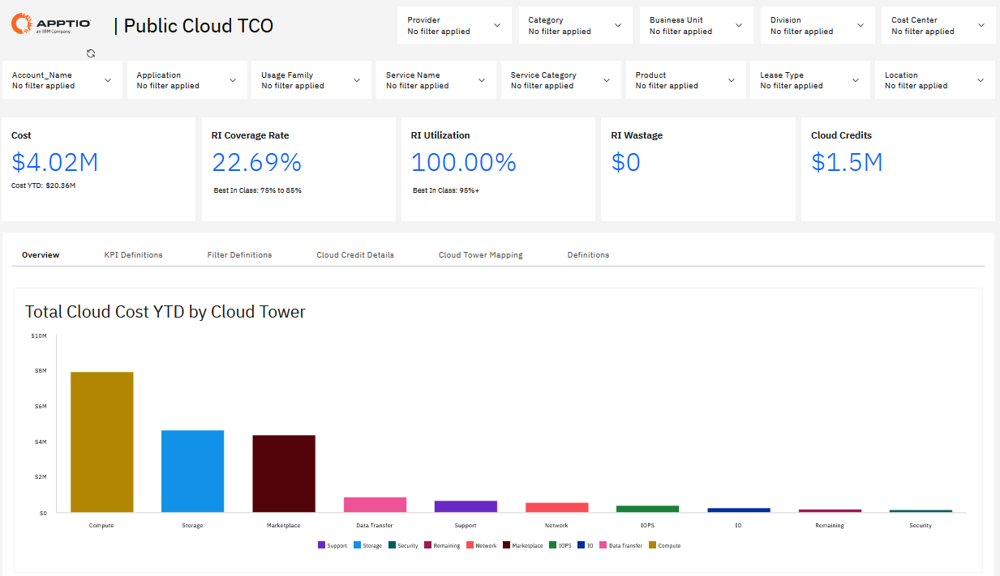
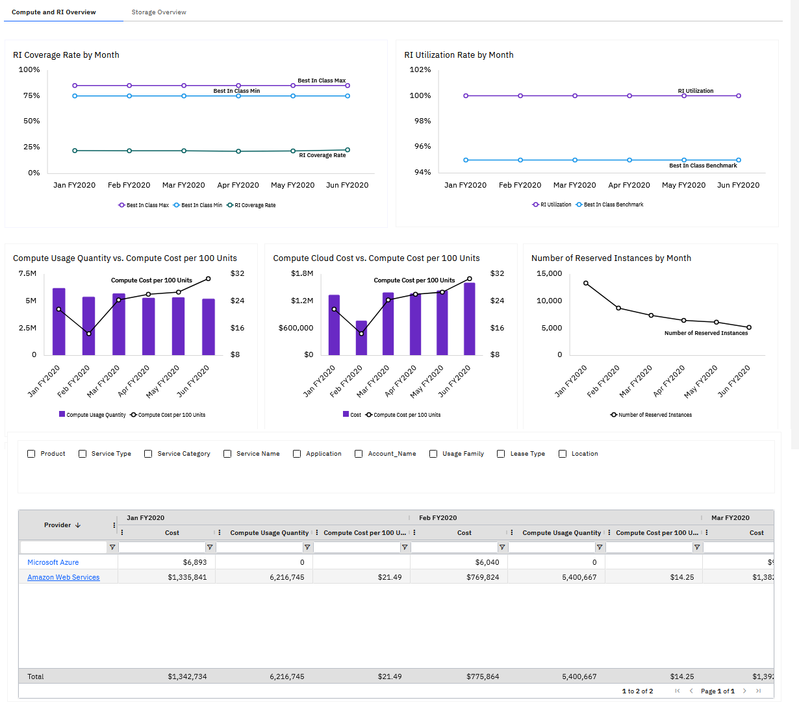
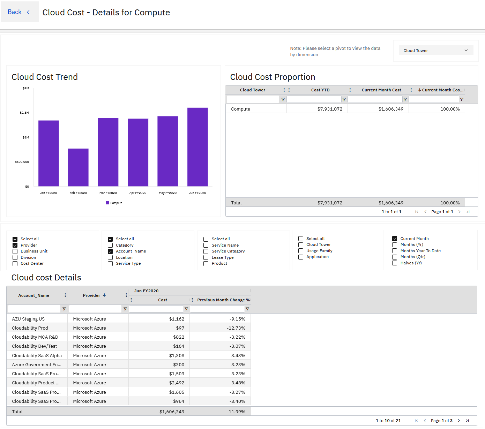
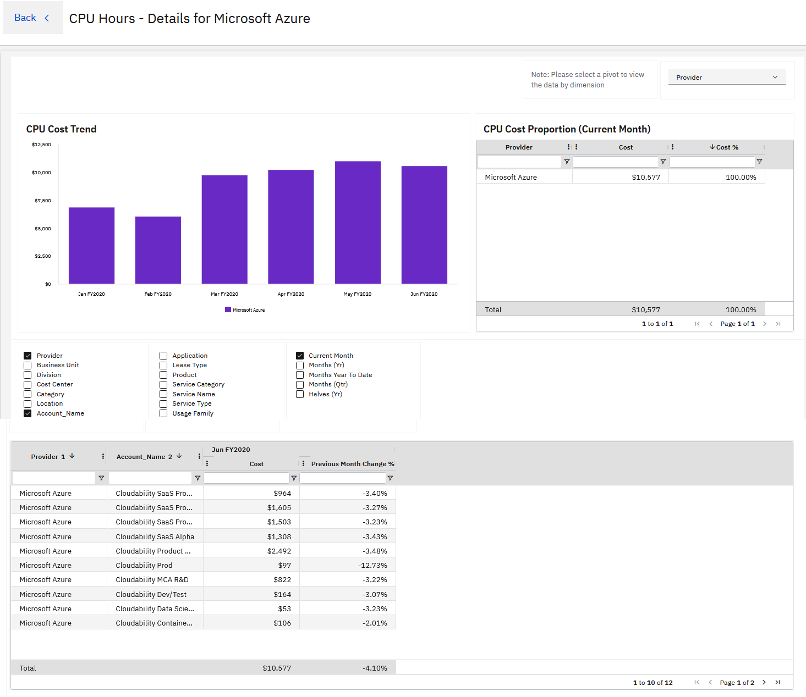
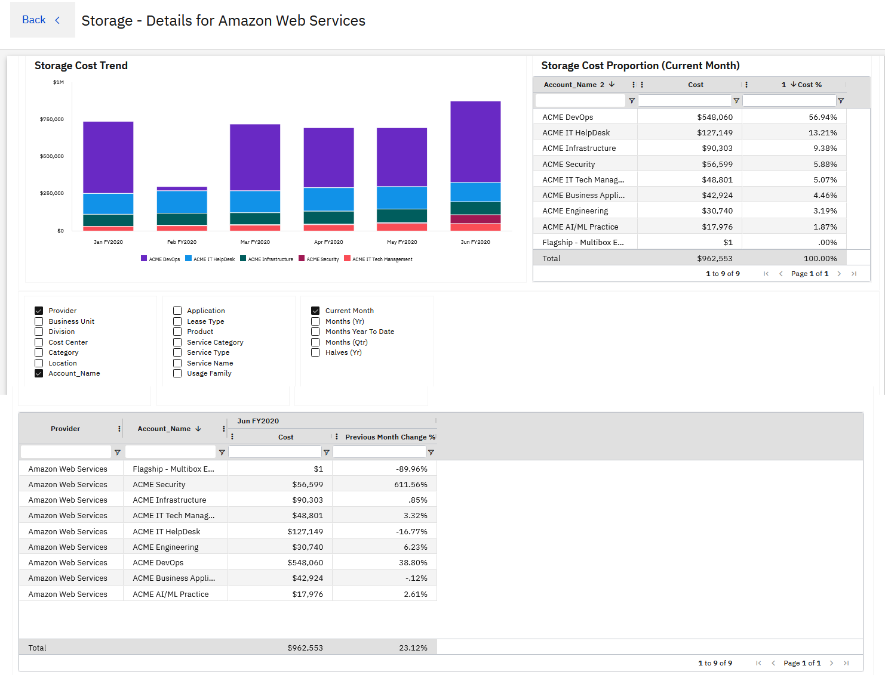

# Informes sobre el coste total de propiedad (TCO) de la nube pública de NX

IBM Apptio Los informes Public Cloud TCO ofrecen a los miembros del equipo financiero información detallada sobre el gasto mensual en la nube, los factores que influyen en los costes y las prácticas de « FinOps » en AWS y Azure.

| Descripción de los elementos clave |
| --- |
| 1. Resumen financiero y operativo de Cloud para los gastos acumulados en lo que va de año, incluidos los créditos aplicables |
| 2. Los metadatos adicionales lo hacen intuitivo, armonizan la taxonomía y facilitan su comprensión. |
| 3. La evolución de los costes en los distintos servicios en la nube ( AWS y Microsoft Azure ). |
| 4. Las tendencias de costes según atributos empresariales como proveedor, centro de costes, nombre de la cuenta, etc. |

| Descripción |
| --- |
| 1. El informe destaca los servicios que influyen en la evolución de los costes. |
| 2. La eficacia del modelo de compra en la nube y su comparación con los mejores estándares del sector. |
| 3. La evolución de la tarifa unitaria en relación con las variaciones del consumo. |
| 4. Desglose detallado de los costes, el consumo y las tarifas unitarias por proveedor de servicios |

## Informes de profundización

Profundice en el análisis para comprender los factores empresariales y técnicos que subyacen a cada uno de los informes.

- Los factores que determinan el coste del servicio, incluyendo la cuenta a la que se imputa y el importe correspondiente.
- El servicio o la aplicación empresarial que impulsó el cambio.

**Costes de la nube: detalles**

**Horas de CPU - Detalles**

**Almacenamiento - Detalles**

