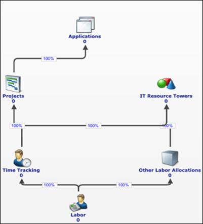

# Personal: Introducción

Utilice los componentes de control de personal y tiempo para cargar, asignar y analizar los datos sobre costes laborales y plantilla de los empleados internos y los contratistas externos. Estos componentes permiten la elaboración de informes sobre gastos laborales, el seguimiento del número de empleados, la asignación de la plantilla y el análisis laboral a nivel de proyecto.

Dependiendo de su modelo operativo (cascada, ágil o híbrido), puede instalar uno o más componentes relacionados con la mano de obra para respaldar los requisitos de generación de informes y asignación de personal.

## Instalación de componentes

**CTF- Trabajo**

- El componente CTF-Labor permite generar informes y análisis sobre los costes laborales y el número de empleados, tanto para los empleados a tiempo completo como para los contratados. Permite comparar los costes reales y la plantilla con respecto al plan y al presupuesto.
- Realice un seguimiento de los costes laborales y el número de empleados por centro de costes, función, proyecto y torre de TI
- Analizar las variaciones del presupuesto laboral
- Apoyar la rendición de cuentas sobre los costes de personal
- Después de instalar este componente, debe cargar los datos laborales y asignarlos a la tabla **de datos maestros laborales** para completar los informes laborales relacionados con los costes y el presupuesto

**CTF - Unidades de trabajo**

El componente CTF-Unidades de trabajo permite una asignación precisa del personal entre proyectos, aplicaciones y productos en modelos operativos en cascada, ágiles o híbridos.

- Asignar personal entre varias subtorres de recursos de TI
- Adopte modelos operativos de TI ágiles, por proyectos o híbridos
- Informar del número exacto de empleados por aplicación, producto o proyecto

Este componente utiliza los datos maestros de mano de obra como fuente e introduce una lógica y métricas de asignación adicionales, incluyendo el personal interno, el personal externo y las unidades de mano de obra.

- Revisar y ajustar las asignaciones (Trabajo → Otras asignaciones de trabajo → Torres de recursos de TI)
- Aplicar métricas **de personal interno**, **personal externo** y **unidades de trabajo** a asignaciones personalizadas
- Utilizar **el ID de mano de obra** y **el factor de ponderación** para la lógica de asignación
- Consulte el siguiente diagrama para ver el modelo recomendado

**CTF: Informes Labor NX (componente adicional)**

Este componente ofrece informes NX predefinidos basados en datos de mano de obra para realizar análisis por centros de coste, funciones y periodos de tiempo.

Utiliza este componente cuando:

- Necesitas informes estándar sobre los costes de mano de obra
- ¿Quieres comparar los datos reales con los presupuestos?
- Necesitas una gestión coherente de la información sobre el personal

## Fuentes comunes de datos

Los datos laborales suelen proceder de los sistemas de gestión de recursos humanos y de la plantilla, que recogen información sobre los empleados, los contratistas y el control del tiempo. Entre los sistemas más comunes se incluyen **SAP, Oracle E-Business Suite, PeopleSoft, y Workday**.

Los datos deben incluir identificadores de empleados o contratistas, tipo de empleo, atributos de funciones, alineación organizativa y, cuando corresponda, información sobre el tiempo o la actividad. Si el cliente sigue las asignaciones del modelo estándar, los datos laborales deberán asignarse a la taxonomía de la torre y subtorre del modelo unificado TBM ( Apptio ) ( ATUM ) para garantizar la coherencia de los informes.

## Conjuntos de datos maestros

Es posible que tenga que cargar varias tablas y asignarlas a las tablas maestras proporcionadas con los componentes. Las tablas son:

- **Datos maestros de mano de obra**
- Contiene información sobre los costes laborales, el presupuesto y el número de empleados internos y externos. Este conjunto de datos se completa cargando y mapeando una tabla de datos laborales.
- **Otras asignaciones de mano de obra Datos maestros**
- Se instala con el componente Unidades de trabajo y se utiliza para asignar mano de obra entre torres de recursos de TI, subtorres, proyectos y aplicaciones utilizando factores de ponderación.
- **Datos maestros de seguimiento del tiempo**
- Utilizado por el componente de seguimiento del tiempo para asignar los costes laborales y el esfuerzo a los proyectos y las actividades operativas
