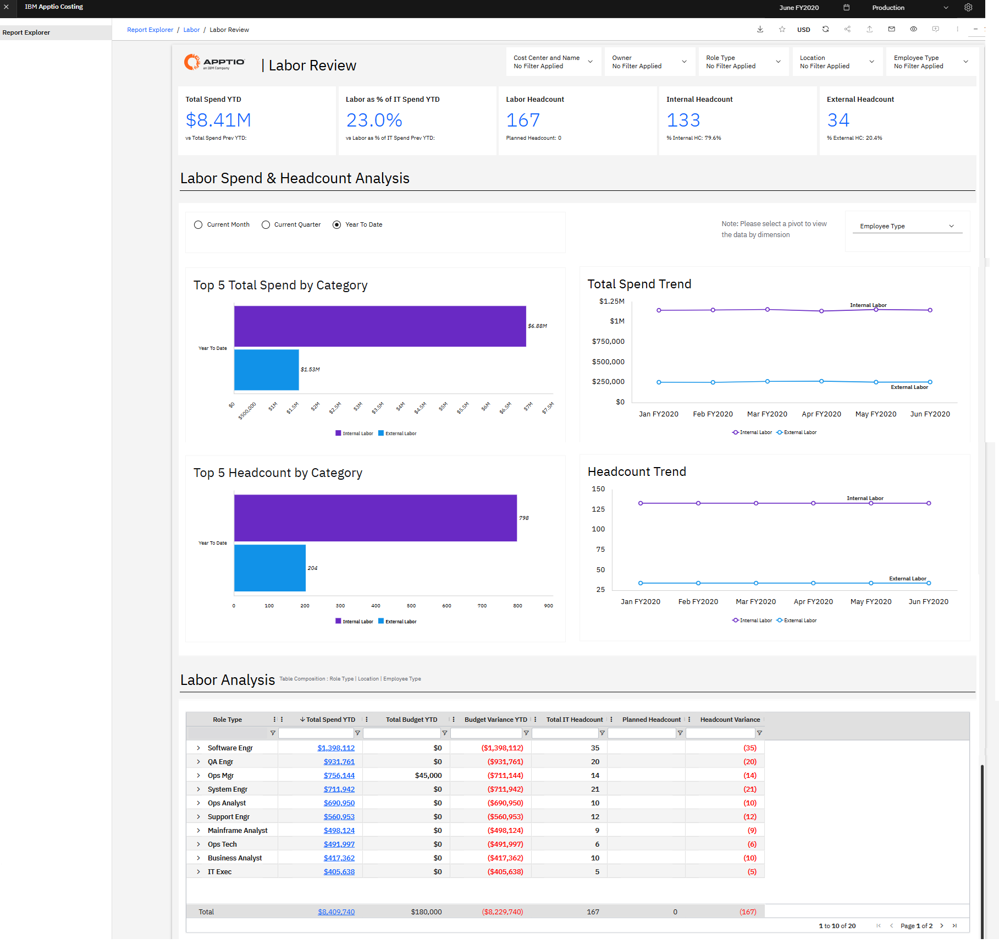
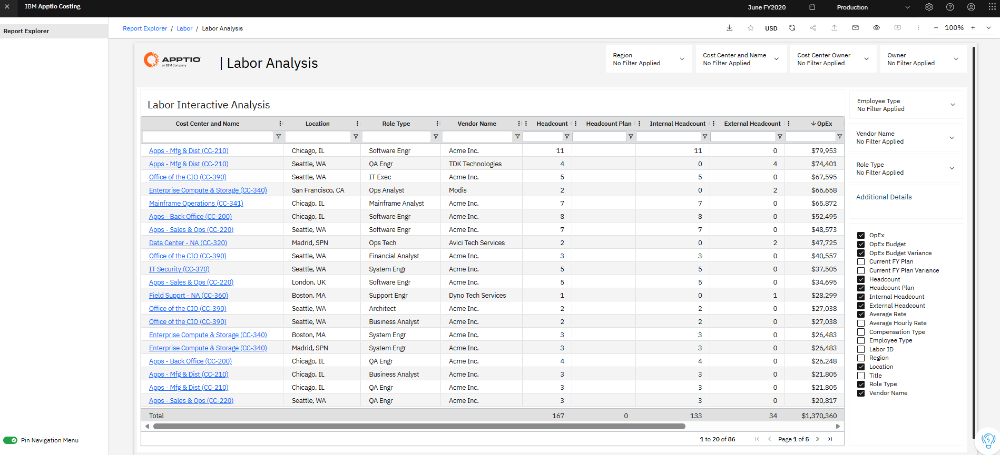
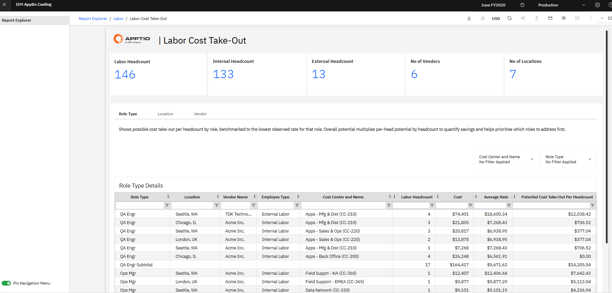

# Informes de Workforce NX

**La recopilación de informes sobre** personal ofrece información sobre los costes laborales, la plantilla y la composición de la plantilla, tanto de los empleados internos como de los contratistas externos. Estos informes facilitan la realización de revisiones periódicas de la plantilla, la planificación de recursos humanos y el análisis de desviaciones, al combinar resúmenes generales con información detallada a nivel de funciones y centros de coste.

La colección de informes sobre el trabajo incluye:

- Revista Laboral
- Análisis laboral
- Coste de mano de obra (sin incluir)

## Revista Laboral

El informe «Labor Review» ofrece una visión general de los costes laborales y la plantilla, tanto de los empleados internos como de los contratistas externos. Ayuda a las organizaciones a supervisar los gastos de personal, las tendencias en la plantilla, los puestos vacantes y el equilibrio entre el personal interno y el externo.

Este informe facilita las revisiones periódicas de los costes laborales, ya que destaca los factores que provocan las desviaciones en el presupuesto de personal y permite ajustar las previsiones y los planes de plantilla utilizando datos detallados a nivel del libro mayor.

Este informe está destinado a los siguientes perfiles:

- Dirección de TI ( -1, director de sistemas de información / Oficina de Gestión del Volumen de Trabajo)
- Responsables de centros de coste y responsables de presupuesto
- Analistas financieros del sector de las tecnologías de la información

**Información proporcionada**

- Analice cómo varían los costes laborales según el puesto, la ubicación y el modelo de contratación para identificar oportunidades de optimización.
- Identificar la combinación de personal interno y externo que presta apoyo a las funciones de TI y a los centros de coste.
- Comprueba si los gastos de personal y la plantilla se ajustan a los planes de contratación y a los objetivos presupuestarios.
- Identificar los factores que influyen en las variaciones del presupuesto de personal mediante el análisis de la evolución del gasto en personal y de la plantilla a lo largo del tiempo.

Para obtener más información sobre cómo utilizar el informe «Labor Review», consulte [«Labor Review».](https://www.ibm.com/docs/en/apptio-commercial/costing-standard/saas?topic=reports-labor-review "(se abre en una pestaña o una ventana nueva)")



## Análisis laboral

El informe de análisis de personal ofrece una visión interactiva y personalizada del gasto en personal y de la plantilla en toda la organización. Permite a los usuarios filtrar datos de forma dinámica y seleccionar métricas para analizar los costes laborales, las tarifas y la plantilla por centro de coste, función, tipo de empleado y ubicación.

Este informe está diseñado para realizar un análisis más profundo de los factores que influyen en los gastos de personal y permite examinar en detalle las tarifas, la distribución de funciones y la comparación entre el personal interno y el externo.

Este informe está pensado para los siguientes perfiles:

- Analista financiero de TI
- Analista de negocios

**Información proporcionada**

- Consulte un resumen completo de la plantilla en todos los centros de coste, incluyendo el número de empleados, el presupuesto de « OpEx, », las desviaciones y las tarifas medias de mano de obra.
- Filtra los datos de personal por región, centro de coste, titular, tipo de empleado y tipo de función para facilitar un análisis específico.
- Analizar las tendencias mes a mes para identificar cambios en los niveles de plantilla, los patrones de costes y la distribución de la mano de obra.
- Personalice el análisis seleccionando métricas adicionales, como la desviación presupuestaria, la plantilla interna frente a la externa y la tarifa media por hora, para respaldar las decisiones financieras y de personal.

Para obtener más información sobre cómo utilizar el informe de análisis de mano de obra, consulte [«Análisis de mano de obra».](https://www.ibm.com/docs/en/apptio-commercial/costing-standard/saas?topic=reports-labor-analysis "(se abre en una pestaña o una ventana nueva)")



## Coste de mano de obra (sin incluir)



| Ventajas claves | Detalles |
| --- | --- |
| - Compara las tarifas de mano de obra por puesto, ubicación y proveedor - Identificar ubicaciones y proveedores de alto y bajo coste para cada puesto - Analizar las tendencias junto con otros factores, como el centro de costes y el tipo de empleado (interno o externo) - Analice el ahorro potencial que supone la contratación de personal a través de ubicaciones y proveedores con menores costes   **Preguntas y respuestas**   - ¿Cuánto podemos ahorrar contratando a un ingeniero en Seattle en comparación con Chicago? - ¿Deberíamos contratar a alguien de la empresa o subcontratar el servicio? - ¿Qué proveedor nos ofrece las tarifas más bajas? | **Para** :  Directores de unidad de negocio  **Cómo acceder a los informes** : Ve a **Informes** > **Cobros de mano de obra** > **Deducción de costes de mano de obra** |

**Detalles**

La tabla anterior ofrece información sobre la posible optimización de costes para los distintos proveedores.

La fila resaltada muestra que el coste del puesto de control de calidad en la sede de Seattle con el proveedor TDK se puede reducir /opt hasta 13 866 $ si se traslada dicho puesto a la consultora PointB en Seattle

La tarifa media corresponde al coste total por empleado: 138 432 / 4 = 34 608.

La tarifa más baja (esta columna está oculta) es la tarifa media más baja de ese tipo de puesto concreto; por ejemplo, ingeniero de software = 31 136

El ahorro potencial por empleado corresponde al coste que se puede optimizar en comparación con el valor más bajo de Ingeniería de Software.`Potential cost take-out per headcount =
Average Rate – Lowest Rate  
 = 34608-1136   
(This is the cost which
can be optimized ) = 3472`

```
Potential Cost Take-Out Overall gives us multiplication of no of labor headcount and Potential Cost Take-Out per headcount = 3472 * 4 = 13866
```
