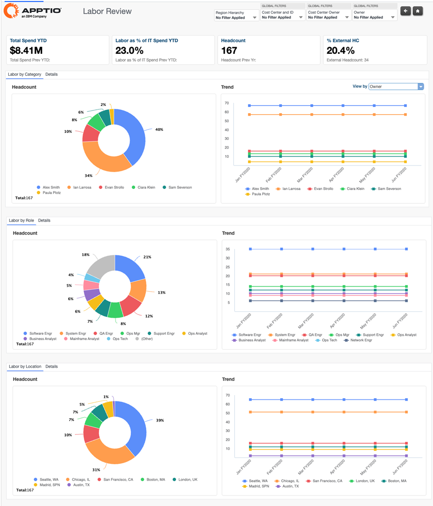
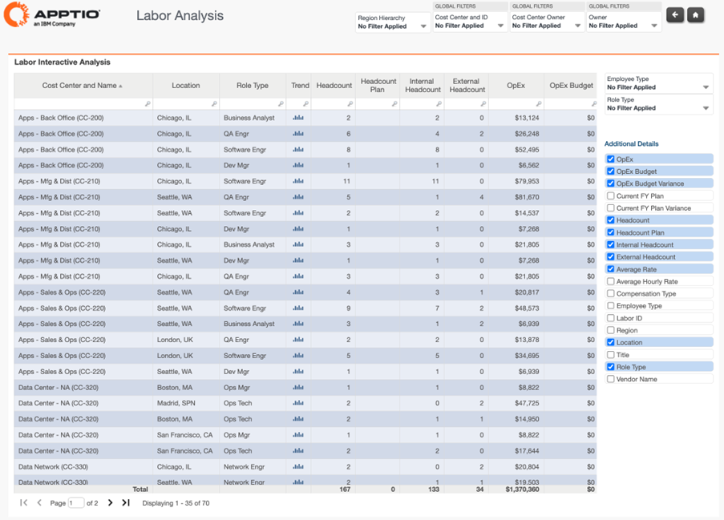

# Informes sobre la fuerza laboral

**La recopilación de informes laborales** ofrece visibilidad sobre los costes laborales, el número de empleados y la composición de la plantilla, tanto de empleados internos como de contratistas externos. Estos informes respaldan las revisiones periódicas de la mano de obra, la planificación de la plantilla y el análisis de variaciones, ya que combinan resúmenes de alto nivel con información detallada sobre las funciones y los centros de costes.

La recopilación de informes laborales incluye:

- Revisión laboral
- Análisis laboral

## Revisión laboral

El informe Labor Review ofrece una visión general de los costes laborales y el número de empleados internos y contratistas externos. Ayuda a las organizaciones a supervisar los gastos laborales, las tendencias de plantilla, los puestos vacantes y el equilibrio entre la mano de obra interna y externa.

Este informe respalda las revisiones periódicas de la mano de obra al destacar los factores que influyen en las variaciones del presupuesto laboral y permitir ajustes en las previsiones y los planes de personal utilizando detalles a nivel del libro mayor.

Este informe está diseñado para los siguientes roles:

- Liderazgo en TI (CIO -1 /Oficina de TBM)
- Responsables de centros de coste y responsables de presupuestos
- Analistas financieros de TI

**Información proporcionada**

- Analizar cómo varían los costes laborales según el puesto, la ubicación y el modelo de contratación para identificar oportunidades de optimización.
- Identificar la combinación de mano de obra interna y externa que respalda las funciones de TI y los centros de costos.
- Comprender si los gastos laborales y la plantilla se ajustan a los planes de contratación y los objetivos presupuestarios.
- Detecte los factores que provocan variaciones en el presupuesto laboral mediante la revisión de las tendencias en el gasto laboral y el número de empleados a lo largo del tiempo.

Para obtener más información sobre cómo utilizar el informe de revisión laboral, haga clic [aquí.](https://www.ibm.com/docs/en/apptio-commercial/costing-standard/saas?topic=reports-labor-review "(se abre en una pestaña o una ventana nueva)")

## Análisis laboral

El informe de análisis laboral ofrece una visión interactiva y ad hoc del gasto laboral y la plantilla en toda la organización. Permite a los usuarios filtrar datos de forma dinámica y seleccionar métricas para analizar los costes laborales, las tarifas y la plantilla por centro de costes, función, tipo de empleado y ubicación.

Este informe está diseñado para realizar un análisis más profundo de los factores que influyen en los gastos laborales y permite investigar en detalle las tarifas, la distribución de funciones y la mano de obra interna frente a la externa.

Este informe está diseñado para ser utilizado por los siguientes perfiles:

- Analista financiero de TI
- Analista de negocios

**Información proporcionada**

- Vea un resumen completo de la plantilla en todos los centros de costes, incluyendo el número de empleados, el presupuesto de costes de personal ( OpEx, ), las variaciones y las tarifas medias de mano de obra.
- Filtra los datos laborales por región, centro de costes, propietario, tipo de empleado y tipo de función para facilitar un análisis específico.
- Analizar las tendencias mensuales para identificar cambios en los niveles de personal, los patrones de costes y la asignación de mano de obra.
- Personalice el análisis seleccionando métricas adicionales, como la variación presupuestaria, el número de empleados internos frente a externos y la tarifa media por hora, para respaldar las decisiones financieras y de personal.

Para obtener más información sobre cómo utilizar el informe de análisis laboral, haga clic [aquí.](https://www.ibm.com/docs/en/apptio-commercial/costing-standard/saas?topic=reports-labor-analysis "(se abre en una pestaña o una ventana nueva)")

