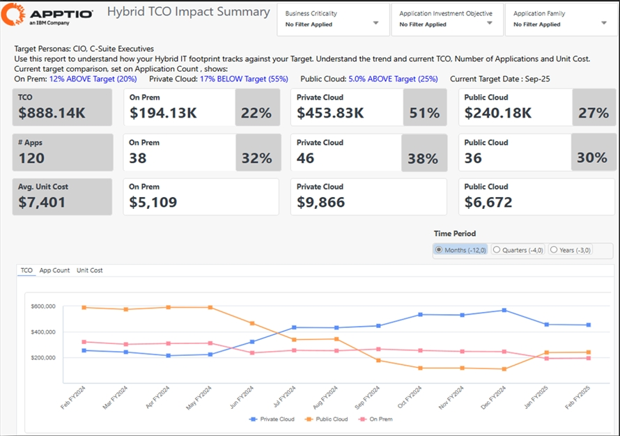
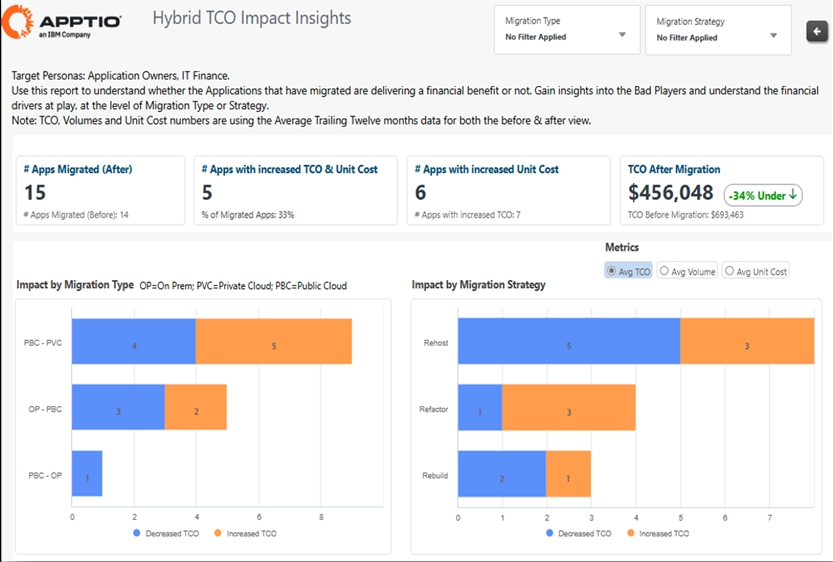
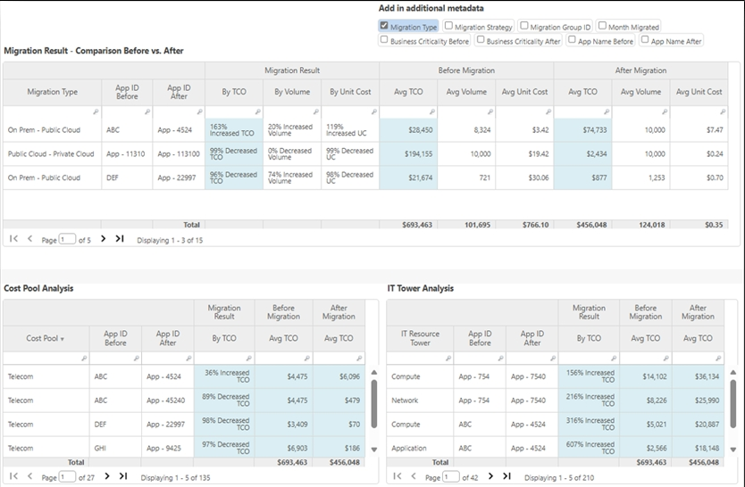
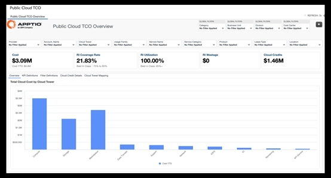
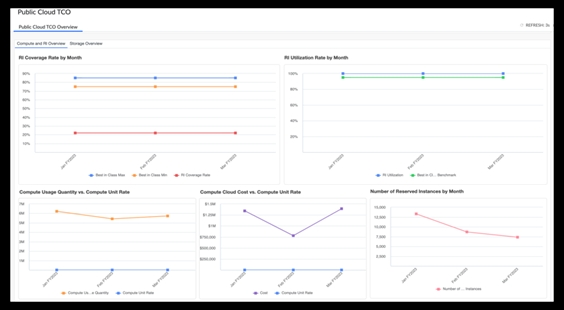

# Notas de la versión 2025

Esta sección describe únicamente todos los cambios en el Costing Standard contenido de la aplicación. Para obtener información sobre los cambios en las TBM Studio versiones del servidor y el cliente, consulte [Novedades en TBM
Studio](../../studio/whats-new.html).

## Costing Standard (plantillas v120 ) - 21 de noviembre de 2025

- IBM Apptio El TCO del producto es una solución específica diseñada para proporcionar una visión clara y justificable de los costes y la composición del producto. Consulte [la descripción general](../configuration/product-tco-overview.html) para obtener más información. Para obtener más información, vea [el vídeo](https://youtu.be/7LD-1gRE6nQ?si=0lgkUTplvW1lS9Jy "(se abre en una pestaña o una ventana nueva)").
- Nuevos informes del panel ejecutivo en IBM Apptio Costing que proporciona información financiera y operativa de alto nivel específica para cada función, adaptada a los directores de informática, directores de tecnología y directores financieros (vista previa pública/beta).
- Mejora [del TCO del mainframe](../configuration/mainframe-tco-overview.html#aitco__benchmarking) : se han añadido comparaciones de costes entre pares basadas en referencias del sector.

## Costing Standard (plantillas v120 ) - 26 de septiembre de 2025

- Mainframe TCO es una solución diseñada específicamente para ofrecer una visión clara y justificable de los costes del mainframe, lo que permite una asignación precisa de los costes, un seguimiento exhaustivo de la utilización y una toma de decisiones basada en datos. Consulte [la Descripción general](configuration/mainframe-tco-overview.html) y [la Guía de configuración](configuration/mainframe-config-guide.html) para obtener más información. Para obtener más información, vea [el vídeo](https://www.youtube.com/watch?v=XyLAwalou4M "(se abre en una pestaña o una ventana nueva)") y [el blog](https://www.apptio.com/blog/introducing-ibm-apptio-mainframe-tco-complete-visibility-into-mainframe-costs-and-usage/ "(se abre en una pestaña o una ventana nueva)").
- Cost Take-Out Analytics & Insights son informes consolidados listos para usar que simplifican la optimización de costes al reunir información sobre proveedores, aplicaciones y mano de obra, lo que permite a las organizaciones identificar rápidamente oportunidades de ahorro y tomar decisiones más rápidas basadas en datos. Consulte [la Descripción general](../configuration/cost-take-out-reports.html) y [la Guía de configuración](../configuration/cost-takeout-config-guide.html) para obtener más información. Para obtener más información, vea [el vídeo](https://youtu.be/ImnfrjRxEVI "(se abre en una pestaña o una ventana nueva)").
- Se han añadido archivos de referencia para la taxonomía TBM v5

## Costing Standard (plantillas v120 ) - 15 de agosto de 2025

- TCO y uso de la IA: se ha añadido una nueva pestaña de definición.
- [Impacto del TCO de la TI híbrida](../reports/hyb-it-sum.html) : nueva ventana emergente con tendencias detalladas en el informe de análisis y métrica de coste medio por aplicación añadida al informe resumido
- TCO del mainframe: se ha añadido un informe detallado y un informe de facturación.
- Se ha añadido la etiqueta «Aplicación» a los informes [de TCO de la nube pública](../reports/pub-cloud-tco-overview.html).
- Se ha añadido el nuevo campo «Código» en las tablas de datos maestros de integración de planificación.

## Costing Standard ( v120 ) - 4 de julio de 2025

- Mejoras en el informe sobre el coste total de propiedad y el uso de la IA; solución añadida a los proyectos de referencia.
- Mejoras en el coste total de propiedad (TCO) de los mainframes (BETA)
- Localización al japonés para el impacto del TCO de la TI híbrida y el TCO y uso de la IA.

## Costing Standard ( v120 ) - 30 de mayo de 2025

- Presentación **de** la solución AI TCO & Usage de IBMApptio, que proporciona a los directores de informática, responsables de negocios y soluciones, y equipos de inteligencia artificial y ciencia de datos una visibilidad completa del coste total de propiedad y el uso de la inteligencia artificial. Al desbloquear información valiosa a través de modelos y soluciones de IA, impulsa decisiones más inteligentes para las inversiones en IA, permite una ampliación responsable y sienta las bases para conversaciones sobre el valor de la IA. Consulte [la Descripción general](../configuration/ai-tco-overview.html "La inteligencia artificial (IA) es una prioridad clave para muchas organizaciones, y los directores de informática (CIO) tienen cada vez más la tarea de liderar las estrategias de IA en toda la organización. A medida que se acelera el gasto en IA, también lo hace la complejidad. Los directores de informática admiten que la gestión de los costes limita su capacidad para aprovechar todo el potencial de la inteligencia artificial. Para que las organizaciones adopten, amplíen y gestionen iniciativas de IA de forma sostenible y aprovechen todo su valor, necesitan una visibilidad clara de los costes, el uso y la adopción de la IA."), [la Guía de configuración](../reports/ai-tco-configguide.html) y [la Recopilación de informes](../reports/ai-tco-report-collection.html) para obtener más información.
- Se han introducido [informes generales de modelos](../reports/pub-cloud-model-views-cs.html) para visualizar los flujos de costes, lo que proporciona información detallada y mejora la transparencia.
- Se han añadido nuevos informes [de Hybrid IT Impact Admin](../reports/hyb-tco-imp-admin.html "Se trata de un reemplazo del conector mensual Apptio Datalink utilizado para «congelar» cualquier aplicación migrada con su TCO, volumen y coste unitario. Las instrucciones están disponibles en el informe de administración.") con el botón «Copiar tabla» para simplificar la configuración y eliminar la necesidad de conectores de enlace de datos de Apptio a Apptio.
- Informe [TCO Public Cloud](../cost-transparency/reports/pub-cloud-tco-overview.dita "(se abre en una pestaña o una ventana nueva)") actualizado con pestaña Definición, gráficos de doble eje para tarifas unitarias, tabla de atributos redimensionada y orden de selección de columnas revisado que sigue una jerarquía taxonómica.

## Costing Standard ( v120 ) - 11 de abril de 2025

Esta versión incluye las siguientes mejoras clave para optimizar la experiencia del usuario y la funcionalidad.

- Proyecto de uso: informes basados en roles según el perfil de Frontdoor.
- IBM Apptio La integración de Turbonomic ya está disponible. Para obtener más información, vea este [vídeo](https://youtu.be/-FY7WfDBK1g?si=20-TTKhVDBaPRo0v "(se abre en una pestaña o una ventana nueva)").
- Soporte en japonés para Public Cloud TCO.
- Public Cloud TCO añadido al proyecto Costing Standard de referencia

## Impacto del coste total de propiedad (TCO) de la TI híbrida para IBM ApptioCosting Standard – 28 de febrero de 2025

**Resumen**

La solución Hybrid IT TCO Impact, ahora disponible con el lanzamiento de R12.11.12, es una importante incorporación a la cartera de productos de IBMApptio. Esta solución está diseñada para abordar los retos que plantea la gestión de entornos de TI híbridos, en los que las aplicaciones se mueven constantemente entre entornos locales, nubes privadas y nubes públicas. En entornos tan dinámicos, es fundamental comprender claramente los costes, las prioridades y los objetivos asociados a una estrategia de TI híbrida basada en datos. Sin esta visibilidad, la toma de decisiones puede volverse especulativa y las organizaciones pueden tener dificultades para optimizar sus inversiones en TI.

La solución Hybrid IT TCO Impact proporciona a las organizaciones las herramientas necesarias para medir y comprender el impacto financiero de sus entornos de TI híbridos en constante evolución. Al ofrecer visibilidad sobre la economía de las unidades, el coste total de propiedad (TCO) y el consumo de las aplicaciones antes y después de las migraciones, esta solución permite a las partes interesadas, incluidos los ejecutivos de alto nivel y los propietarios de aplicaciones, tomar decisiones informadas. Con Hybrid IT TCO Impact, las organizaciones pueden garantizar que sus migraciones aporten el valor financiero previsto y optimizar sus inversiones en TI para lograr mejores resultados empresariales. Al aprovechar esta solución, las organizaciones pueden navegar con confianza por las complejidades de la TI híbrida y tomar decisiones basadas en datos que impulsan el éxito empresarial.

**Compare el parque informático híbrido con los objetivos**

El informe «Resumen del impacto del TCO de la TI híbrida» ofrece una visión general completa del patrimonio de TI híbrida de una organización, que abarca entornos locales, de nube privada y de nube pública, lo que permite a los usuarios realizar un seguimiento de métricas clave como el coste total de propiedad (TCO), el coste unitario y el número de aplicaciones para estados híbridos actuales y pasados. Este informe permite a los usuarios medir cómo ha cambiado su entorno de TI híbrido a lo largo del tiempo y comparar su estado actual con objetivos predefinidos, lo que proporciona información valiosa para tomar decisiones y optimizar su huella de TI híbrida.

**Comprender el impacto financiero de las migraciones de aplicaciones**

A medida que se realicen las migraciones de aplicaciones, los usuarios podrán ver el impacto financiero de cada tipo de migración y estrategia de migración. Los tipos de migración incluyen de local a Public Cloud, Public Cloud a nube privada, y cualquier otra dirección y combinación de estas. Las estrategias de migración podrían incluir el reubicación de aplicaciones, la refactorización, la reconstrucción, etc.

Esto permite a los usuarios obtener rápidamente información sobre cualquier «elemento negativo», como aplicaciones con un aumento del coste unitario tras la migración. Además, ayuda a comprender qué migraciones han proporcionado los mayores beneficios financieros hasta la fecha en términos de coste total de propiedad, coste unitario y volúmenes de uso.

**Descubra los factores que impulsan los cambios en el TCO**

Analizar los resultados de la migración a nivel de cada aplicación individual, incorporando metadatos como la importancia crítica para el negocio y la fecha de migración. Esto ayuda a identificar grupos de costes específicos y torres de TI que generan beneficios o inconvenientes financieros, lo que permite tomar decisiones basadas en datos para optimizar futuras migraciones.

## Public Cloud TCO para Costing Standard ( v120 ) – 28 de febrero de 2025

La versión Public Cloud TCO para Costing Standard ( v120 ) y Costing Essentials ( v200 ) ofrece múltiples ventajas para los usuarios principales, principalmente los equipos financieros de TI. Esta versión ofrece una perspectiva financiera sencilla y transparente de los costes mensuales de la nube pública, lo que ayuda a evitar sorpresas desagradables en la factura. También permite a los equipos impulsar la responsabilidad y garantizar una eficiencia óptima de los servicios de nube pública, minimizando el desperdicio.

La nueva versión incluye la instalación de nuevos componentes, como TCOPublic Cloud en v120 y TCOPublic CloudPublic Cloud y TCO Reporting en v200. Los usuarios pueden conectarse a los datos en la nube y utilizar funciones como «Nombre de la cuenta», «Unidad de negocio» y «Tabla de asignación de torres en la nube» para personalizar los informes y obtener información sobre las prácticas de su organización en la nube. Con esta versión, los usuarios pueden evaluar si su organización está aplicando las mejores prácticas en materia de nube, incluyendo la cobertura de RI y las tasas de utilización, para optimizar sus servicios en la nube.

Para obtener más información sobre la configuración, consulte [aquí](../reports/public-cloud-config.html).

## Costing Standard ( v120 ) - 17 de enero de 2025

Esta publicación refleja la información más reciente sobre precios de Hybrid Business Management (HBM) para Q4 2024. Esta actualización garantiza que nuestros clientes tengan acceso a la información más actualizada y precisa sobre precios, lo que les permite planificar y gestionar eficazmente sus necesidades de HBM.
