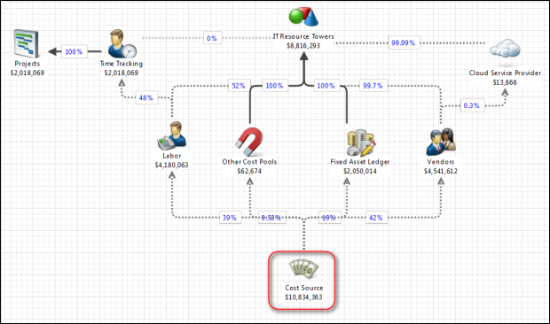

# Acerca de los informes de calidad de datos

Se aplica a: Costing Standard 11.8.x que se ejecuta en TBM Studio v12 o TBM Studio v11.

## Introducción

Los informes sobre la calidad de los datos se centran en la calidad y exhaustividad de los mismos.

Utilice los informes de calidad de datos para:

- Identificar áreas de mejora de los datos
- Revisar las asignaciones y estrategias financieras
- Revisar las asignaciones y estrategias de recursos informáticos

Los informes presentan información sobre las siguientes dimensiones de datos:

- Fuente de costes, incluyendo mano de obra, proveedores, proyectos, centros de datos, servidores, almacenamiento, tickets, aplicaciones y unidades de negocio.
- Integridad, validez y unicidad de los datos.
- Asignación de costes.

Hay informes de calidad de datos para:

- Finanzas
- Recursos
- Servicios
- Servidores
- Almacenamiento
- Centro de servicio al usuario
- Centros de datos

El informe Finanzas se describe [Calidad de datos - Informe Finanzas](dataqualityfinancials.html). Los demás informes no se describen, pero son similares.

## Información sobre la asignación

Uno de los principales objetivos de los informes de calidad de datos es la asignación de costes de la fuente de costes a las distintas entidades de la organización. Las asignaciones vienen definidas por los modelos de asignación. El modelo principal de imputación de costes se muestra a continuación en la Figura A. Para obtener más información sobre la definición de asignaciones, consulte Asignación de valor en modelos en la Guía de Studio.

## Acceder a los informes

Para acceder a los informes de Calidad de datos, haga clic en Datos y asignaciones en la página de inicio. Desde el informe resumido, puede acceder a informes detallados sobre las distintas dimensiones.
