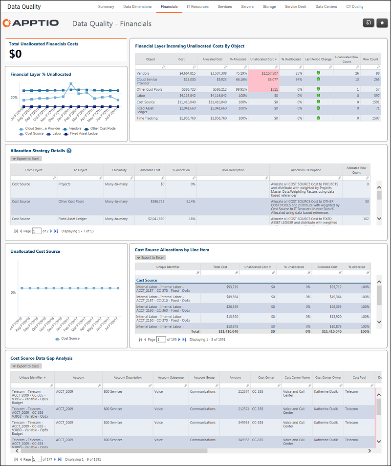
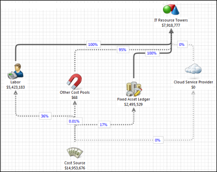

# Calidad de los datos - Informe financiero

Se aplica a: Costing Standard 11.8.x que se ejecuta en TBM Studio v12 o TBM Studio v11.

## Introducción

El informe financiero se centra en los costes no asignados.

## Navegación

Calidad de datos > Finanzas

## Funciones

Este informe está destinado a los administradores de TBM.

## Objetivos

Utilice este informe para analizar las asignaciones de la capa financiera del modelo de costes que se muestra a continuación. El informe se centra en el conjunto de datos de la fuente de costes y en los registros específicos que no fluyen en el modelo.

Entre los objetivos específicos figuran los siguientes:

- Vea rápidamente los costes no asignados de la capa financiera.
- Evaluar las tendencias de los costes no asignados a lo largo del tiempo por objetos del modelo financiero de TI.
- Identificar los costes no asignados por objetos del modelo financiero de TI.
- Revisar las estrategias de asignación de los objetos financieros de TI en el modelo (por ejemplo, fuente de costes, mano de obra, activos fijos, etc.).

## Preguntas contestadas

La información presentada en este informe puede utilizarse para responder a las siguientes preguntas:

- ¿Qué registros específicos no se están asignando a uno de los objetos de destino (mano de obra, activos fijos, etc.)?
- ¿Puedo ver algún patrón que permita identificar el error?
- ¿Están completos y son válidos todos los campos importantes que determinan mis asignaciones?

## Próximas acciones

- Exporte registros específicos para revisarlos y corregirlos.
- Ajuste o corrija las normas de asignación en Studio.
- Corrija los datos en los datos de origen o mediante transformaciones de datos en Data Studio.

## Información relacionada

- [Enviar comentarios sobre el Centro de ayuda](productfeedback@apptio.com "(se abre en una pestaña o una ventana nueva)")
