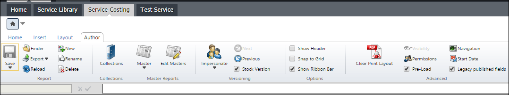
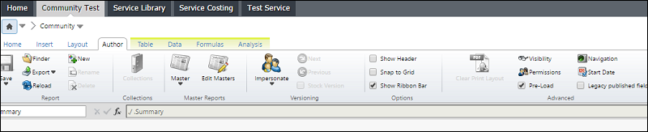

# Cómo: Comprobar si un informe es de stock o personalizado

En la **pestaña Informes (Modo Edición/Pestaña Autor)**, puede comprobar si un informe viene de fábrica (stock) o si se ha personalizado. Esto podría ser útil para determinar si se han realizado cambios sin comprobar los registros de auditoría.

## Versión de archivo de un informe

1. Seleccione un informe específico en mente.
2. Entra en el modo de edición.
3. Haga clic en la pestaña **Autor**.
4. Observe que **Versión de Stock** está marcada.

## Versión no stock de un informe

La siguiente imagen muestra la cinta de opciones de un informe que se ha personalizado o que no es un informe de existencias OOTB (out of the box).

## Información relacionada

- [Enviar comentarios sobre el Centro de ayuda](productfeedback@apptio.com "(se abre en una pestaña o una ventana nueva)")
