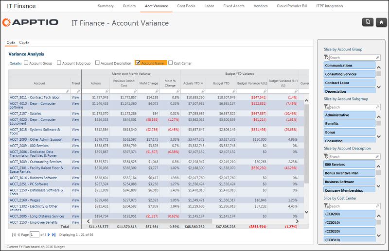

# IT Finanzas - Informe de desviación de cuenta ( v103 )

Se aplica a: Costing Standard 11.8.x que se ejecuta en TBM Studio v12 o TBM Studio v11.

## Introducción

Utilice este informe para examinar todas las cuentas por categoría de coste y ver a dónde se destina el gasto total.

## Navegación

IT Finanzas > Desviación contable

## Funciones

Este informe está destinado al personal de Finanzas de TI.

## Objetivos

Utilice este informe para:

- Examine todas las cuentas por categoría de coste para ver a dónde se destina el gasto total.
- Busque/corte por grupos de cuentas para encontrar y ver los gastos de categorías específicas.
- Incluya otros filtros de jerarquía de cuentas para organizar y visualizar la información.

## Preguntas contestadas

Puede utilizar la información presentada en este informe para responder a las siguientes preguntas:

- ¿En qué categoría gastamos más?
- ¿Estamos gastando en esta categoría de costes más de lo que esperábamos?
- ¿Existen oportunidades para controlar mejor o reducir el gasto en un área?

## Próximas acciones

- Haga clic en Ver en la columna Tendencia de la variación para ver la variación mensual YTD.
- Haga clic en una cuenta de la columna Descripción de cuenta para ver las transacciones detalladas.
