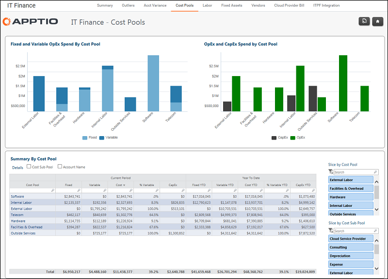

# Finanzas de TI - Informe de grupos de costes ( v103 )

Se aplica a: Costing Standard 11.8.x que se ejecuta en TBM Studio v12 o TBM Studio v11.

## Introducción

Utilice este informe para visualizar los gastos fijos /var iable y los gastos de OpEx/CapEx por grupo de costes.

## Navegación

Finanzas TI > Grupos de costes

## Funciones

Este informe está destinado al personal de Finanzas de TI.

## Objetivos

Utilice este informe para visualizar los gastos fijos /var iable y OpEx/CapEx por grupo de costes.

## Preguntas contestadas

Puede utilizar la información presentada en este informe para responder a las siguientes preguntas:

- Si baja la demanda o el consumo, ¿tengo flexibilidad para reducir el gasto?
- ¿Dónde podría considerar cambios en el aprovisionamiento que crearan una estructura de costes más variable?
- ¿Qué agilidad financiera conviene a nuestra empresa en este momento? ¿Debo fijar un objetivo variable porcentual?
- ¿Cómo varía la capitalización en función del conjunto de costes?
- ¿Dónde se capitaliza la mayor parte de mi gasto?

## Próximas acciones

- Evaluar la demanda futura y los servicios necesarios (fuera de Apptio ).
- Evalúe las tarifas externas y las condiciones contractuales (fuera de Apptio ).
- Seleccione la opción Cuenta encima de la tabla para ver los gastos fijos /var iable y OpEx/CapEx por cuenta.
- Evalúe las tarifas externas y las condiciones contractuales (fuera de Apptio ).

## Información relacionada

- [Enviar comentarios sobre el Centro de ayuda](productfeedback@apptio.com "(se abre en una pestaña o una ventana nueva)")
