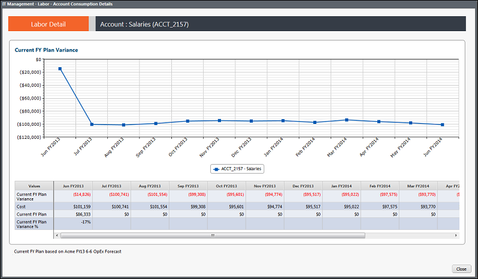

# IT Finance - Detalles laborales - Composición - Informe de tendencias ( v103 )

Se aplica a: Costing Standard 11.8.x que se ejecuta en TBM Studio v12 o TBM Studio v11.

## Introducción

Utilice este informe para ver los gastos y el presupuesto (si procede) por mes durante los últimos 13 meses.

## Navegación

Finanzas TI > Mano de obra > Centro de coste > Composición de cuentas > Vista de tendencias

## Funciones

Este informe está destinado a:

- Personal informático financiero
- Propietario del centro de costes

## Objetivos

Utilice este informe para:

- Consulte en el gráfico los efectivos de Personal Interno y Externo por meses en los últimos 13 meses.
- Revise los efectivos y la tasa media por mes utilizando las tablas.

## Preguntas contestadas

Puede utilizar la información presentada en este informe para responder a las siguientes preguntas:

- ¿Cómo ha fluctuado mi plantilla a lo largo del tiempo?
- ¿Los cambios en la capacidad del recurso/rol son gestionados por mano de obra externa?
- ¿Mis tarifas medias de mano de obra externa se mantienen estables o cambian con el tiempo?
- Si esta función es crítica para la empresa, ¿estamos reteniendo suficiente personal interno?

## Próximas acciones

Para la mano de obra externa, investigue la composición de la cuenta para revisar las transacciones (informe de mano de obra de TI).
