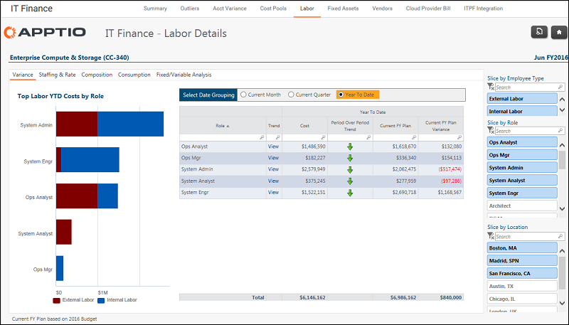

# IT Finance - Detalles laborales - Informe de desviaciones ( v103 )

Se aplica a: Costing Standard 11.8.x que se ejecuta en TBM Studio v12 o TBM Studio v11.

## Introducción

Utilice este informe para ver los principales gastos de mano de obra por función y desglose interno/externo.

## Navegación

Finanzas TI > Mano de obra > Centro de coste > Desviación presupuestaria

## Funciones

Este informe está destinado a:

- Personal informático financiero
- Propietario del centro de costes

## Objetivos

Utilice este informe para:

- Vea los gastos de mano de obra más importantes por función y desglose interno/externo. (Gráfico de los principales costes interanuales por función)
- Identificar la desviación entre los gastos y el presupuesto por función para el mes, trimestre y año en curso. (Seleccione la opción Agrupación de fechas)

## Preguntas contestadas

Puede utilizar la información presentada en este informe para responder a las siguientes preguntas:

- ¿Cómo se desglosa mi gasto laboral por funciones e interno/externo?
- ¿Dónde gasto más?
- ¿Dónde está mi mayor desviación?
- ¿Es adecuada mi combinación de mano de obra interna y externa para las necesidades de nuestra empresa?
- ¿Es necesario tomar medidas para mitigar los riesgos presupuestarios o de otro tipo (por ejemplo, funciones clave completamente externas)?

## Próximas acciones

- Visualice los gastos y el presupuesto de 13 meses para identificar tendencias anormales haciendo clic en Ver en la columna Tendencia.
- Investigue la dotación de personal y las tarifas haciendo clic en la pestaña Dotación de personal y tarifas.
