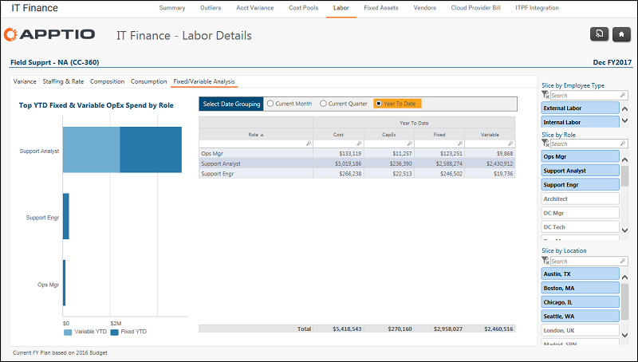

# IT Finance - Detalles laborales - Informe de análisis fijo/variable ( v103 )

Se aplica a: Costing Standard 11.8.x que se ejecuta en TBM Studio v12 o TBM Studio v11.

## Introducción

Utilice este informe para identificar los gastos fijos relativos de /var iable y OpEx/CapEx por función.

## Navegación

Finanzas TI > Mano de obra > Centro de coste > Análisis fijo/variable

## Funciones

Este informe va dirigido a:

- Personal informático financiero
- Propietario del centro de costes

## Objetivos

Utilice este informe para identificar los gastos fijos relativos de /var iable y OpEx/CapEx por función.

## Preguntas contestadas

Puede utilizar la información presentada en este informe para responder a las siguientes preguntas:

- Si baja la demanda o el consumo, ¿tengo flexibilidad para ajustar la plantilla?
- ¿Qué porcentaje de mi coste laboral se capitaliza?
- ¿Cómo varía la capitalización de mi trabajo según la función?
- ¿Existen cambios de contratación que pueda adoptar para crear una estructura de personal o de costes variables más flexible?
- ¿Cuál es la proporción adecuada entre mano de obra interna y externa para nuestra empresa y mi área de responsabilidad?

## Próximas acciones

- Para ver los gastos fijos de 13 meses de /var iable e identificar las tendencias a lo largo del tiempo, haga clic en Ver en la columna Tendencia.
- Consulte el informe de gastos financieros de TI para ver qué cuentas son fijas o variables.

## Información relacionada

- [Enviar comentarios sobre el Centro de ayuda](productfeedback@apptio.com "(se abre en una pestaña o una ventana nueva)")
