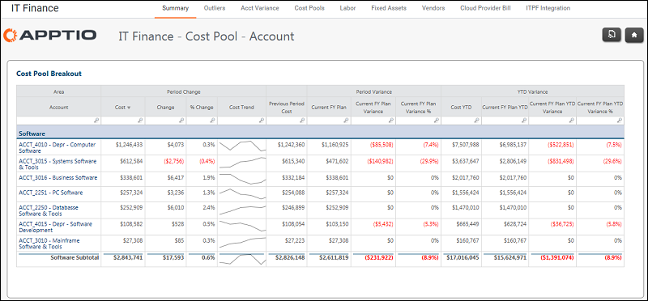

# Finanzas TI - Resumen - Pool de costes - Informe de cuentas ( v103 )

Se aplica a: Costing Standard 11.8.x que se ejecuta en TBM Studio v12 o TBM Studio v11.

## Introducción

Utilice este informe para identificar y verificar las cuentas asignadas a un grupo de costes específico.

## Navegación

Finanzas TI > Resumen > Haga clic en un grupo de costes de la tabla

## Funciones

Este informe está destinado al personal financiero de TI.

## Objetivos

Utilice este informe para:

- Identificar y verificar las cuentas asignadas a un grupo de costes específico (por ejemplo, categoría de costes).
- Visualice los gastos y la desviación para el período actual y el período interanual.

## Preguntas contestadas

Utiliza la información presentada en este informe para responder a las siguientes preguntas:

- ¿Todas estas cuentas pertenecen a esta categoría de pool de costes?
- Si una cuenta no corresponde, ¿a dónde debe trasladarse?
- Por cuenta, ¿cuál es mi mayor gasto y desviación, por importe y por porcentaje?
- ¿Es necesario tomar medidas para mitigar el riesgo presupuestario?

## Próximas acciones

- Si la variación es irrelevante, no es necesario preocuparse ni tomar medidas.
- Para ver los detalles de las transacciones de una cuenta, haga clic en una cuenta.
