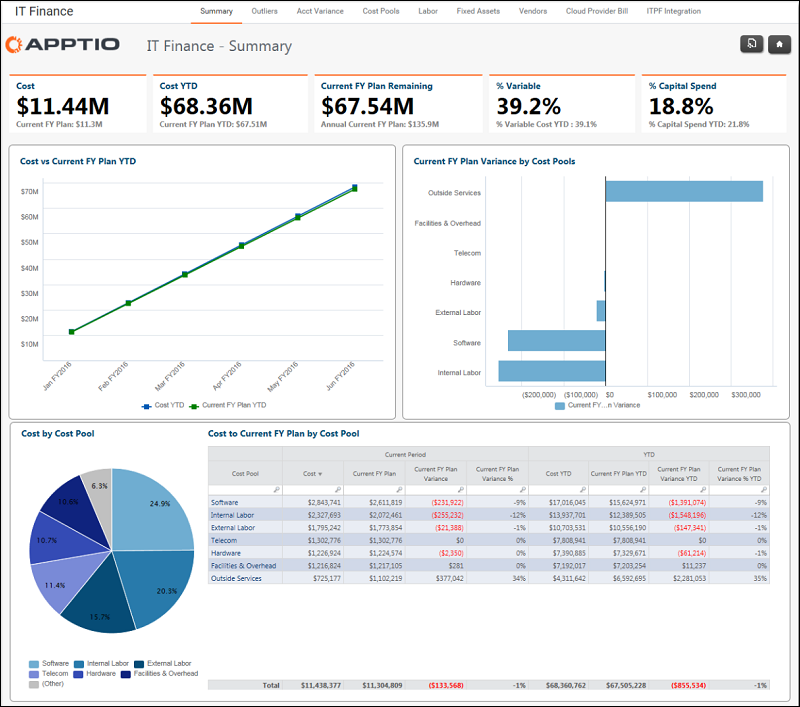

# Informe de síntesis sobre las finanzas informáticas ( v103 )

Se aplica a: Costing Standard 11.8.x que se ejecuta en TBM Studio v12 o TBM Studio v11.

## Introducción

Utilice el informe Resumen financiero de TI para revisar los gastos acumulados hasta la fecha, los gastos anuales previstos y la variación presupuestaria por grupo de costes.

## Navegación

Finanzas TI > Resumen

## Funciones

Este informe está destinado al personal de Finanzas de TI.

## Objetivos

Utilice este informe para:

- Revisar los KPI de gastos y presupuesto.
- Comprender el gasto acumulado hasta la fecha y el gasto anual previsto.
- Identificar la desviación presupuestaria por grupo de costes.
- Identificar los gastos máximos y la desviación por grupo de costes (por ejemplo, categoría de costes) utilizando el gráfico Coste por grupo de costes y la tabla Coste a presupuesto por grupo de costes.

## Preguntas contestadas

Utiliza la información presentada en la parte superior del informe para responder a las siguientes preguntas:

- ¿Cómo van mis gastos con respecto al presupuesto de este año?
- ¿Estoy por encima o por debajo del presupuesto anual?
- ¿Qué grupos de costes están por encima o por debajo del presupuesto?
- ¿Cuánto he gastado este año en el fondo común de gastos?

Utiliza la información presentada al final del informe para responder a las siguientes preguntas:

- ¿Cuánto he gastado este año en el fondo común de gastos?
- ¿Dónde gasto más?
- ¿Dónde está mi mayor desviación, por importe y por porcentaje?
- ¿Qué cantidad de desviación o porcentaje de desviación es material en comparación con mi gasto global en TI?
- ¿Es necesario tomar medidas para mitigar el riesgo presupuestario?

## Próximas acciones

- Si la variación es irrelevante, no es necesario preocuparse ni tomar medidas.
- Para obtener más información, haga clic en un grupo de costes específico en la tabla inferior para ver qué cuentas están asignadas a cada grupo de costes.
