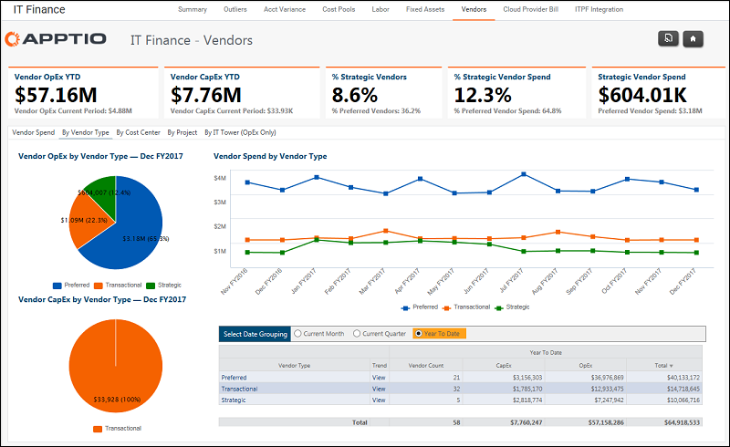

# IT Finance - Proveedores - Informe por tipo de proveedor ( v103 )

Se aplica a: Costing Standard 11.8.x que se ejecuta en [TBM Studio v12](https://community.apptio.com/community/apptio/product-central/tbm-studio/studio-v12 "(se abre en una pestaña o una ventana nueva)") o [TBM Studio v11](https://community.apptio.com/community/apptio/product-central/tbm-studio/studio-v11 "(se abre en una pestaña o una ventana nueva)").

## Introducción

Utilice este informe para revisar los gastos de proveedores por tipo de proveedor: preferido, estratégico y transaccional.

## Navegación

Finanzas TI > Proveedores > Por tipo de proveedor

## Funciones

Este informe está destinado a:

- Finanzas TI
- Gestor de proveedores
- Gestión de TI

## Objetivos

Utilice este informe para revisar los gastos de proveedores por tipo (Estratégicos, Preferidos y Transaccionales).

Los tipos de vendedor se describen a continuación:

Preferido
:   Los proveedores preferentes han sido investigados por una empresa y aprobados. A menudo, se han cumplido los requisitos de adquisición y contratación y pueden existir los acuerdos, términos y condiciones apropiados. Pueden establecerse compromisos de compra por volumen para obtener mejores precios y servicios adicionales. A menudo, los vendedores deben solicitar entrar en el programa preferente de una empresa.

Estratégico
:   Todos los proveedores estratégicos son también proveedores preferentes. La diferencia es que hay atributos adicionales que son de valor para la empresa y que pueden incluir: relación comprador-proveedor clave, fuente única, tecnologías conjuntas, utillaje heredado, objetivos de sostenibilidad y otras características diferenciadoras o importantes. Cuando una empresa necesita productos o servicios, recurre primero a proveedores estratégicos y preferentes.

Transaccional
:   Todos los demás proveedores de productos y servicios se consideran transaccionales. En función de los controles de contratación que se apliquen, es posible que el personal sólo pueda comprar a proveedores transaccionales si los productos o servicios no se ofrecen a través de los proveedores estratégicos o preferentes de la empresa.

## Preguntas contestadas

La información presentada en este informe puede utilizarse para responder a las siguientes preguntas:

- ¿Cuánto gasto en proveedores según el tipo de proveedor?
- ¿Cómo se desglosa por OpEx y CapEx?
- ¿Tengo demasiados gastos repartidos entre numerosos proveedores transaccionales?
- Si se está llevando a cabo una consolidación de proveedores, ¿se está reduciendo el número de proveedores y aumentando el gasto en proveedores preferentes o estratégicos?

## Próximas acciones

- Analice los proveedores específicos de un tipo seleccionando un tipo de proveedor en la tabla.
- Analice los gastos de proveedores por centro de coste seleccionando la ficha Por centro de coste.
