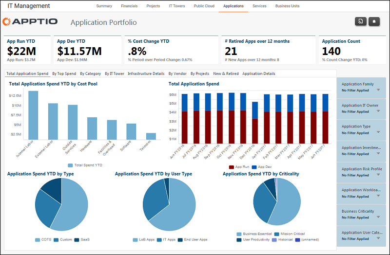

# Gestión informática - Informes sobre aplicaciones

Se aplica a: Costing Standard 11.8.x que se ejecuta en TBM Studio v12 o TBM Studio v11.

## Introducción

Los informes sobre aplicaciones de gestión de TI se centran en el gasto en aplicaciones desde una amplia gama de perspectivas.

Utilice los informes de Aplicaciones de Gestión de TI para ver los gastos de aplicaciones por:

- Gasto máximo
- Categoría
- Torre IT
- Detalles de infraestructura
- Proveedor
- Proyectos
- Aplicaciones nuevas y retiradas
- Detalles de la aplicación

