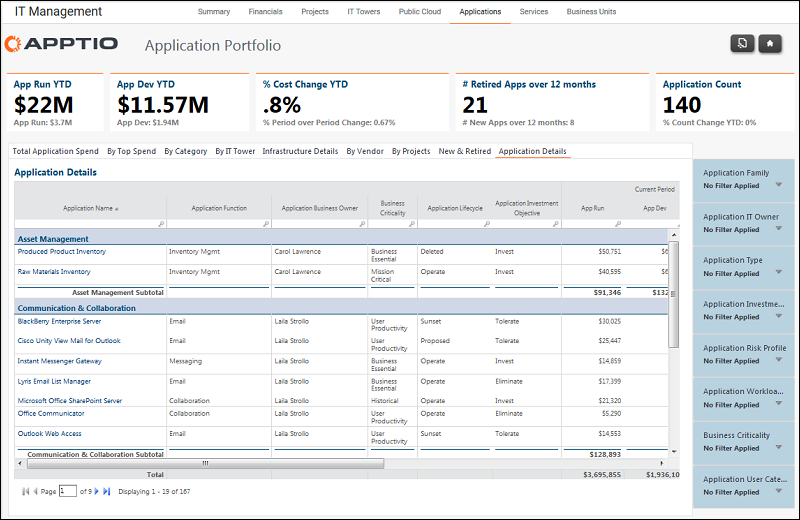

# Gestión informática - Aplicaciones - Informe detallado de aplicaciones ( v103 )

Utilice este informe para revisar el gasto en aplicaciones por nube privada, física y virtual.

Se aplica a: Costing Standard 11.8.x que se ejecuta en TBM Studio v12 o TBM Studio v11.

## Navegación

Gestión TI > Aplicaciones > Detalles de la aplicación

## Funciones

Este informe está destinado a:

- Propietarios de aplicaciones
- Propietarios de la cartera de aplicaciones / Vicepresidente de desarrollo y soporte de aplicaciones
- Arquitectos de empresa

## Objetivos

Utilice este informe para:

- Revisar el gasto en aplicaciones y el número de usuarios.
- Obtenga el coste unitario por usuario en lo que va de año para cada aplicación.

## Preguntas contestadas

La información presentada en este informe puede utilizarse para responder a las siguientes preguntas:

- ¿Está el coste total por usuario en línea con las expectativas o puntos de referencia?
- ¿Es necesario tomar medidas para mitigar el riesgo?

## Próximas acciones

Utilice los cortadores del informe para revisar los distintos costes asociados a la aplicación.
