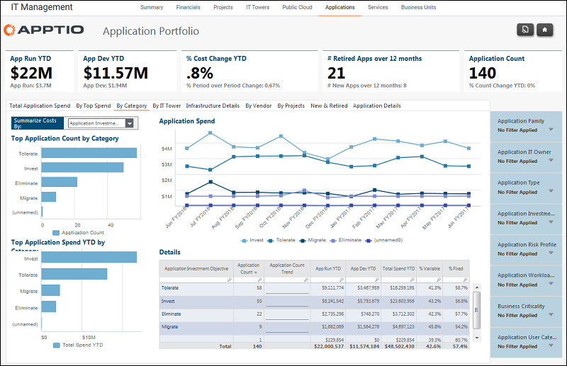

# Gestión de TI - Aplicaciones - Informe por categoría ( v103 )

Utilice este informe para revisar los principales gastos en aplicaciones por objetivo de inversión en aplicaciones, ciclo de vida de la aplicación, criticidad empresarial, tipo de aplicación, categoría de usuario de la aplicación, familia de aplicaciones o función de la aplicación.

Se aplica a: Costing Standard 11.8.x que se ejecuta en TBM Studio v12 o TBM Studio v11.

## Navegación

Gestión TI > Aplicaciones > Por categoría

## Funciones

Este informe está destinado a:

- Propietarios de aplicaciones
- Propietarios de la cartera de aplicaciones / Vicepresidente de desarrollo y soporte de aplicaciones
- Arquitectos de empresa

## Objetivos

Utilice este informe para:

- Utilice la lista desplegable para revisar los principales gastos en aplicaciones por objetivo de inversión en aplicaciones, ciclo de vida de la aplicación, criticidad empresarial, tipo de aplicación, categoría de usuario de la aplicación, familia de aplicaciones o función de la aplicación.
- Revise la tendencia del gasto en aplicaciones por la categoría seleccionada.

## Preguntas contestadas

La información presentada en este informe puede utilizarse para responder a las siguientes preguntas:

- ¿Es ésta la combinación correcta de gastos entre las distintas categorías de inversión?
- ¿Son suficientes nuestras inversiones en aplicaciones para apoyar los objetivos corporativos?
- ¿Hay que tomar medidas para mitigar el riesgo?

## Próximas acciones

Haga clic en un Objetivo de inversión de la solicitud para ver los detalles.
