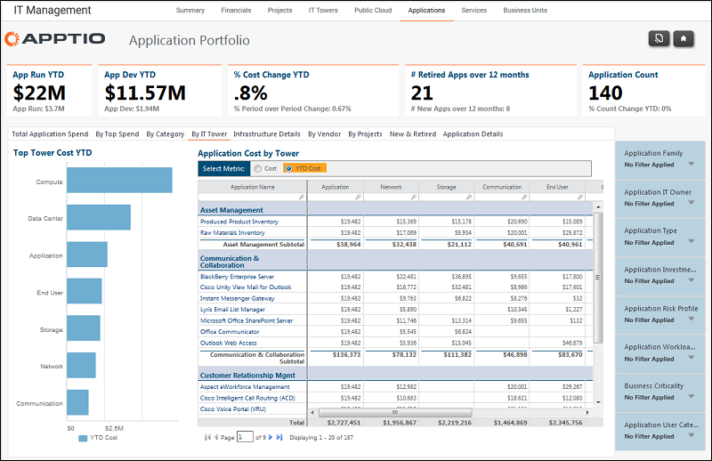

# Gestión informática - Aplicaciones - Informe By IT Tower ( v103 )

Utilice este informe para revisar el gasto en aplicaciones en todas las torres de TI y por familia de aplicaciones.

Se aplica a: Costing Standard 11.8.x que se ejecuta en TBM Studio v12 o TBM Studio v11.

## Navegación

Gestión TI > Aplicaciones > Por torre de TI

## Funciones

Este informe está destinado a:

- Propietarios de aplicaciones
- Propietarios de la cartera de aplicaciones / Vicepresidente de Desarrollo y Soporte de Aplicaciones
- Arquitectos de empresa

## Objetivos

Utilice este informe para revisar el gasto en aplicaciones en todas las torres de TI y por familia de aplicaciones.

## Preguntas contestadas

La información presentada en este informe puede utilizarse para responder a las siguientes preguntas:

- Para una aplicación determinada, ¿es correcto el consumo de centros de datos, servidores y costes de almacenamiento?
- ¿Es necesario tomar medidas para mitigar el riesgo presupuestario?

## Próximas acciones

Haga clic en el nombre de una aplicación para obtener un informe detallado de la misma.
